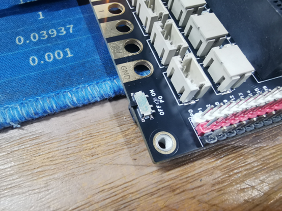

# 掌控板/microbit扩展板 IO扩展板

## 简介：

掌控板/micro:bit扩展板 是针对于掌控板和micro:bit主板设计的接口扩展板，以排针以及ph2.0防反接座的形式同时引出几乎所有IO，用于连接数量较多的传感器，适用于创客教育里大多数项目场景的应用。

板载microusb和PH2.0供电接口，皆可用来给主板供电，同时能给2路直流电机供电，可以应用在很多智能小车的项目中。

## 接口说明：

io接口：排针3P接口、ph2.0-3P防反接接口

IIC接口：SDA-P20  SCL-P19

4P接口：P13 P14 + - 

PH2.0电池供电接口：输入电压推荐3.5-5V

MicroUSB：usb供电接口

电机接口：连接直流电机

金手指接口：可通过鳄鱼夹连接元件、传感器

## 备注说明

1、掌控板/micro:bit主板上的usb供电 不能用于io接口的传感器以及电机驱动供电，如需连接更多传感器或者使用电机驱动，请单独给扩展板的usb口进行供电，避免因主板供电不足烧坏主板

2、掌控板/micro:bit连接扩展板插槽方向，应参考扩展板上插槽两侧的丝印（GND  3V 2 1 0）（P Y T H O N）这丝印与掌控板/micro:bit主板上的金手指丝印 对应方向一致。

## 参数：

蜂鸣器（开关切换）

供电方式：ph2.0座以及microusb两种供电接口，支持3.7V锂电池供电或者3节干电池供电，也可选择板载microUSB连接数据线至充电宝/电源适配器 的5V输出接口 来进行供电

电机驱动电流：最大连续输出电流1.8A

金手指引脚： 0,1,2,3,V,G   

触摸金手指（6路）：PYTHON（掌控板独有）

金手指孔径/孔距：4.8mm /8mm （兼容乐高）

外框尺寸：62*84mm

（贴片螺母）固定孔尺寸:56*74mm

## 使用方法：

1、插针IO口连接传感器

​  

2、防反接接口连接传感器

3、蜂鸣器控制方式

4、驱动iic硬件（TCS34725颜色传感器）

5、驱动超声波传感器

6、驱动2路电机

7、python金手指触摸功能测试

