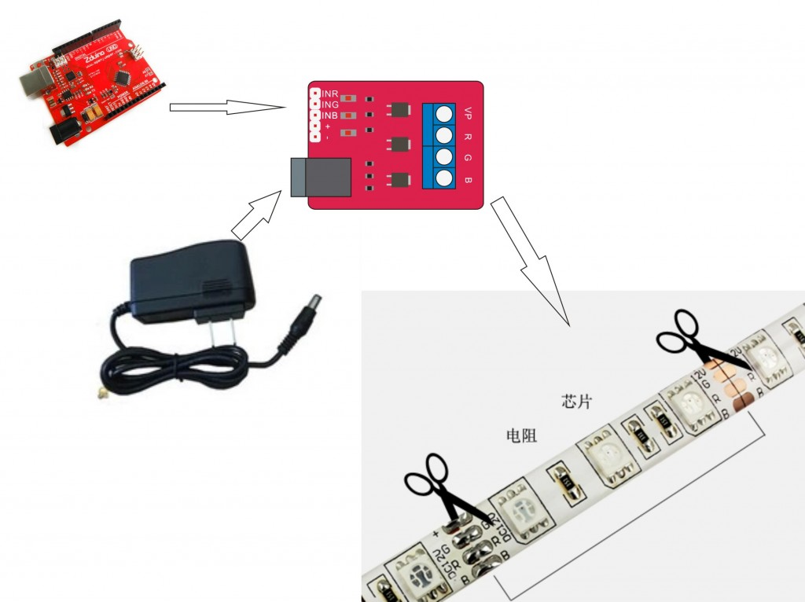

# RGB灯条驱动器

## 概述

众所周知，普通的控制器IO口输出电压为5V或者3.3V，对于12V的灯条，直接驱动显得无可奈何。而OJ RGB灯条驱动是设计用来可利用arduino和其他同类主控器驱动的12VRGB 全彩灯条的模块，可让你的RGB灯条在你的控制下变换五颜六色。是灯光互动必备设备。


[点我购买](https://item.taobao.com/item.htm?id=538368855811)

## 模块特点

+ 集成了3个N沟道的MOSFET，不仅可以对单色的12v灯带直接驱动，还支持驱动RGB 的全彩灯带，让你有了无穷的颜色变化区间。  
    
+ 最高耐压25V，电流最高6A ，完全满足12V的灯带驱动条件。  
      
+ 留出信号接口，允许arduino等控制器控制其输出颜色变化。  
+ 独立的DC接口，让你的电源直接可以通过直流电池或者直流电源适配器接入。
  
## 模块参数

+ 工作电压：小于等于12V （DC口进入）
  
+ 最大功率：43.2W（单路）
  
+ 模块尺寸：41mm*30mm



## Arduino驱动示例：

```C++
void setup()
{
  Serial.begin(9600);
 }
 void loop()
{
  analogWrite(9,255);
  analogWrite(10,255);
  analogWrite(11,255);
  delay(1000);
  analogWrite(9,255);
  analogWrite(10,255);
  analogWrite(11,0);
  delay(1000);
   analogWrite(9,0);
  analogWrite(10,255);
  analogWrite(11,255);
  delay(1000);
   analogWrite(9,255);
  analogWrite(10,0);
  analogWrite(11,255);
  delay(1000);
  analogWrite(9,0);
  analogWrite(10,0);
  analogWrite(11,0);
  delay(1000);
}
```
