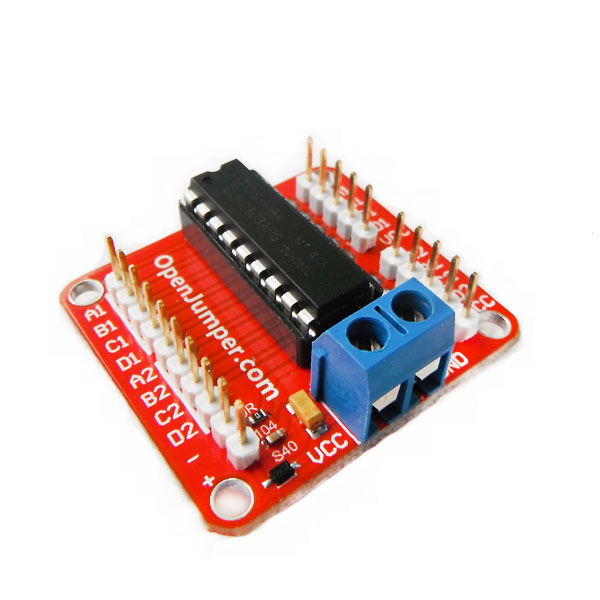

# ULN2803步进电机驱动模块
## 概述

ULN2803是八重达林顿芯片，可以用来控制两个四相五线步进电机，或八个继电器等需要输出低电平、大电流的驱动场合。左边十个引脚为8路输入及5V电源输入，中间引出外部供电接口，右边为两路步进电机输出口，连接两个四相五线步进电机，驱动能力为500MA 50V。亦可外部供电以提高驱动能力，可直接取代ULN2003驱动四相无线步进电机。



## 模块参数

+ 尺寸：33*37mm

+ 推荐输入电压：5V DC

## 主要特性：

+ 达林顿管驱动器

+ 包含8个NPN达林顿管 高耐压，大电流

+ 输出击穿电压: 50(V)

+ 输出电流: 500(mA)

+ 输入电阻 :2.7k(Ω)

+ 推荐输入电压:5(V)

+ 温度范围:-40℃～+85℃

+ 不要超过每个驱动器的电流的限制

## 模块特点

+ 可驱动两个4相五线步进电机

+ 指示灯指示输出状态

+ 可外部供电提高驱动能力

## 示例程序

驱动24BYJ48五线四相减速步进电机

```C++
    void setup() 
     { 
       for(int i=2;i<6;i++) 
       { 
         pinMode(i,OUTPUT); 
       }  
     } 
     void loop() 
     { 
       int a; 
       a=512; 
       while(a--) 
       { 
        for(int i=2;i<6;i++) 
        { 
         digitalWrite(i,1); 
         delay(10); 
        digitalWrite(i,0);  
        } 
       } 
     }
```
## 其他文档

schematic：[ULN2803](http://www.openjumper.cn/wp-content/uploads/2012/08/ULN2803.pdf)