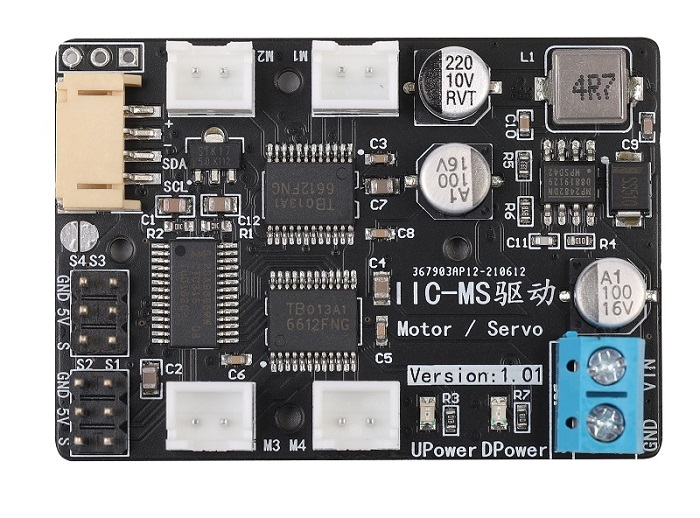
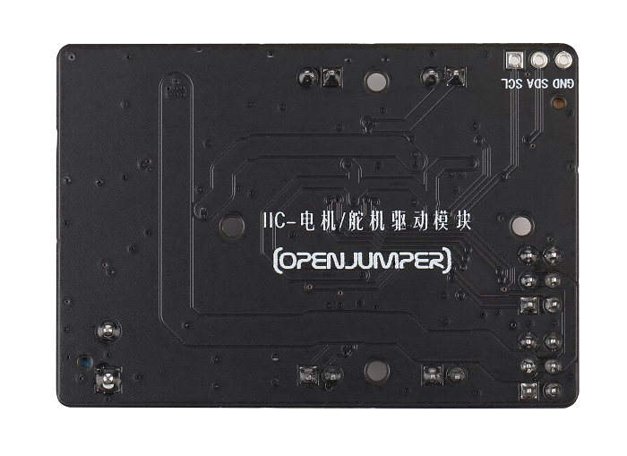
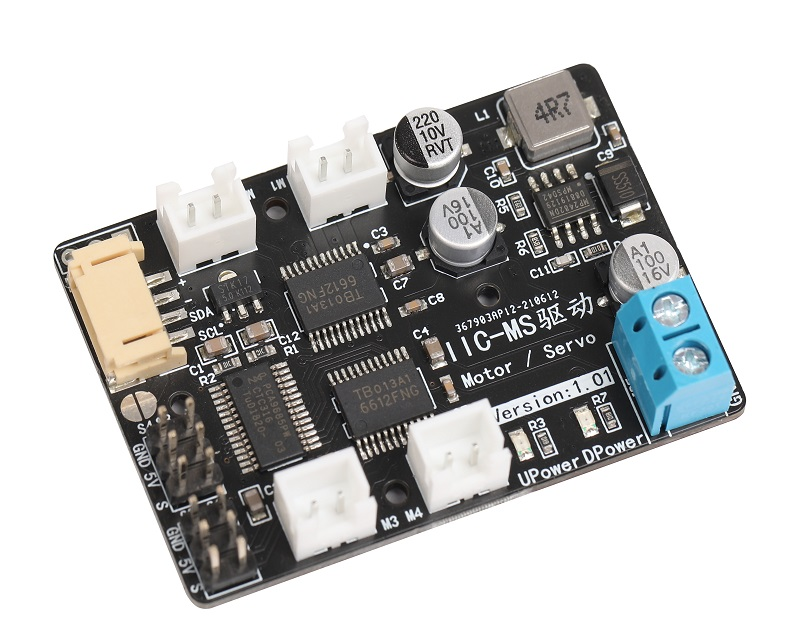
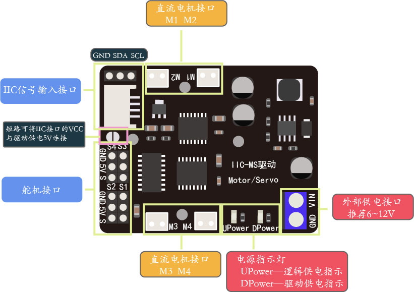

# IIC-电机/舵机驱动模块

## 简介

IIC-电机/舵机驱动模块是一款兼容Arduino、ESP8266、ESP32和树莓派的电机驱动模块。通过IIC的方式和主控板进行通讯，这样可以大大减少主控芯片引脚的占用。同时模块可以同时支持驱动四个直流电机和四个舵机，并且实现直流电机的正反转和电机调速控制。模块可以外部供电，为舵机提供5V电压，输出电流最大能够达到5A，足以驱动如MG995等大舵机。模块具有体积小、重量轻、占用IO数量少、功能强大、驱动能力强、不易发热等诸多优点。常用于机器人小车的多路直流电机或者多路舵机的驱动中。

<table border="1" align="center">

<tr>
  <td align="center"></td>
  <td align="center"></td>
  <td align="center"></td>
</tr>
<tr>
  <td style="background-color:rgb(232,232,232,0.5) "colspan="3" align="center"> <a href="https://item.taobao.com/item.htm?id=649762345837"><font style="font-size:16px"> IIC-电机/舵机驱动模块</font></a> </td>
</tr>
</table>


## 模块参数

  |          名称           |              参数               |
  | :--------------------- | :-----------------------------|
  |        通信方式         |               IIC               |
  | 建议电源电压（VIN,GND） |             6V-12V              |
  |    舵机驱动部分电压     |     5V（板载DCDC电源芯片）      |
  |  舵机驱动部分峰值电流   |  5A（建议持续工作电流小于3A）   |
  | 单路电机驱动电流平均值  |              1.2A               |
  |  单路电机驱动电流峰值   |              1.6A               |
  |        静态电流         |              10mA               |
  |      驱动的舵机数       |               4路               |
  |   驱动的直流电机数量    | 4路（带正反转和12位高精度调速） |
  |        固定方式         |     4个M2固定孔（直径2mm）      |
## 引脚说明




+ **IIC信号输入接口：** 与arduino、wifiduino、micro:bit、树莓派等主板进行IIC通信
  
+ **测试点：** IIC输入接口中的+引脚没直接与板载5V导通，这是为避免电机驱动模块电源对主板产生干扰。跳帽焊接短路后，将IIC接口的+与板载5V连接，此时电机驱动模块可为主板提供5V电源。
  
+ **舵机接口：** 连接舵机，可支持4路舵机
  
+ **直流电机接口：** 连接直流电机，可支持4路直流电机
  
+ **电源指示灯：** DPower为舵机接口电源指示灯，UPower为驱动芯片逻辑供电电源指示灯
  
+ **外部供电接口：** 用于外接电池或其他电源，推荐电压6~12V

## Arduino示例程序

```C++
#include <Wire.h>
#include <Openjumper_IICMotorDriver.h>

Openjumper_IICMotorDriver pwm = Openjumper_IICMotorDriver();//默认地址为0X40
//Openjumper_IICMotorDriver pwm = Openjumper_IICMotorDriver(0X41);//也可以这样自定义地址

#define SERVOMIN 100 //舵机脉冲最小值
#define SERVOMAX 400 // 舵机脉冲最大值

void setup()
{
  Serial.begin(9600);
  Serial.println("16 channel Servo test!");
  //Wire.begin(D4,D5);//IIC引脚，库中已经声明
  pwm.begin();
  pwm.motorConfig(DIRP,DIRP,DIRN,DIRN);//DIRN小车前进方向定义，分别是M1、M2、M3、M4
  // pwm.setPWMFreq(60);  // Analog servos run at ~60 Hz updates频率
}

void loop()
{
  pwm.setMotor(M3, 1000);//单独驱动一个电机参数一：固定为M1,M2,M3,M4为电机标号;参数二：-4095~4095为电机转速。正为正转，负为反转。
  delay(500);
  pwm.setAllMotor(3000);//同时设定所有电机速度，参数：-4095~4095为电机转速
  delay(500);
  pwm.setAllMotor(3000, 1000, 1000, 100);//同时设定所有电机速度，参数分别为M1,M2,M3,M4电机的转速：-4095~4095
  delay(500);
  pwm.stopMotor(MAll);//停止所有的电机
  delay(500);
  pwm.digitalWrite(2,HIGH);//输出高电平
  pwm.setServoPulse(1, 200);//控制舵机转到对应角度，输出脉冲值
  delay(1500);
  pwm.setServoPulse(1, 300);
  pwm.digitalWrite(2,LOW);//输出低电平
  delay(1500);
  pwm.digitalWrite(S3,HIGH);//引脚写1,2,3,4或S1,S2,S3,S4均可
  delay(1500);
  pwm.digitalWrite(S3,LOW);
 }
 ```

## 库文件及示例程序

[Arduino库文件下载](http://download.openjumper.cn/Openjumper_IICMotorDriver.rar)
