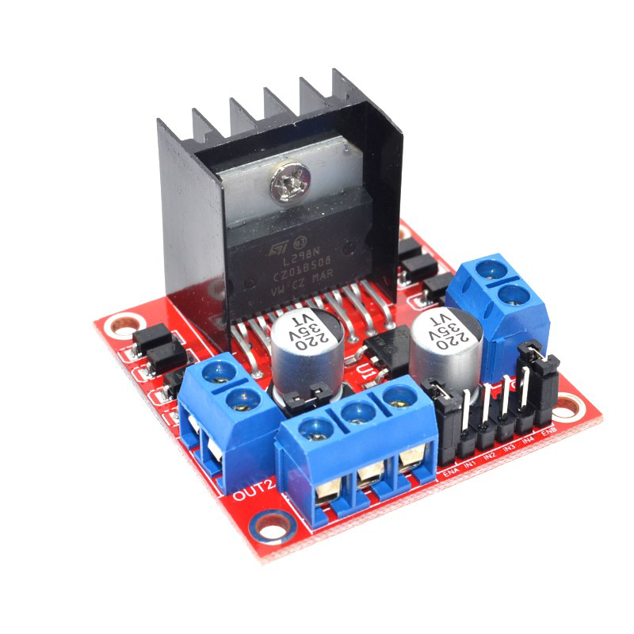
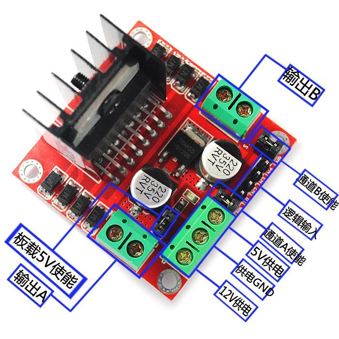
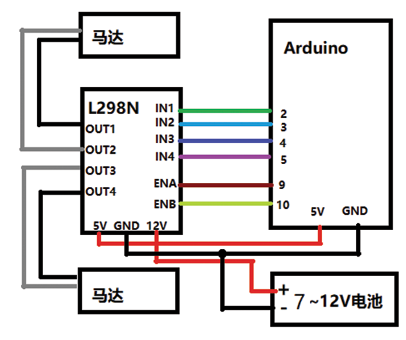

# L298N直流电机驱动板模块

## 产品介绍

本模块使用ST公司的L298N作为主驱动芯片，具有驱动能力强，发热量低，抗干扰能力强的特点。本模块可以使用内置的78M05通过驱动电源部分取电工作，但是为了避免稳压芯片损坏，当使用大于12V驱动电压时,请使用外置5V逻辑供电。本模块使用大容量滤波电容，续流保护二极管，可以提高可靠性。

[点我购买](https://item.taobao.com/item.htm?id=591769814865)

## 产品规格

+ 模块名称:L298N双H桥电机驱动模块

+ 驱动部分端子供电范围Vs:+ 5V~ +35V

+ 驱动部分峰值电流:2A

+ 逻辑部分端子供电范围Vss:+5V~+7V

+ 逻辑部分工作电流范围: 0-36mA

+ 最大功耗:20W (温度T=75°C时)

+ 控制信号输入电压范围:
    + 低电平: -0.3≤VIN≤1.5V

    + 高电平: 2.3V≤VIN≤Vss

+ 使能信号输入电压范围:
    + 低电平: -0.3≤VIN≤1.5V

    + 高电平: 2.3V≤VIN≤Vss

+ 存储温度:-25°C~+130°C

+ 驱动板尺寸:53mm*43mm

+ 驱动板重量：35g

## 端口说明

## 接线说明

