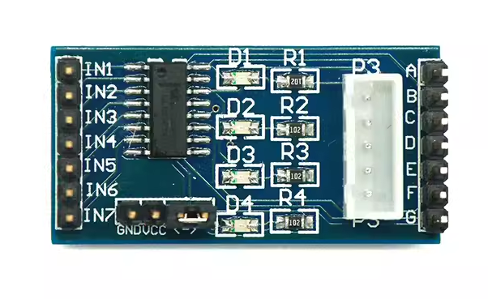
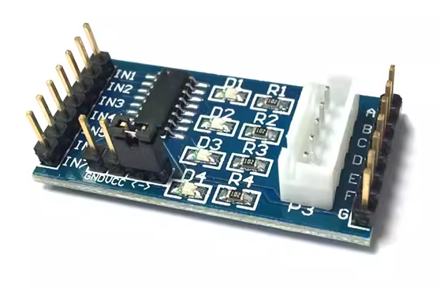
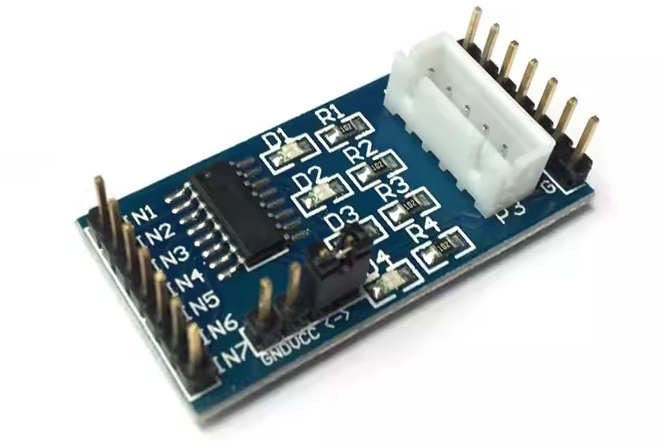

# ULN2003A步进电机驱动

<table border="1" align="center">

<tr>
  <td align="center"></td>
  <td align="center"></td>
  <td align="center"></td>
</tr>
<tr>
  <td style="background-color:rgb(232,232,232,0.5) "colspan="3" align="center"> <a href="https://item.taobao.com/item.htm?id=537610098158"> ULN2003A步进电机驱动 </a> </td>
</tr>
</table>

## 产品介绍

此驱动板将ULN2003A芯片的10口全部引出，可驱动步进电机或多路继电器等需要放大的系统。且为五线进电机预留专用接口，避免了插反插错的情况，4相电路有LED指示灯，可以清楚了解驱动板每个信号的工作情况。

## 参数规格

+ 驱动芯片：ULN2003a

+ 板载插座型号：XH-5P

+ 供电电压：5-12V

+ 驱动板尺寸：40.5mm*21.3mm

## 产品特点

1、板载ULN2003A电机驱动芯片;

2、芯片常用管脚已经引出，方便连接使用;

3、插针5-12V供电;

4、板载4路信号指示灯;

5、板载XH-5P插座，可以直接连接28BYJ-48型号的步进电机。

## 资料下载
下载链接: <https://pan.baidu.com/s/1oxGcKhKUNLGxQUsnk93pag> 
提取码: cqhd 