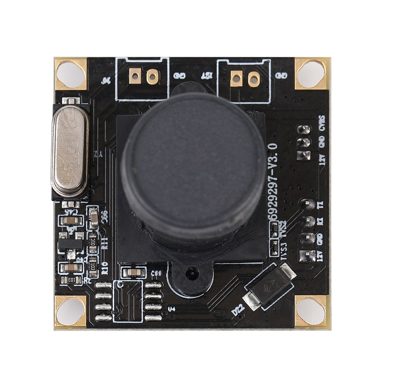
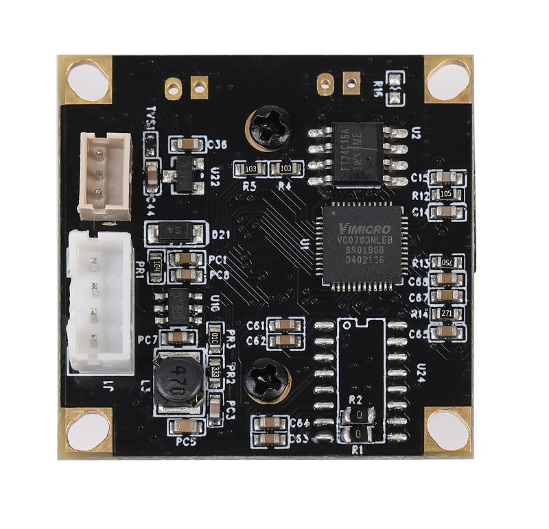
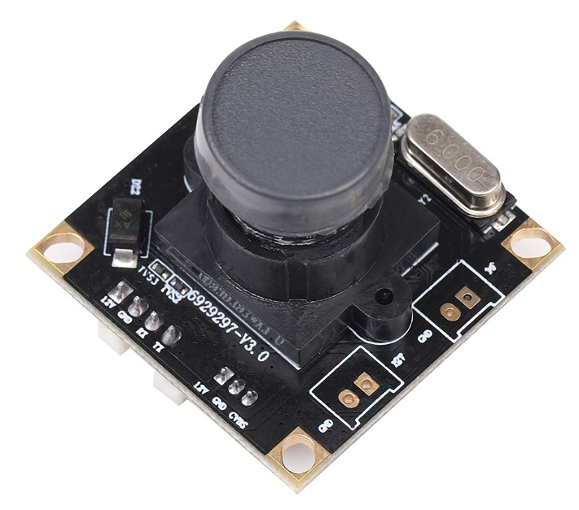
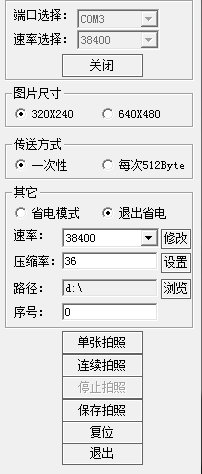
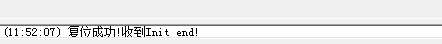
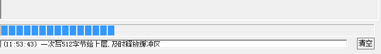
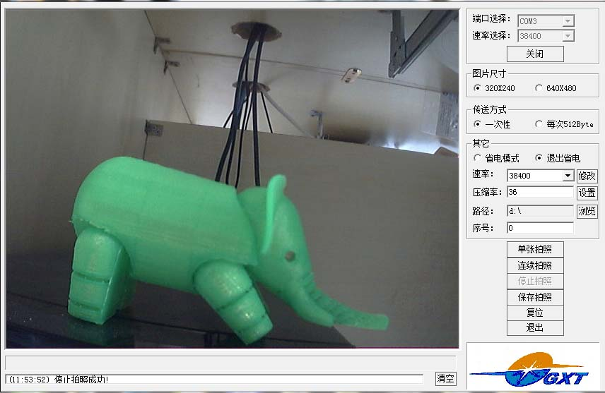
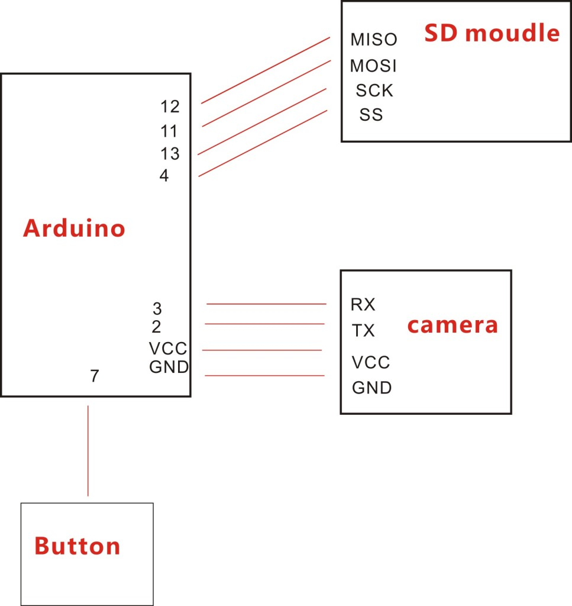
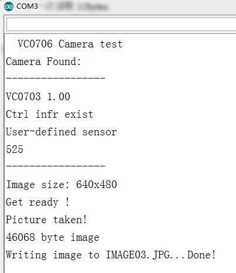

# Arduino 摄像头模块

## 简介

该串口摄像头是一款基于串口TTL通信接口的摄像头模块，可以方便的与Arduino主控器进行连接，通过串口即可读取图像数据，从而可以进行一些图像处理方面的工作。

<table border="1">

<tr>
  <td align="center"></td>
  <td align="center"></td>
  <td align="center"></td>
</tr>
<tr>
  <td style="background-color:rgb(232,232,232,0.5) "colspan="3" align="center"> <a href="https://item.taobao.com/item.htm?id=537690820220"><font style="font-size:16px"> Arduino 摄像头模块</font></a> </td>
</tr>
</table>


## 参数

+ BPS 38400

+ 电平：TTL电平

+ 制式：NTSC ，510×492

+ 图片格式：JPEG格式

+ 图片大小：QVGA（320*240）高、中、低三档可选

+ 串口波特率：9600~115200

+ PCB板尺寸：38×38mm/32×32mm 灵活工厂外壳组装

+ 工作电压：DC4.8V~DC6.5V

+ 工作电流：90mA（红外灯不工作时）

+ 镜头：FOV 60°~120°，650普通镜头/850、940 IR红外镜头  
   用户可参照通信协议任意更改，图片越小，图片传送速度越快

+ 接线端子：6PIN-2.0mm/2PIN-2.0mm（红外灯板接口）

+ 工作温度：-20℃~ +60℃，存储温度：-30℃至70℃，湿度：90%非凝结。


## 应用说明

### 一：串口工具调试摄像头（USB转串口模块）

**步骤一：** 将摄像头模块与USB转串口模块（OpenJumper cp2102 module）连接

**接线：**

|摄像头模块 |	USB转串口模块|
|:--:|:--:|
|VCC |	VCC|
|GND |	GND|
|RX |TX|
|TX |	RX|

 

**步骤二：** USB转串口模块连接至电脑后安装驱动

+ 驱动下载地址：<http://openjumper.cn/usb-serial/>

+ 摄像头软件下载：[PTC01](http://openjumper.cn/wp-content/uploads/2014/08/PTC01.rar)

**步骤三：** 打开摄像头串口工具（必须以管理员权限打开）

1、选择对应串口端口，波特率默认38400 ，单击打开

2、选择对应尺寸及其他参数



3、单击复位，复位成功会收到如下信息



4、单击单击拍照，等待数据传输



拍照成功会显示拍得的图像及提示信息



### 二、Arduino 驱动示例 (利用按键SD卡模块和摄像头模块实现拍照功能)

**连线示意图：**



```C++
#include <camera_VC0706.h>
#include <SD.h>
#include <SoftwareSerial.h>

#define chipSelect 4
#if ARDUINO >= 100
SoftwareSerial cameraconnection = SoftwareSerial(2, 3);
#else
NewSoftSerial cameraconnection = NewSoftSerial(2, 3);
#endif
camera_VC0706 cam = camera_VC0706(&cameraconnection);
void setup() {


#if !defined(SOFTWARE_SPI)
#if defined(__AVR_ATmega1280__) || defined(__AVR_ATmega2560__)
	if(chipSelect != 53) pinMode(53, OUTPUT); // SS on Mega
#else
	if(chipSelect != 4) pinMode(4, OUTPUT); // SS on Uno, etc.
#endif
#endif

	pinMode(7,INPUT_PULLUP);
	Serial.begin(9600);
	Serial.println("VC0706 Camera test");

	//SD卡检测
	if (!SD.begin(chipSelect)) {
		Serial.println("Card failed, or not present");
		return;
	}

	// 查询摄像头
	if (cam.begin()) {
		Serial.println("Camera Found:");
	} else {
		Serial.println("No camera found?");
		return;
	}
	// 摄像头版本号
	char *reply = cam.getVersion();
	if (reply == 0) {
		Serial.print("Failed to get version");
	} else {
		Serial.println("-----------------");
		Serial.print(reply);
		Serial.println("-----------------");
	}

	// 选择合适的图片尺寸 640x480, 320x240 or 160x120
	// 图片越大，传输速度越慢
	cam.setImageSize(VC0706_640x480);
	//cam.setImageSize(VC0706_320x240);
	//cam.setImageSize(VC0706_160x120);

	uint8_t imgsize = cam.getImageSize();
	Serial.print("Image size: ");
	if (imgsize == VC0706_640x480) Serial.println("640x480");
	if (imgsize == VC0706_320x240) Serial.println("320x240");
	if (imgsize == VC0706_160x120) Serial.println("160x120");

	Serial.println("Get ready !");

}

void loop() {

	if(digitalRead(7)== 0) { //按键检测
		delay(10);
		if(digitalRead(7)== 0) {
			if (! cam.takePicture())
				Serial.println("Failed to snap!");
			else
				Serial.println("Picture taken!");
			char filename[13];
			strcpy(filename, "IMAGE00.JPG");
			for (int i = 0; i < 100; i++) {
				filename[5] = '0' + i/10;
				filename[6] = '0' + i%10;
				// create if does not exist, do not open existing, write, sync after write
				if (! SD.exists(filename)) {
					break;
				}
			}
			File imgFile = SD.open(filename, FILE_WRITE);
			uint16_t jpglen = cam.frameLength();
			Serial.print(jpglen, DEC);
			Serial.println(" byte image");

			Serial.print("Writing image to ");
			Serial.print(filename);

			while (jpglen > 0) {
				// 一次读取32bytes
				uint8_t *buffer;
				uint8_t bytesToRead =  min(32, jpglen); // 调节一次性读取数据大小，从32-64byte ，过大容易不工作
				buffer = cam.readPicture(bytesToRead);
				imgFile.write(buffer, bytesToRead);
				jpglen -= bytesToRead;
			}
			imgFile.close();
			Serial.println("...Done!");
	        cam.resumeVideo();
		}
	}
}
```
下载程序成功后，打开串口助手：



按下按键拍照，等待图片上传至SD卡，这个过程可能需要十几秒，耐心等待，成功后会提示 Done !

文件库下载：[camera_VC0706](http://download.openjumper.cn/camera_VC0706.rar)