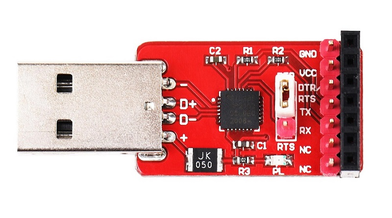
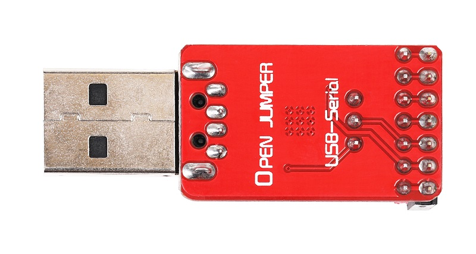
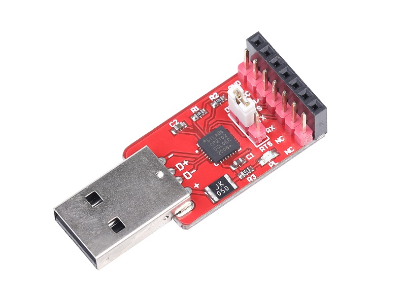

# USB转串口模块（CP2102）

## 概述

OpenJumper USB转串口模块（CP2102）集成了USB转串口芯片CP2102，使用方便简洁。CP2102与其他USB-UART转接电路的工作原理类似，通过驱动程序将PC的USB口虚拟成COM口以达到扩展的目的。引出接口包括VCC、GND、DTR、RTS、TX、RX。不仅兼容APC220无线模块和蓝牙模块，还可以利用该转接板对STC单片机与Arduino下载程序。同时加上了自恢复保险丝，防止短路或过流，从而保护您的计算机的USB端口。虽然大多数计算机提供都带有内部保护，但保险丝也可以提供额外的保护.如果电流超过500 mA，保险丝会自动断开连接防止短路或过载。

<table border="1">

<tr>
  <td align="center"></td>
  <td align="center"></td>
  <td align="center"></td>
</tr>
<tr>
  <td style="background-color:rgb(232,232,232,0.5) "colspan="3" align="center"> <a href="https://item.taobao.com/item.htm?id=552664858393"> USB转串口模块(CP2102)</a> </td>
</tr>
</table>

    
## 特性

+ 工作电压：5V
+ 硬件接口：符合USB2.0规范的要求 ，支持的数据格式为数据位8、停止位1、2和校验位 。
+ 尺寸：30mm*18mm(不含USB头)
+ 其他：
  
  + 内含上电复位电路

  + 异步串行[数据总线](http://baike.baidu.com/view/712987.htm)兼容所有握手和调制调节器接口信号

  + 内涵512字节接收缓冲器和512字节发送缓冲器 

  + 板载LED指示灯

  + 支持Windows, MAC(OSX-9以上版本) and Linux(2.4 kernel以上版本)操作系统

  + 兼容OJ蓝牙模块及APC220无线通信模块

## 引脚定义

+ GND：接地引脚

+ VCC：输出5V

+ DTR：复位引脚

+ TX：串口发送引脚

+ RX：串口接收引脚

+ NC：无连接

+ NC：无连接

## 跳帽选择

选择连接DTR或者RTS引脚，DTR和RTS在特殊场合作为握手信号，一般不使用。
    
连接RTS可对APC220无线模块进行参数设置。
    
连接DTR可以对Arduino下载程序。

## 驱动下载

<https://www.silabs.com/products/development-tools/software/usb-to-uart-bridge-vcp-drivers>

## 其他文档

[Schematic:USB-Serial](http://www.openjumper.cn/wp-content/uploads/2013/06/USB-Serial.pdf)