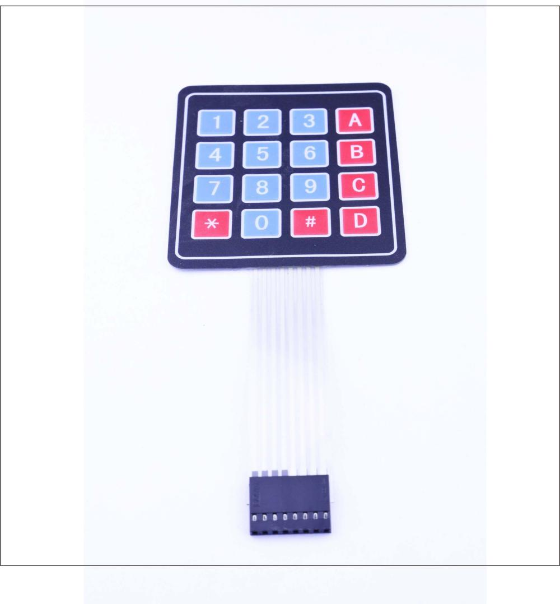
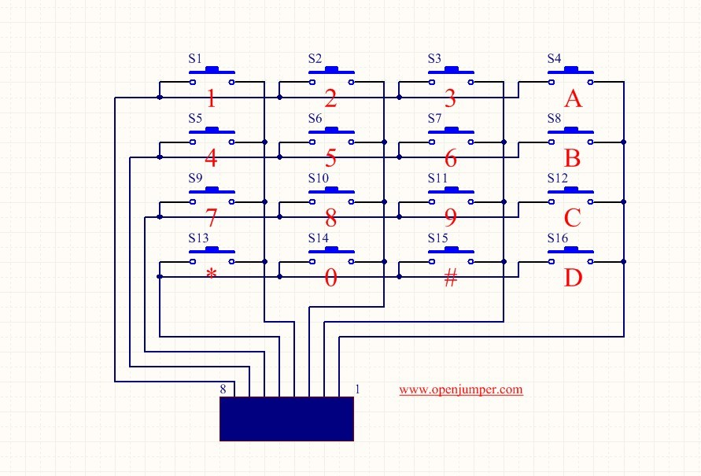

# 4*4薄膜数字键盘



[点我购买](https://item.taobao.com/item.htm?id=537974337095)

## 概述

4*4矩阵键盘，用于你的DIY项目，键盘带有8p的杜邦线母头，通过排针或排线轻松连接arduino，用于你的项目。



## 参数

+ 接口：8P杜邦线母口（2.54间距）

+ 尺寸：76.5mmx69mm

## arduino驱动示例

```C++
#include <Keypad.h>

const byte ROWS = 4; // Four rows
const byte COLS = 4; // Four columns

//Define the keymap
char keys[ROWS][COLS] = {
{'1','2','3','A'},
{'4','5','6','B'},
{'7','8','9','C'},
{'*','0','#','D'}
};

//// Connect keypad ROW0, ROW1, ROW2 and ROW3 to these Arduino pins.
byte rowPins[ROWS] = {6,7,8,9};

// Connect keypad COL0, COL1, COL2 and COL3 to these Arduino pins.
byte colPins[COLS] = {2,3,4,5}; //connect to column pinouts

// Create the Keypad
Keypad keypad = Keypad( makeKeymap(keys), rowPins, colPins, ROWS, COLS );

void setup(){
   Serial.begin(9600);
}

void loop(){
   char key = keypad.getKey();

   if (key != NO_KEY){
   Serial.println(key);
   }
}
```


## 接线

|Arduino | 4×4 Keypad|
|:--:|:--:|
|D2|1|
|D3|2|
|D4|3|
|D5|4|
|D6|5|
|D7|6|
|D8|7|
|D9|8|

## 库文件

[keypad](http://www.openjumper.cn/wp-content/uploads/2014/02/keypad.zip)

