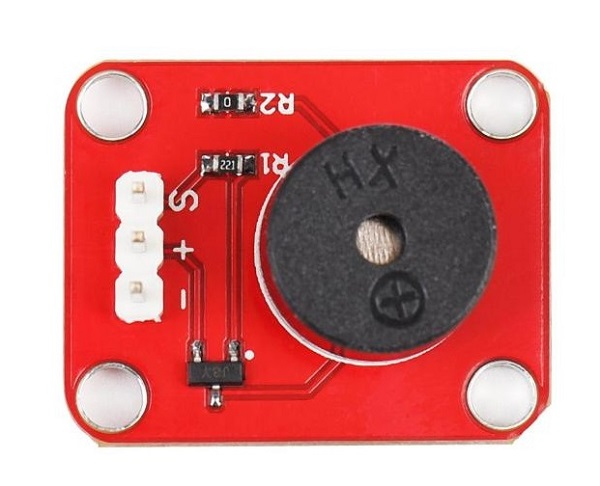

# 无源蜂鸣器模块

## 概述

通过Arduino控制器改变输出频率的控制信号就能轻松的控制蜂鸣器发出声音及音乐。该模块与Arduino其他传感器结合使用，能够实现酷炫的声光互动作品。

<table border="1">

<tr>
  <td align="center"></td>
  <td align="center"></td>
  <td align="center"></td>
</tr>
<tr>
  <td style="background-color:rgb(232,232,232,0.5) "colspan="3" align="center"> <a href="https://item.taobao.com/item.htm?id=537967285497"><font style="font-size:16px"> 无源蜂鸣器模块</font></a> </td>
</tr>
<tr>
  <td align="center"></td>
  <td align="center"></td>
  <td align="center"></td>
</tr>
<tr>
  <td style="background-color:rgb(232,232,232,0.5) "colspan="3" align="center"> <a href="https://item.taobao.com/item.htm?id=591873405828"><font style="font-size:16px">无源蜂鸣器模块 防反接</font></a> </td>
</tr>
</table>


## 产品参数：

+ 产品尺寸：19*26mm  

+ 驱动信号：数字信号  

+ 工作电压：5V  
  
## 引脚定义

+ S：信号  

+ +：VCC   

+ -：GND
  


## 示例程序

**一、通过模拟电位器模块控制蜂鸣器发声频率**
```C++
/*OJ buzzer module 
www.openjumper.cn
*/

int Buzzerpin=3 ;      //蜂鸣器引脚定义

void setup()
{
  pinMode(Buzzerpin,OUTPUT);  //将输出口置为输出
}
void loop()
{    
      digitalWrite(Buzzerpin,HIGH); //发声音
      delay(2);
      digitalWrite(Buzzerpin,LOW);  //不发声音
      delay(2);                     //修改延时时间，改变发声频率
}
```

**二、arduino控制蜂鸣器播放《小星星》** 

```C++
/*OJ buzzer module 
www.openjumper.cn
*/

int speakerPin = 9; 

int length = 15; // the number of notes 
char notes[] = "ccggaagffeeddc "; // a space represents a rest 
int beats[] = { 1, 1, 1, 1, 1, 1, 2, 1, 1, 1, 1, 1, 1, 2, 4 }; 
int tempo = 300; 

void playTone(int tone, int duration) { 
  for (long i = 0; i < duration * 1000L; i += tone * 2) { 
    digitalWrite(speakerPin, HIGH); 
    delayMicroseconds(tone); 
    digitalWrite(speakerPin, LOW); 
    delayMicroseconds(tone); 
  } 
} 

void playNote(char note, int duration) { 
  char names[] = { 'c', 'd', 'e', 'f', 'g', 'a', 'b', 'C' }; 
  int tones[] = { 1915, 1700, 1519, 1432, 1275, 1136, 1014, 956 }; 

  // play the tone corresponding to the note name 
  for (int i = 0; i < 8; i++) { 
    if (names[i] == note) { 
      playTone(tones[i], duration); 
    } 
  } 
} 

void setup() { 
  pinMode(speakerPin, OUTPUT); 
} 

void loop() { 
  for (int i = 0; i < length; i++) { 
    if (notes[i] == ' ') { 
      delay(beats[i] * tempo); // rest 
    } else { 
      playNote(notes[i], beats[i] * tempo); 
    } 

    // pause between notes 
    delay(tempo / 2);  
  } 
}
```


 ## 相关文档


[mixly程序下载](http://download.openjumper.cn/mixly/buzzer.mix)  

[Schematic:buzzer-schematic](http://openjumper.cn/wp-content/uploads/2012/08/buzzer-schematic.pdf)
