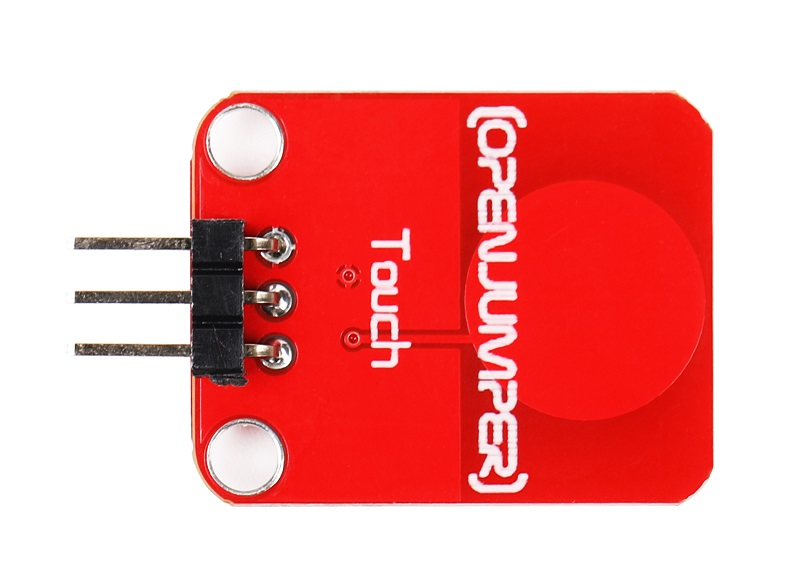
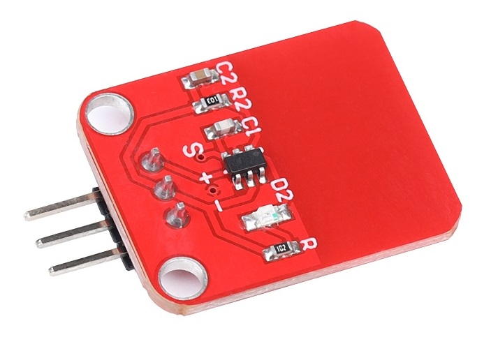
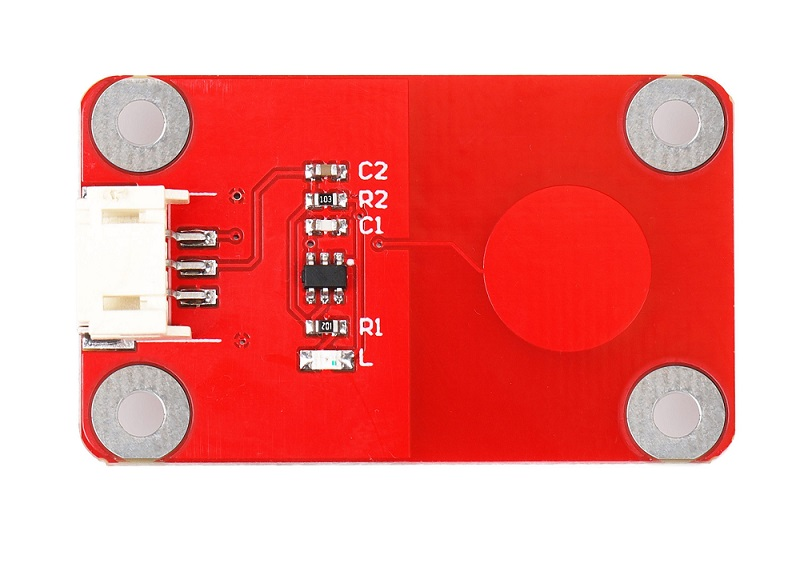
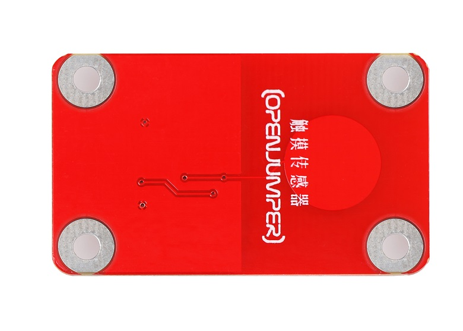
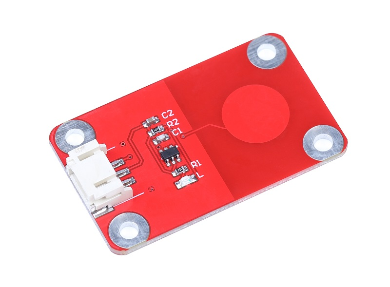
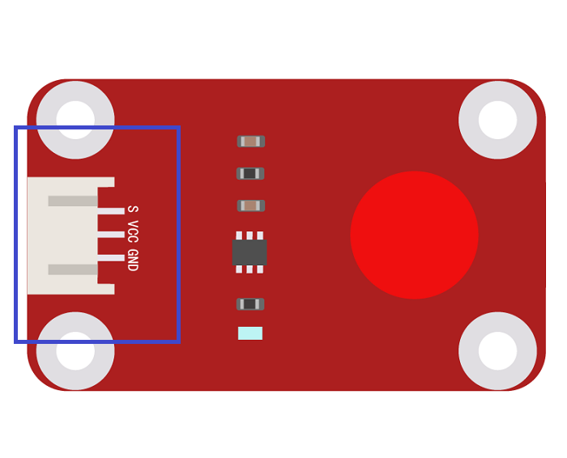

# 触摸模块

## 概述

该触摸模块是基于电容感应制作的触摸模块，除了直接触摸Touch 区域感应外，在该范围隔着一定厚度的塑料、玻璃等材料也可以感应到。配合Arduino 主控板或者扩展板结合使用，可以替代开关功能，制作有趣的互动作品。例如ED 灯触控、隔离触控开关、玩具人体感应检测、游戏配件设备触摸感应。  

<table border="1">

<tr>
  <td align="center"></td>
  <td align="center"></td>
  <td align="center"></td>
</tr>
<tr>
  <td style="background-color:rgb(232,232,232,0.5) "colspan="3" align="center"> <a href="https://item.taobao.com/item.htm?id=538007928781"><font style="font-size:16px"> 触摸模块</font></a> </td>
</tr>
<tr>
  <td align="center"></td>
  <td align="center"></td>
  <td align="center"></td>
</tr>
<tr>
  <td style="background-color:rgb(232,232,232,0.5) "colspan="3" align="center"><a href="https://item.taobao.com/item.htm?id=592150603455"><font style="font-size:16px">触摸模块 防反接</font></a> </td>
</tr>
</table>　
　　　　　　　　　　　　　　　　　　　　

## 产品参数

+ 尺寸大小：20mm×25mm（不含插针）

+ 主要芯片：专业的触控芯片TTP223  

+ 工作电压：DC 2.5V ～ 5.5V  

+ 工作电流：3mA  

+ 感应距离：0 ～ 3.5mm  

+ 非自锁模式：当触摸时为高电平，松开为低电平，有触摸就保持状态输出  

+ 输出：TTL 高/低电平信号  

+ 工作温度：-20℃ ～ +50℃    

+ 板缘设有固定螺栓孔，方便安装固定
      
## 引脚定义

+ S：输出  

+ +：VCC  

+ -：GND  

 

##  示例程序

```C++
    /*OJ touch module
     www.openjumper.cn
     */

     int Sensor_pin = 2;

     void setup() {
       Serial.begin(9600);
     }
     void loop() {
       int sensorValue = digitalRead(Sensor_pin);
       Serial.println(sensorValue);
       delay(100);
     }
```  
## 其他文档

[mixly程序下载](http://download.openjumper.cn/mixly/touch-module.mix)  

[Datasheet:touch module datasheet](http://www.openjumper.cn/wp-content/uploads/2013/02/touch-module-datasheet.pdf)  

[schematic:TOUCH-schematic](http://www.openjumper.cn/wp-content/uploads/2013/02/TOUCH-schematic.pdf)
