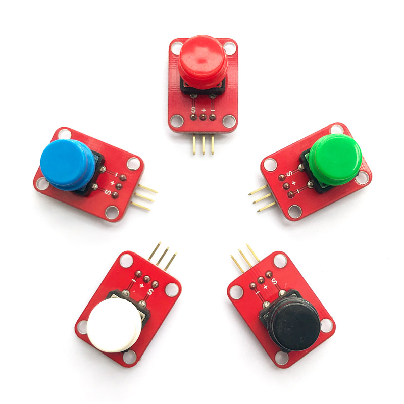
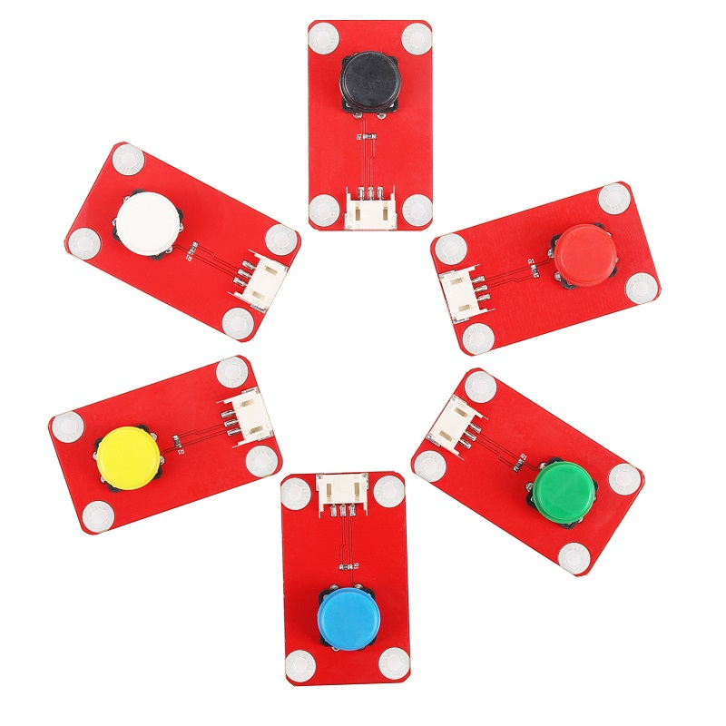
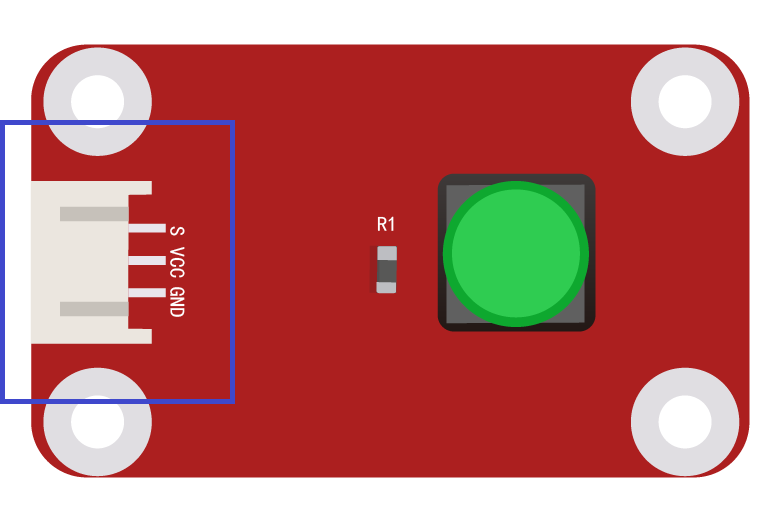

# 按键模块

## 概述

该按键配合彩色按键帽，直接用arduino数字口可方便的读取按键状态值，配合Arduino传感器扩展板可以完成使用按钮进行互动的作品。

<table border="1">

<tr>
  <td align="center"></td>
  <td align="center"></td>
</tr>
<tr>
  <td  align="center" style="background-color:rgb(232,232,232,0.5)"> <a href="https://item.taobao.com/item.htm?id=552829021903"><font style="font-size:16px">按键模块</font></a></td>
  <td  align="center"style="background-color:rgb(232,232,232,0.5)"> <a href="https://item.taobao.com/item.htm?id=592027730224"><font style="font-size:16px">按键模块 防反接</font></a></td>

</tr>

</table>

## 产品参数

+ 尺寸：19*26mm

+ 工作电压：5V

+ 类型：数字模式

+ 按键帽颜色：白、黑、蓝、绿


## 端口说明

+ S：信号输出

+ +：VCC

+ –：GND
  


# 示例程序：

```C++
/*OJ Button module 
www.openjumper.cn
*/

int pushButton = 2;

void setup() {
  Serial.begin(9600);
  pinMode(pushButton, INPUT_PULLUP);
}

void loop() {
  int buttonState = digitalRead(pushButton);
  Serial.println(buttonState);
  delay(100);       
}
```
 ## 相关文档：
[schematic：Button](http://www.openjumper.cn/wp-content/uploads/2012/12/Button.pdf)
