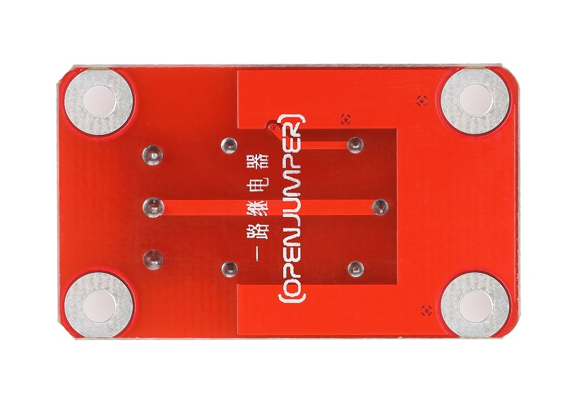

# 继电器模块

<table border="1">

<tr>
  <td align="center"></td>
  <td align="center"></td>
  <td align="center"></td>
</tr>
<tr>
  <td style="background-color:rgb(232,232,232,0.5) "colspan="3" align="center"> <a href="https://item.taobao.com/item.htm?id=585991217227"><font style="font-size:16px"> 继电器模块</font></a> </td>
</tr>
<tr>
  <td align="center"></td>
  <td align="center"></td>
  <td align="center"></td>
</tr>
<tr>
  <td style="background-color:rgb(232,232,232,0.5) "colspan="3" align="center"> <a href="https://item.taobao.com/item.htm?id=591983914867"><font style="font-size:16px">继电器模块 防反接</font></a></td>
</tr>
</table>

## 概述

OJ数字继电器模块就是采用大电流优质继电器，提供1路输入与输出，最高可以接直流30V 10A 或者 交流250V 10A设备，因此能够用来控制电灯、电机等设备。在使用Arduino做互动项目时，很多大电流或高电压的设备通常无法直接用Arduino的数字IO口进行控制（如电磁阀、电灯、电机等），此时可以考虑用继电器的方案解决。


## 模块参数

+ 尺寸：26*48mm
  
+ 指示灯：具有继电器吸合指示灯
  
+ 供电电压：5V
  
+ 驱动电平：TTL 电平，高电平驱动
  
+ 触点：一个常开触点，一个常闭触点。
  
+ 触电容量（被控信号功率）：直流30V 10A或者 交流250V 10A

## 触点说明

+ 常开触点

在常态（不通电）的情况下处于断开状态的触点叫常开触点。

+ 常闭触点

在常态（不通电、无电流流过）的情况下处于闭合状态的触点叫常闭触点。

常开——NO（normal open）通常情况下是断开状态，即线圈未得电的情况下断开的。

常闭——NC（normal close）通常情况下是关合状态，即线圈未得电的情况下闭合的。


## 端口说明

+ S：信号输出

+ +：VCC

+ –：GND


## 示例程序
```C++
/*OJ relay module 
www.openjumper.cn
*/

int Relay_pin = 13;            //连接模块至arduino信号脚13

void setup() {                
  pinMode(Relay_pin, OUTPUT);      
}

void loop() {
  digitalWrite(Relay_pin, HIGH);   // 常开触点闭合，常闭触点断开
  delay(1000);               
  digitalWrite(Relay_pin, LOW);    // 常闭触点闭合，常开触点断开
  delay(1000);               
}
```
## 相关文档

[mixly程序下载](http://download.openjumper.cn/mixly/relay-schmatic.mix)  

[schematic:relay-schematic](http://www.openjumper.cn/wp-content/uploads/2012/08/relay-schematic.pdf)