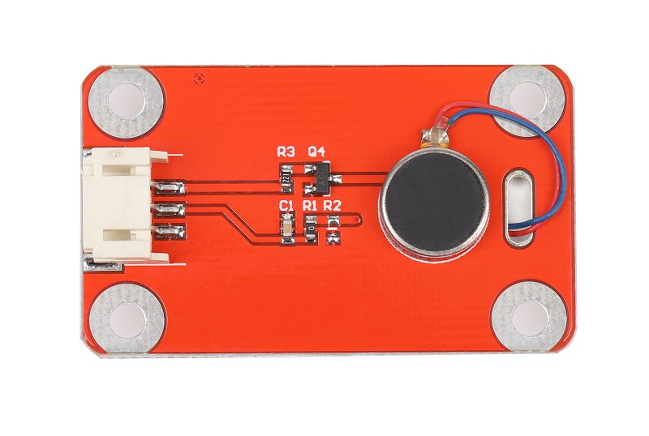
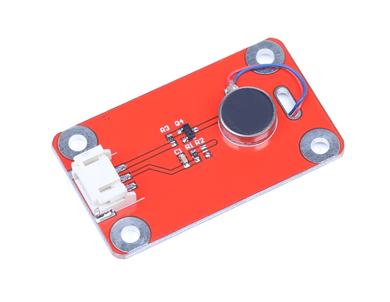
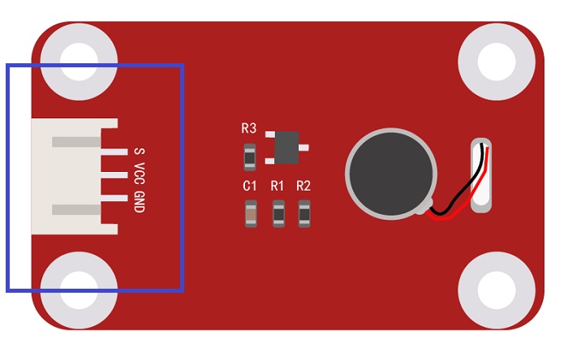

# 震动马达

## 产品概述

震动传感器是一种目前广泛应用的报警检测传感器，它通过内部的弹簧重锤结构感受机械运动振动的参量（如振动速度、频率、加速度等）并转换成可用输出信号，振动传感器在测试技术中是关键部件之一，它具有成本低、灵敏度高、工作稳定可靠，振动检测的优点，广泛应用于能源、化工、医学、汽车、冶金，机器制造，军工，科研教学等诸多领域，同时兼容于Arduino和micro bit等开源硬件(建议用中断检测)。

<table border="1">

<tr>
  <td align="center"></td>
  <td align="center"></td>
  <td align="center"></td>
</tr>
<tr>
  <td style="background-color:rgb(232,232,232,0.5) "colspan="3" align="center"> <a href="https://item.taobao.com/item.htm?id=638039232124"><font style="font-size:16px"> 震动马达</font></a> </td>
</tr>
</table>

## 产品参数

+ 工作电压：3.3V到5V
  
+ 尺寸：27*32mm
  
+ 导通时间：0.1ms
  
+ 开路电阻：10Mohm
  
+ 无方向性，任何角度均可以触发工作
  
+ 适用于小电流电路(二次回路)或(IC)的触发
  
+ 在常温及正常使用下开关寿命可达10万次(次/1sec)  
  本开关在静止时为开路（OFF）状态，当受到外力碰触而达到适当震动力时，或速度达到适当离（偏）心力时，导电接脚会+ 发生瞬间导通（ON）状态，使电气特性改变，而当外力消失时电气特性恢复开路（OFF）状态

## 端口说明

+ S：信号端口

+ +：VCC

+ -：GND

+ 接口类型：2.0_3pin防反接插口 



## arduino示例代码

```C++
#define testLED     13

#define shakeINPUT   3  //将引脚连到中断检测引脚3 上

unsigned char status = 0;

void setup()

{

  pinMode(testLED, OUTPUT); //设置输出模式

  pinMode(shakeINPUT, INPUT);  //设置输入模式

  attachInterrupt(1, shake_ISR, FALLING);// 检测到下降沿触发

}

void loop()

{

      if(status!=0)

      {

        status = 0;

        digitalWrite(testLED,HIGH);

        delay(500);

      } 

      else

        digitalWrite(testLED,LOW);

}

void shake_ISR()//中断功能函数

{

 status =1;

}
```