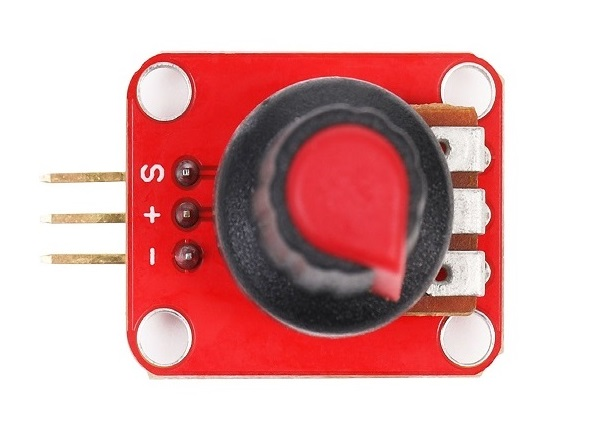
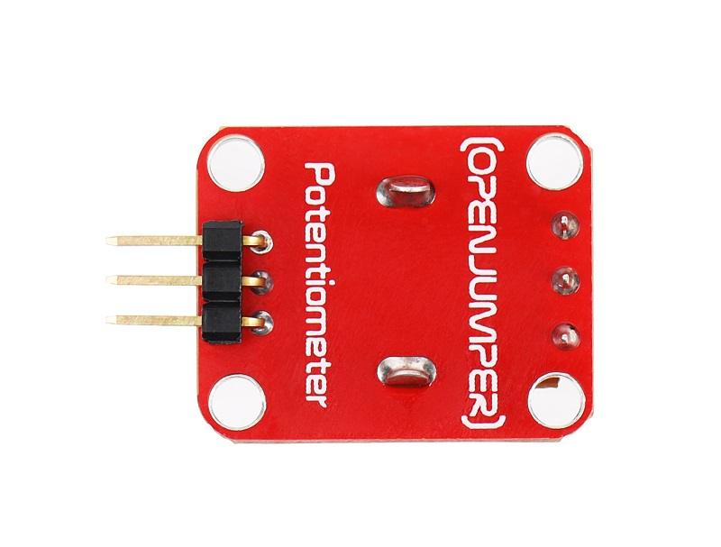
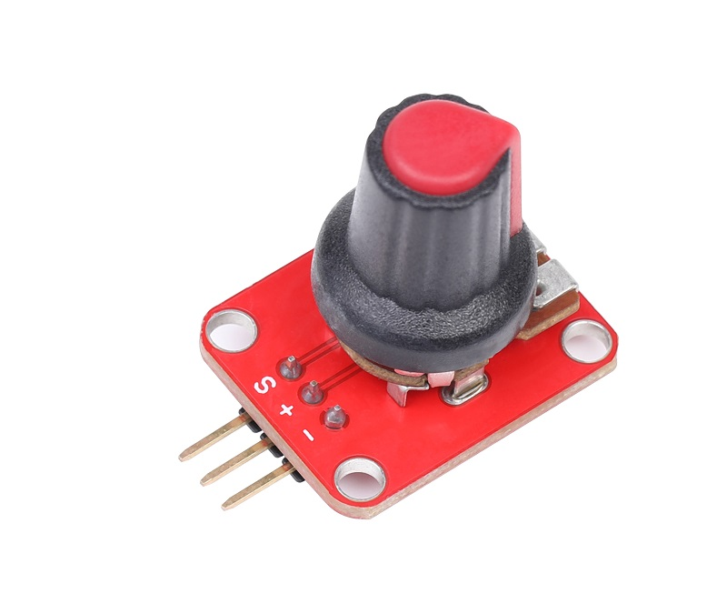
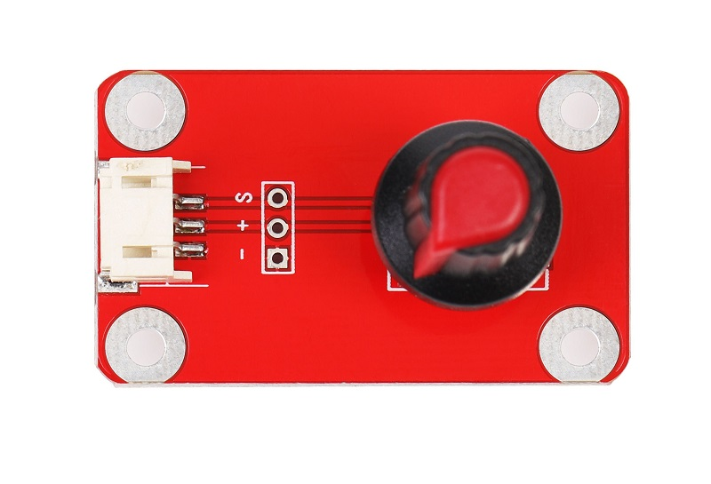
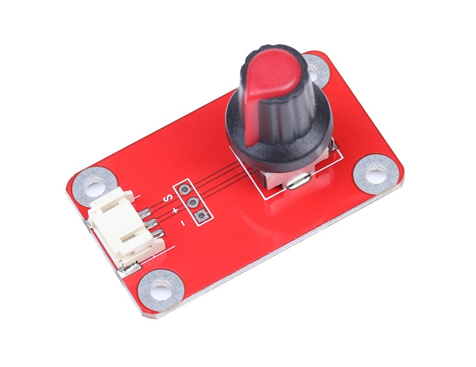
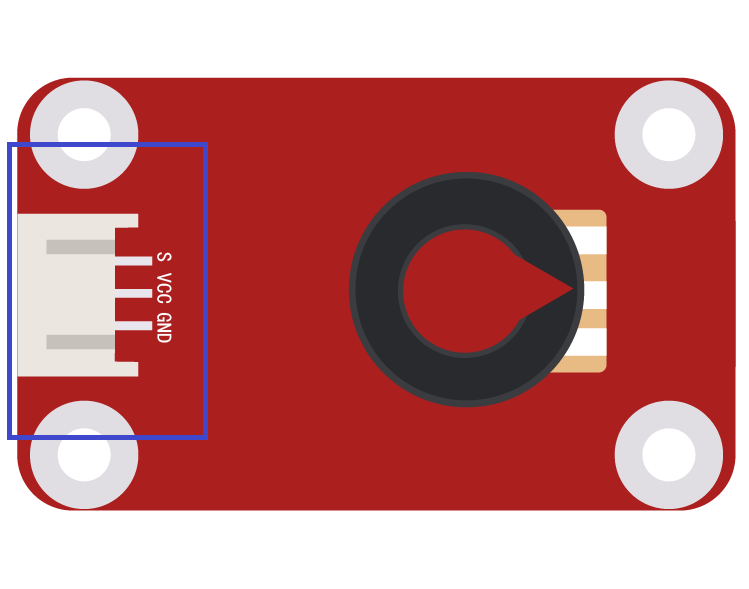

# 电位器模块

<table border="1">

<tr>
  <td align="center"></td>
  <td align="center"></td>
  <td align="center"></td>
</tr>
<tr>
  <td style="background-color:rgb(232,232,232,0.5) "colspan="3" align="center"> <a href="https://item.taobao.com/item.htm?id=552870478515"><font style="font-size:16px">电位器模块</font></a> </td>
</tr>
<tr>
  <td align="center"></td>
  <td align="center"></td>
  <td align="center"></td>
</tr>
<tr>
  <td style="background-color:rgb(232,232,232,0.5) "colspan="3" align="center"> <a href="https://item.taobao.com/item.htm?id=591832053942"><font style="font-size:16px">电位器模块 防反接</font></a> </td>
</tr>
</table>

## 概述
OJ旋钮式电位器模块可以结合Arduino传感器扩展板，可实现与位置变化相关的互动作品。模块连接在arduino模拟IO口上只需analogRead()函数便可读取传感器输入的模拟值。


## 模块参数

+ 尺寸：19*26mm  

+ 输出信号：模拟信号  

+ 输出电位器阻值：0—10K  

+ 工作电压：5V  

## 端口说明

+ S：信号端口

+ +：VCC

+ -：GND
  


## 示例代码
```C++
/*OJ Potentiometer module
www.openjumper.cn
*/

void setup() {
  Serial.begin(9600);
}
void loop() {
  int sensorValue = analogRead(A0);
  Serial.println(sensorValue);
  delay(100);
}
```
## 相关文档

[mixly程序下载](http://download.openjumper.cn/mixly/potentiometer.mix)  

[Potentiometer](http://www.openjumper.cn/wp-content/uploads/2012/08/Potentiometer.pdf)