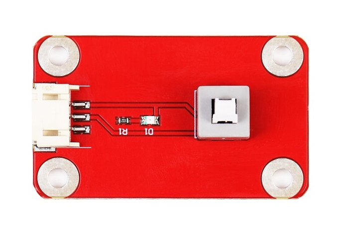
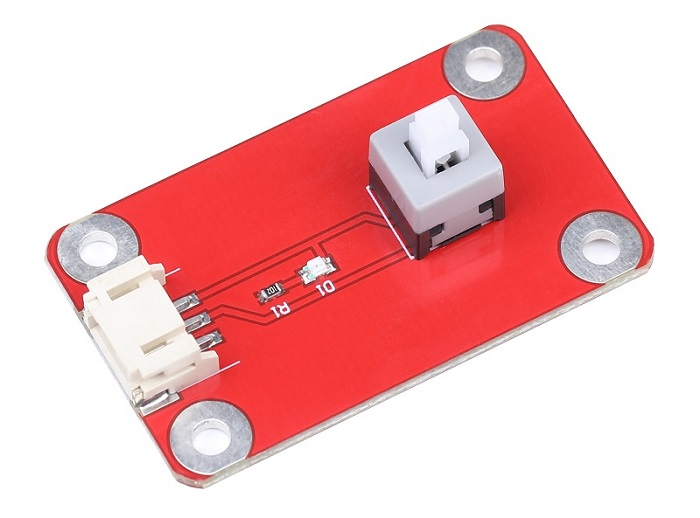
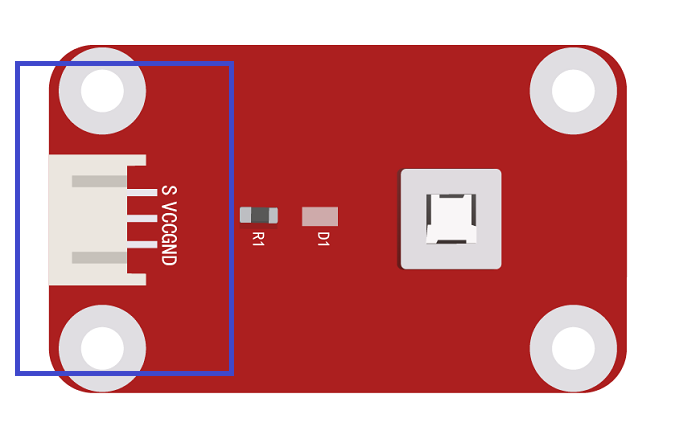

# 自锁开关模块

## 产品概述
自锁开关是一款大量应用于各种电子设备电源、信号等作为开关和触发信号使用的一种器件，自锁开关模块则可以方便的通过3_pin线或杜邦线等连接于开发板或者各种模块上。

<table border="1">

<tr>
  <td align="center"></td>
  <td align="center"></td>
  <td align="center"></td>
</tr>
<tr>
  <td style="background-color:rgb(232,232,232,0.5) "colspan="3" align="center"><a href="https://item.taobao.com/item.htm?id=599753637691"> 自锁开关模块 </a> </td>
</tr>
</table>

## 产品参数

+ 使用温度： -40C°~70C°

+ 额定负荷：DC12v 0.1A

+ 接触电阻：<200mΩ

+ 板子尺寸：27mm*45mm

+ 寿命 ：1000times 

## 端口说明

+ S ： 电平输出

+ \+ ：VCC

+  – ： GND

