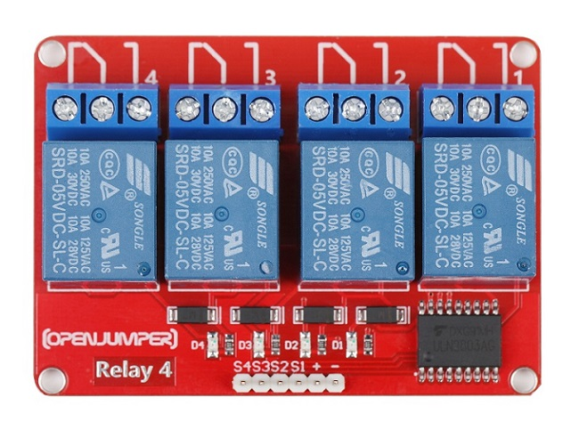
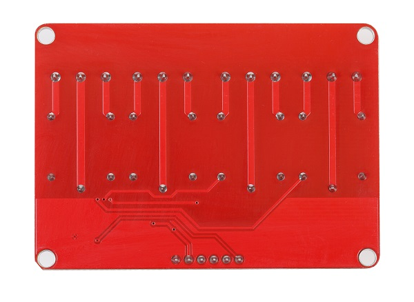
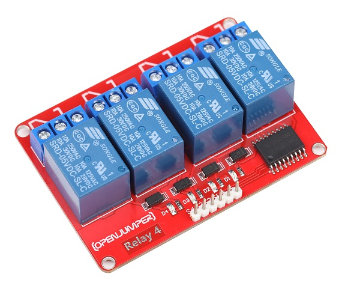

# 四路继电器模块

## 概述

4路数字继电器模块就是采用大电流优质继电器，提供4路输入与输出，最高可以接直流30V 10A 或者 交流250V 10A设备，因此能够用来控制电灯、电机等设备。在使用Arduino做互动项目时，很多大电流或高电压的设备通常无法直接用Arduino的数字IO口进行控制（如电磁阀、电灯、电机等），此时可以考虑用继电器的方案解决。

<table border="1">

<tr>
  <td align="center"></td>
  <td align="center"></td>
  <td align="center"></td>
</tr>
<tr>
  <td style="background-color:rgb(232,232,232,0.5) "colspan="3" align="center"><a href="https://item.taobao.com/item.htm?id=589830550033"><font style="font-size:16px"> 四路继电器模块 </font></a> </td>
</tr>
</table>


## 模块参数

+ 尺寸：50*70mm

+ 指示灯：每路具有继电器吸合指示灯

+ 供电电压：5V

+ 驱动电平5V TTL 电平，高电平驱动

+ 触点：每路一个常开触点，一个常闭触点。

+ 触电容量（被控信号功率）：直流30V 10A或者 交流250V 10A

## 引脚定义

+ S1 ：继电器1信号输入

+ S2 ： 继电器2信号输入

+ S3 ： 继电器3信号输入

+ S4 ： 继电器4信号输入

+ \+ ：VCC

+ – ：GND

## Arduino 驱动示例

```C++
/*OJ 4-relay module 
www.openjumper.cn
*/

int Relay_S1 = 10;            
int Relay_S2 = 11; 
int Relay_S3 = 12;
int Relay_S4 = 13; 

void setup() {                
  pinMode(Relay_S1, OUTPUT);     
  pinMode(Relay_S2, OUTPUT);  
  pinMode(Relay_S3, OUTPUT);  
  pinMode(Relay_S4, OUTPUT);   
}

void loop() {
  digitalWrite(Relay_S1, HIGH);   // 常开触点闭合，常闭触点断开
  delay(1000);               
  digitalWrite(Relay_S1, LOW);    // 常闭触点闭合，常开触点断开
  delay(1000);   

  digitalWrite(Relay_S2, HIGH);   // 常开触点闭合，常闭触点断开
  delay(1000);               
  digitalWrite(Relay_S2, LOW);    // 常闭触点闭合，常开触点断开
  delay(1000);      

  digitalWrite(Relay_S3, HIGH);   // 常开触点闭合，常闭触点断开
  delay(1000);               
  digitalWrite(Relay_S3, LOW);    // 常闭触点闭合，常开触点断开
  delay(1000); 

   digitalWrite(Relay_S4, HIGH);   // 常开触点闭合，常闭触点断开
  delay(1000);               
  digitalWrite(Relay_S4, LOW);    // 常闭触点闭合，常开触点断开
  delay(1000);  

}
```
## 其他文档
 [4-relay-module](http://www.openjumper.cn/wp-content/uploads/2013/08/4-relay-module.pdf)

## 常见问答

问：继电器模块驱动电机，怎样接线？

> 答：模块信号输入口S1、S2、S3、S4、+、-连接主控器，蓝色接线端子，设置有常开触点与常闭触点，模块上白色丝印标有。默认左端两触点是闭合的，当驱动输入高电平，继电器的触点吸合到右边，将右边两触点连接通。