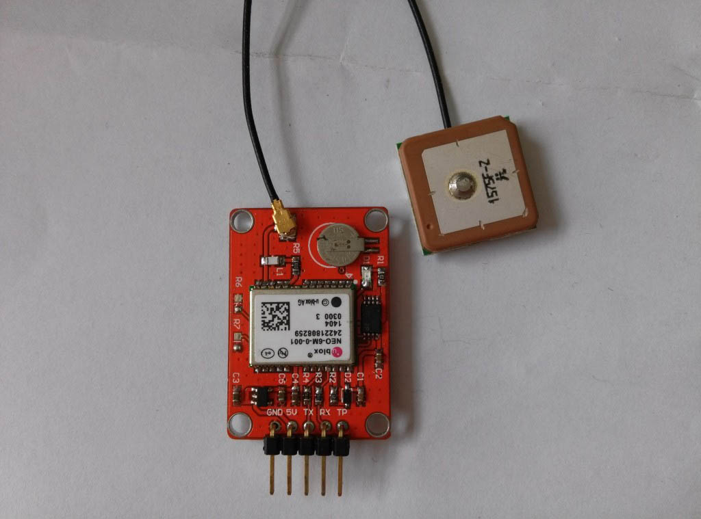

# Openjumper GPS 定位模块

## 模块参数

+ 供电电源 ：3.3V-5V

+ 定位精度：2.5 mCEP （SBAS：2.0mCEP）

+ 工作温度：-40℃~85℃

+ 更新速度：最大5HZ（默认1HZ）

+ 通信协议：NMEA（默认）/UBX Binary

+ 接收特性：50通道，GPS L1(1575.42Mhz) C/A 码SBAS:WAAS/EGNOS/MSAS

+ 追踪灵敏度：-161dBm

+ 工作电流：45mA

+ 捕获时间：冷启动：27S（最快）

+ 热启动：1S

+ 串口通信波特率：4800、9600(默认)、19200、38400、57600、115200、230400

+ 速度限制：500m/s

+ 高度限制：50000m

## 模块特性

+ 模块采用U-BLOX NEO-6M模组，体积小巧，性能优异。

+ 模块可通过串口进行各种参数设置，并可保存在EEPROM，使用方便。

+ 模块自带可充电后备电池，可以掉电保持星历数据。

+ 模块自带陶瓷天线及MAXIM公司20.5dB高增益LNA芯片，搜星能强。

+ 模块兼容3.3V/5V电平，方便连接各种单片机系统。

+ 模块自带IPX接口，可以连接各种天线，适应能力强。

## 引脚说明

+ VCC：源（3.3V~5.0V）

+ GND：接地

+ RX：模块串口接收脚

+ TX：模块串口发送脚
  
+ TP(PPS)：时钟脉冲输出脚

## 典型应用

导航仪  

四轴飞行器定位

## 技术附件

+ Opjumper GPS 模块使用手册：[OPenjumper GPS](http://openjumper.cn/wp-content/uploads/2015/01/OPenjumper-GPS-.pdf) 技术手册

+ GPS 官方资料：[NEO-6M GPS官方资料](http://openjumper.cn/wp-content/uploads/2015/01/4%EF%BC%8CNEO-6M-GPS.rar)

+ 配套软件：[Software](http://openjumper.cn/wp-content/uploads/2015/01/Software.rar)