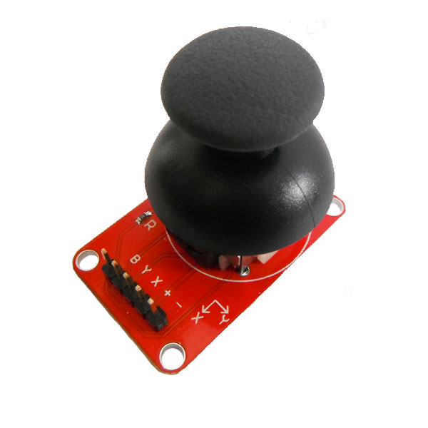

# 摇杆模块
## 概述

OJ摇杆模块是采用采用原装优质金属PS2摇杆电位器制作，具有(X,Y)2轴模拟输出，1路按钮数字输出。配合Arduino传感器扩展板可以制作遥控器等互动作品。



## 技术参数

+ 尺寸：25*40mm

+ 工作电压：5V

+ 摇杆电位器阻值：0-10K

+ 输出：两路模拟输出，一路按键输出

## 参考例程
```C++
//OPEN JUMPER
//www.openjumper.cn
int X=A0;
int Y=A1;
int BUTTON=2;
void setup(void)
{
  Serial.begin(9600);//设置串口通信9600波特率
  pinMode(BUTTON,INPUT_PULLUP);
}

void loop(void)
{
  Serial.print("X=");
  Serial.print(analogRead(X));//读取摇杆X轴的值，串口显示
  Serial.print(",");

  Serial.print("Y=");
  Serial.print(analogRead(Y));//读取摇杆Y轴的值，串口显示
  Serial.print(",");

  Serial.print("BUTTON state = ");
  Serial.println(digitalRead(BUTTON));//读按键值，串口显示

  delay(100);   //100ms刷新一次
}
```
## 其他文档

[Schematic:Joystick-schematic](http://www.openjumper.cn/wp-content/uploads/2012/12/Joystick-schematic.pdf)
