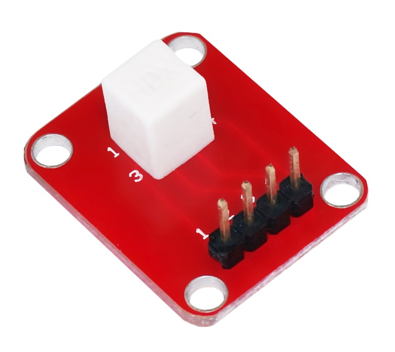

# 五向倾斜检测模块
## 概述

五向倾斜模块，内部由一个金属球和4个触点组成，可以检测倾斜方向。相较于陀螺仪，它的成本更低，更简单易用，可以检测4个倾斜方向和水平位置，共五种状态，可以满足很多互动场合的要求。



## 摘要

可检测方向：四个方向，一个水平位置

检测临界角度：45度

尺寸：25\*20*10mm

## 使用方法

依次把四个脚连接到arduino的任意四个IO口即可

## 示例程序

```C++
//Author:OPEN JUMPER-奈何col
//2012-11-17
 String Tilt(int T1,int T2,int T3,int T4) {
    pinMode(T3,OUTPUT);
    pinMode(T1,INPUT_PULLUP);
    pinMode(T2,INPUT);
    digitalWrite(T3,LOW);
    int F31=digitalRead(T1);
    if (F31==LOW) return "d";
    /*-------------------------*/ 
    pinMode(T1,OUTPUT);
    pinMode(T2,INPUT_PULLUP);
    pinMode(T4,INPUT);
    digitalWrite(T1,LOW);
    int F12=digitalRead(T2);
    if (F12==LOW) return "a";
    /*-------------------------*/
    pinMode(T2,OUTPUT);
    pinMode(T4,INPUT_PULLUP);
    pinMode(T3,INPUT);
    digitalWrite(T2,LOW);
    int F24=digitalRead(T4);
    if (F24==LOW) return "b"; 
    /*-------------------------*/
    pinMode(T4,OUTPUT);
    pinMode(T3,INPUT_PULLUP);
    pinMode(T1,INPUT);
    digitalWrite(T4,LOW);
    int F43=digitalRead(T3);
    if (F43==LOW) return "c"; 
    /*-------------------------*/
    return "0";
  }

  void setup() {                
    Serial.begin(9600);
  }
  void loop() {                
    String S=Tilt(2,3,4,5);//模块1234脚分别连接到arduino的D2D3D4D5数字IO上
    Serial.println(S);
    delay(100);
  }
```
## 相关文档
schematic:[Tilt-Module](http://www.openjumper.cn/wp-content/uploads/2012/11/Tilt-Module.pdf)
