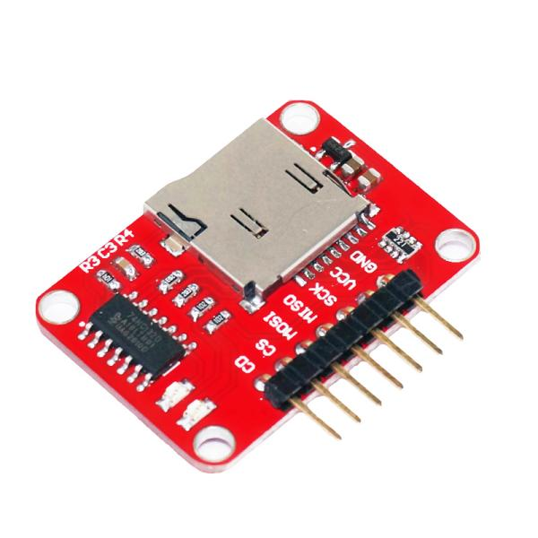
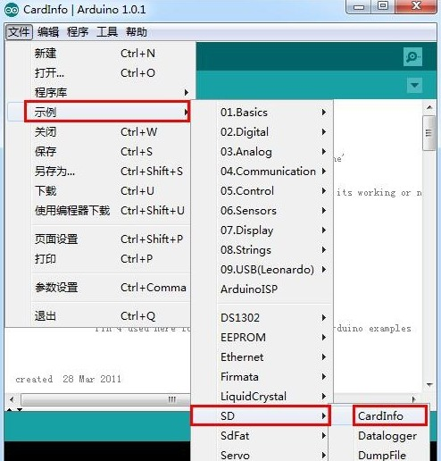
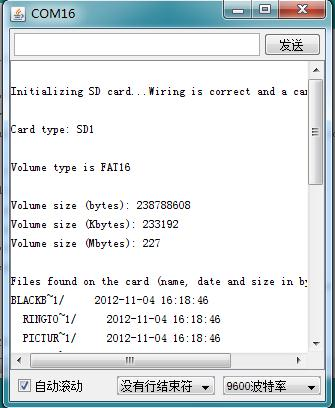

# TF卡读写储存模块

## 概述

本TF卡读写储存模块是互动媒体设备最常用存储模块，采用SPI接口。模块可以通过杜邦线与Arduino传感器扩展板连接，编写相应的程序可以实现各种传感器（如温湿度传感器、光线传感器，GPS 等等）数据记录等功能，通过读卡器将TF卡数据读出，便可轻松加以分析利用，模块并带有两个LED灯以指示TF卡工作状态。

[点我购买](https://item.taobao.com/item.htm?id=538761368823)

## 产品参数

+ 工作电压：3.3V—5V

+ 通信方式：SPI

+ TF卡座形式：自弹出式

+ 尺寸：25X35mm

## 引脚定义

|编号|名称|功能|默认状态|
|:--|:--|:--|:--|
|1|CD|插卡检测|高电平(无卡)/低电平(卡插入)|
|2|CS|TF卡片选|低电平(默认选中)|
|3|MOSI|SPI数据输入口|高电平|
|4|MISO|SPI数据输出口|高电平|
|5|SCK|SPI时钟|低电平|
|6|VCC|电源供电正端|NA|
|7|GND|电源供电负端|NA|

## 指示灯说明

1、当接上电源未插卡时，一个LED常亮，表示模块供电正常。
2、插入卡后常亮的LED开始闪速，表示TF卡已经插入。
3、另一个LED闪烁是表示正在通信。

## 示例代码

## 接线方式

+ CD——用户可用来检测卡是否插入，不使用可不连接(例程中不使用)
+ CS——TF卡片选，例程中需连接到4号脚(在没有使用其他SPI设备时可不连接)
+ MOSI——连接到arduino的MOSI口，在UNO及兼容板上为11号引脚
+ MISO——连接到arduino的MISO口，在UNO及兼容板上为12号引脚
+ SCK——连接到arduino的SCLK口，在UNO及兼容板上为13号引脚
+ VCC——电源供电正端，连接到5V
+ GND——电源供电负端，连接到电源负极，GND

下载成功后打开串口显示TF卡里数据内容：

## 其他文档：
[TF-schematic](http://www.openjumper.cn/wp-content/uploads/2013/02/TF-schematic.pdf)
