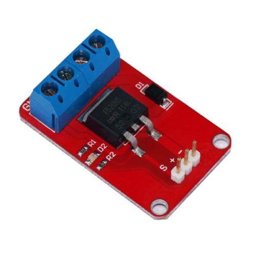

# 场效应管模块（MOS管模块）
## 概述

OJ 场效应模块采用IRF520高功率MOS管，不同于机械继电器，模块可以使用PWM调节输出，控制大电流负载。模块可以连接arduino控制高达24V的直流负载。



[点我购买](https://item.taobao.com/item.htm?id=537533019970)

## 模块参数

+ 尺寸：25mm*35mm

+ 工作电压：5V

+ 输出负载电压：0—24V

+ 最大工作电流：5A

+ 导通电阻：Rds=0.23R@10V,5A

## 模块引脚

+ S:控制信号输入

+ +：5V

+ -：GND

+ VIN：负载电源正极

+ GND：负载电源负极

+ V+：负载正极

+ V-：负载负极

## 示例程序
```C++

 /*OJ MOSFET module
 www.openjumper.cn
 */
 void setup() {                
  pinMode(O1, OUTPUT);     
}

void loop() {
  digitalWrite(O1, HIGH);   // turn the MOSFET on
  delay(1000);              // wait for a second
  digitalWrite(O1, LOW);    // turn the transistor off
  delay(1000);              // wait for a second
}
```

## 相关文档

[mixly程序下载](http://download.openjumper.cn/mixly/mos-module.mix)  

Schematic:[MOSFET](http://www.openjumper.cn/wp-content/uploads/2013/03/MOSFET.pdf)