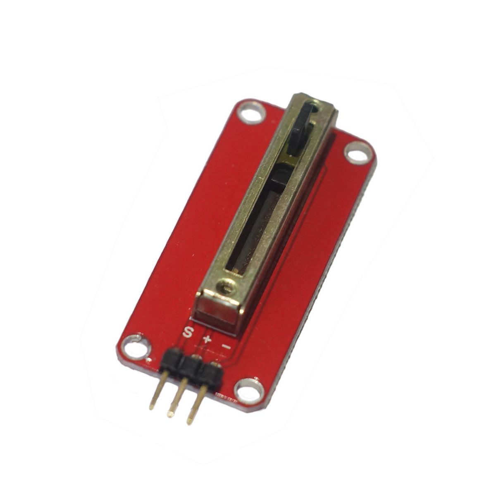

# mini直滑电位器
## 概述

超小直滑电位器，可代替旋钮式电位器，直接位置滑动输出模拟值，结合arduino传感器扩展板，可以轻松做出您的互动作品。



## 产品参数

+ 尺寸：20*45mm

+ 工作电压：3.3~5V

+ 输出信号：模拟信号

+ 阻值：10K

## 引脚定义

+ S ：输出

+ \+ ：VCC

+ – ：GND

## 示例程序
```C++
/*OJ mini linear Potentiometer module
 www.openjumper.cn
 */

 void setup() {
   Serial.begin(9600);
 }
 void loop() {
   int sensorValue = analogRead(A0);
   Serial.println(sensorValue);
   delay(100);
 }
```
## 其他文档

schematic:[Mini-Linear-Potentiometer](http://www.openjumper.cn/wp-content/uploads/2013/07/Mini-Linear-Potentiometer.pdf)