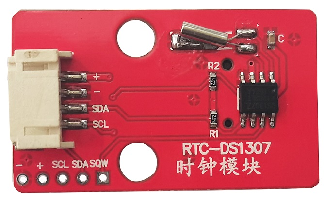
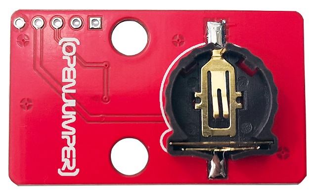
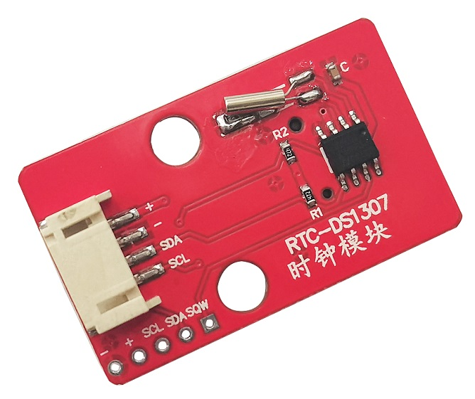

# 时钟模块DS1307

## 概述

OJ时钟模块是基于DS1307实时时钟芯片，DS1307是一款低功耗，具有56字节非失性RAM的全BCD码时钟日历实时时钟芯片，地址和数据通过两线双向的串行总线的传输，芯片可以提供秒，分，小时等信息，每一个月的天数能自动调整。并且有闰年补偿功能。模块集成CR1225纽扣电池，可以在没有外部5V供电的情况下正常持续工作9年以上。模块IIC接口可以与单片机通信，提供一种高性能时钟，常被用于计时场所。

<table border="1">

<tr>
  <td align="center"></td>
  <td align="center"></td>
  <td align="center"></td>
</tr>
<tr>
  <td style="background-color:rgb(232,232,232,0.5) "colspan="3" align="center"> <a href="https://item.taobao.com/item.htm?id=684981321065"><font style="font-size:16px">DS1307时钟模块</font></a> </td>
</tr>
</table>

## 模块参数

+ 工作电压：4.5V ~~5.5V

+ 模块尺寸：25mm*25mm(不含伸出引脚)

+ 通信接口：IIC通信

+ 工作温度：0°C ~~70°C

+ 记年上限：2100年

**其他：** 

   56字节非失性的RAM

   自动掉电检测和切换电路

   在电池备份模式下，功耗小于500nA

## 引脚参数

SQW：方波输出。当SQWE位设为1时,管脚输出可供选择的频率方波(1 Hz, 4 kHz, 8 kHz, 32 kHz).需外接上拉电阻. 

SDA：输入输出数据

SCL：用来同步数据

VCC：电源正极

GND：电源负极

## Arduino示例程序

（下载程序前安装库文件）

**1、设置系统时间：**
```C++
#include <DS1307RTC.h>
#include <Time.h>
#include <Wire.h>

const char *monthName[12] = {
  "Jan", "Feb", "Mar", "Apr", "May", "Jun",
  "Jul", "Aug", "Sep", "Oct", "Nov", "Dec"
};

tmElements_t tm;

void setup() {
  bool parse=false;
  bool config=false;

  // get the date and time the compiler was run
  if (getDate(__DATE__) && getTime(__TIME__)) {
    parse = true;
    // and configure the RTC with this info
    if (RTC.write(tm)) {
      config = true;
    }
  }

  Serial.begin(9600);
  while (!Serial) ; // wait for Arduino Serial Monitor
  delay(200);
  if (parse && config) {
    Serial.print("DS1307 configured Time=");
    Serial.print(__TIME__);
    Serial.print("Date=");
    Serial.println(__DATE__);
  } else if (parse) {
    Serial.println("DS1307 Communication Error :-{");
    Serial.println("Please check your circuitry");
  } else {
    Serial.print("Could not parse info from the compiler, Time=");
    Serial.print(__TIME__);
    Serial.print("Date=");
    Serial.print(__DATE__);
    Serial.println("");
  }
}

void loop() {
}

bool getTime(const char *str)
{
  int Hour, Min, Sec;

  if (sscanf(str, "%d:%d:%d", &Hour, &Min, &Sec) != 3) return false;
  tm.Hour = Hour;
  tm.Minute = Min;
  tm.Second = Sec;
  return true;
}

bool getDate(const char *str)
{
  char Month[12];
  int Day, Year;
  uint8_t monthIndex;

  if (sscanf(str, "%s %d %d", Month, &Day, &Year) != 3) return false;
  for (monthIndex = 0; monthIndex < 12; monthIndex++) {
    if (strcmp(Month, monthName[monthIndex]) == 0) break;
  }
  if (monthIndex >= 12) return false;
  tm.Day = Day;
  tm.Month = monthIndex + 1;
  tm.Year = CalendarYrToTm(Year);
  return true;
}
```
 

**2、读取时间**

```C++
#include <DS1307RTC.h>
#include <Time.h>
#include <Wire.h>

void setup() {
  Serial.begin(9600);
  while (!Serial) ; // wait for serial
  delay(200);
  Serial.println("DS1307RTC Read Test");
  Serial.println("-------------------");
}

void loop() {
  tmElements_t tm;

  if (RTC.read(tm)) {
    Serial.print("Ok, Time = ");
    print2digits(tm.Hour);
    Serial.write(':');
    print2digits(tm.Minute);
    Serial.write(':');
    print2digits(tm.Second);
    Serial.print(", Date (D/M/Y) = ");
    Serial.print(tm.Day);
    Serial.write('/');
    Serial.print(tm.Month);
    Serial.write('/');
    Serial.print(tmYearToCalendar(tm.Year));
    Serial.println();
  } else {
    if (RTC.chipPresent()) {
      Serial.println("The DS1307 is stopped.  Please run the SetTime");
      Serial.println("example to initialize the time and begin running.");
      Serial.println();
    } else {
      Serial.println("DS1307 read error!  Please check the circuitry.");
      Serial.println();
    }
    delay(9000);
  }
  delay(1000);
}

void print2digits(int number) {
  if (number >= 0 && number < 10) {
    Serial.write('0');
  }
  Serial.print(number);
}
```
 

## 其他文档

Schematic:[DS13071](http://www.openjumper.cn/wp-content/uploads/2013/07/DS13071.pdf)

Library: [Time](http://www.openjumper.cn/wp-content/uploads/2013/07/Time.rar) 、[DS1307RTC](http://www.openjumper.cn/wp-content/uploads/2013/07/DS1307RTC.rar)

Datasheet：[DS1307](http://www.openjumper.cn/wp-content/uploads/2013/07/DS1307.pdf)