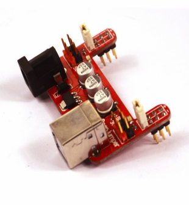

# 面包板电源

## 概述

一般情况下，在使用面包板搭建电路时，电源线路最多且繁杂，使用OJ面包板电源可以有效的为你节约时间。模块可以直接插在面包板电源引脚上给面包板提供配有3.3V和5V电压输出，支持USB或DC2.1接口外部适配器供电。

[点我购买](https://item.taobao.com/item.htm?id=538795440426)

## 模块参数

+ 尺寸：32mm*53mm

+ 输入电压：6~12V（DC口供电）5V（USB口供电）

+ 输出电压：3.3V 、5V

+ 输出电流：500ma

+ 供电接口：USB或DC2.1接口

+ 适用面包板：宽度约为5.3cm的面包板 例如:[Bread board Clear – 165*53mm](http://item.taobao.com/item.htm?spm=a1z10.3.w1017-2403254098.11.Lw21R2&id=17465313117&)