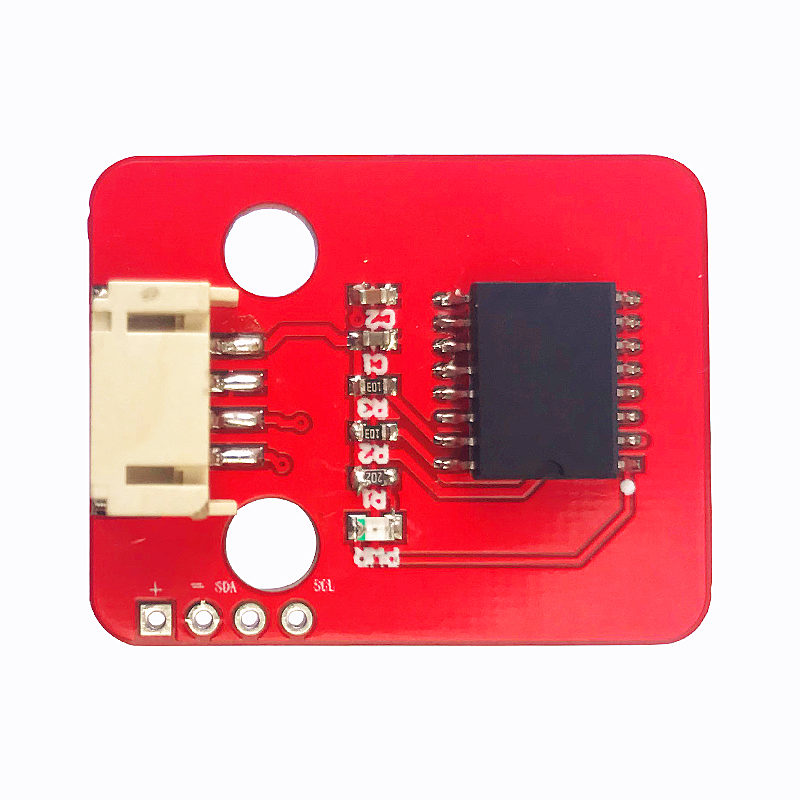
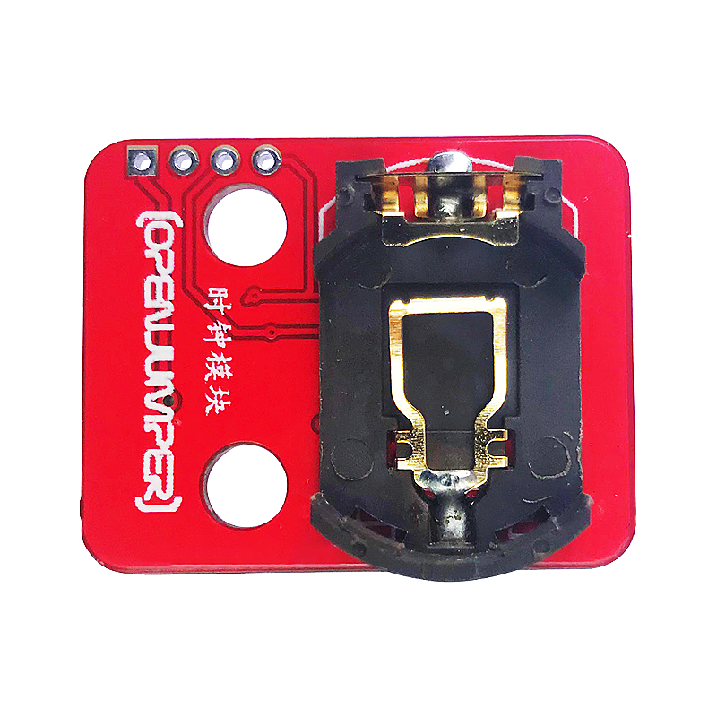
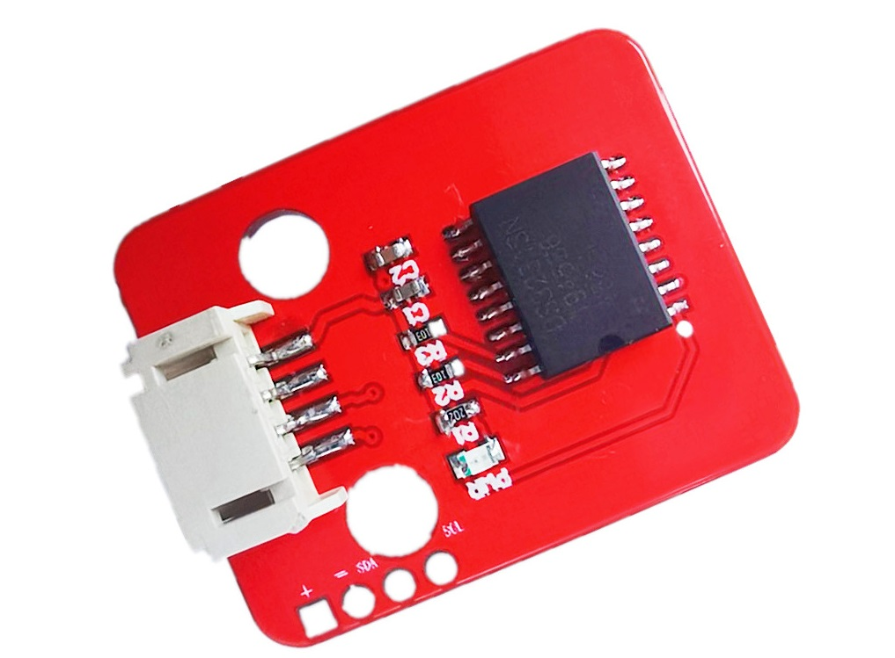
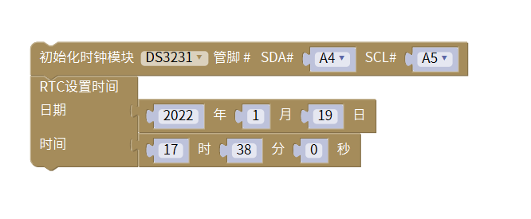
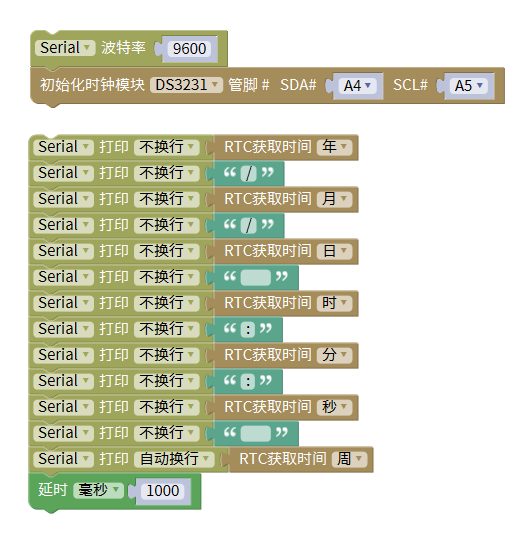

# DS3231高精度时钟模块

## 概述

OJTI3231高精度时钟模块是一款I2C实时时钟（RTC）；具有集成的温补晶体振荡器（TCXO）和晶体，提高了器件的长期精确度；该器件包含电池输入端，断开主电源时仍可保持高精度的计时：模块可提供秒、分、时、星期、日期、月和年信息。少于31天的月份将自动调整月末日期，包括闰年补偿。时钟的工作格式可以是24小时或带AM/PM指示的12小时格式。
<table border="1">

<tr>
  <td align="center"></td>
  <td align="center"></td>
  <td align="center"></td>
</tr>
<tr>
  <td style="background-color:rgb(232,232,232,0.5) "colspan="3" align="center"><a href="https://item.taobao.com/item.htm?id=668820018945"><font style="font-size:16px"> DS3231高精度时钟模块 </font></a> </td>
</tr>
</table>

## 参数

+ 电源电压：3.3V/5V

+ 通讯方式：I2C

+ I2C上拉电阻：有

+ 接口类型：PH2.0防反接4Pin+2.54排针4Pin

+ 板子尺寸：26.4X33.4（单位：mm）

+ 工作温度：0~70°C

+ 时间最大有效期至：2100年

+ 固定孔：乐高积木孔（间隔两个单位）

## 参考程序（图形化）

**设置时间**



**读取时间并输出显示**



## 参考程序（Arduino IDE）

**设置时间**

其中月份由1到12分别是：

Jan,Feb,Mar,Apr,May,Jun,Jul,Aug,Sep,Oct,Nov,Dec
```C++
#include <RtcDS3231.h>
#include <SoftwareWire.h>

SoftwareWire myWire(A4,A5);
RtcDS3231<SoftwareWire> Rtc(myWire);

void setup(){
  Rtc.Begin();
  Rtc.SetIsRunning(true);
}

void loop(){
  Rtc.SetDateTime(RtcDateTime("Jan/19/2022", "17:38:00"));//月/日/年  时:分:秒

}
```

**读取时间并输出显示**
```C++
#include <RtcDS3231.h>
#include <SoftwareWire.h>

SoftwareWire myWire(A4,A5);
RtcDS3231<SoftwareWire> Rtc(myWire);

void setup(){
  Serial.begin(9600);
  Rtc.Begin();
  Rtc.SetIsRunning(true);
}

void loop(){
  Serial.print(Rtc.GetDateTime().Year());
  Serial.print("/");
  Serial.print(Rtc.GetDateTime().Month());
  Serial.print("/");
  Serial.print(Rtc.GetDateTime().Day());
  Serial.print("      ");
  Serial.print(Rtc.GetDateTime().Hour());
  Serial.print(":");
  Serial.print(Rtc.GetDateTime().Minute());
  Serial.print(":");
  Serial.print(Rtc.GetDateTime().Second());
  Serial.print("      ");
  Serial.println(Rtc.GetDateTime().DayOfWeek());
  delay(1000);
}
```
## 驱动库文件

[Rtc_by_Makuna.zip](http://download.openjumper.cn/Rtc_by_Makuna.zip)

[SoftwareWire.zip]( http://download.openjumper.cn/SoftwareWire.zip)

[Wire.zip](http://download.openjumper.cn/Wire.zip)
