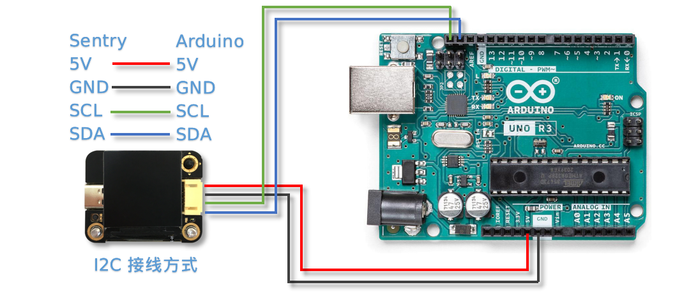
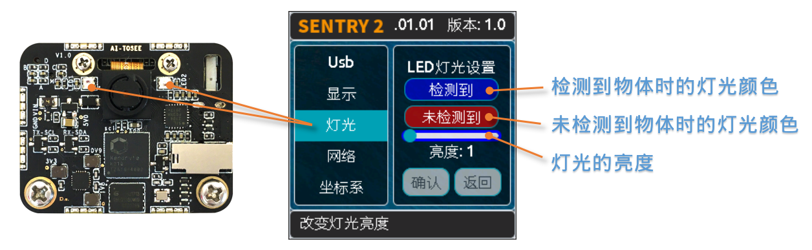

# k210 AI视觉传感器模块

## 产品概述

Sentry2视觉传感器采用先进的64位RISC-V神经网络处理器K210开发设计，集成多种先进的离线视觉处理算法，可以满足基本的视觉处理需求。 板载ESP8285-WiFi芯片，可以直接通过Arduino进行编程开发，实现云端图像识别，无线图传，AIoT物联网等应用。ESP8285可以作为K210的协处理器，无需外接主控也可进行AI编程的学习。


[点我购买](https://item.taobao.com/item.htm?id=671587931446)

## 应用领域
 
智能机器人、智能小车、创意设计、STEAM教育、创客比赛、智能玩具、AIoT物联网、学校课题设计。

## 配置说明
[点击观看视频：“Sentry2视觉传感器-功能介绍”](https://www.bilibili.com/video/BV19v4y1D785/)


+ **LED灯：** 通过灯光不同的颜色可以反映出不同的识别结果，当设置为白光常亮时可以当作补光灯使用

+ **摄像头：** 实时的采集图像数据，Sentry2提供了摄像头设置功能，可以调节图像缩放、白平衡、亮度、饱和度等参数，满足高阶玩家需求

+ **WiFi天线：** 传感器板载ESP8285芯片，具有WiFi无线通信功能，可以实现云端图像识别，无线图传，无联网应用等功能。

+ **K210处理器：** 带有神经网络处理单元，双核64位RISC-V处理器，在MCU级别处理其中具有十分优秀的图像处理能力

+ **SD卡座：** 支持Micro-SD（TF）卡，用于保存图片使用，（注意：有些SD卡并不支持，仅支持SPI通讯方式，不支持SDIO功能）

+ **USB：** 板载USB-UART芯片，可以直接与电脑通信与控制，同时作为固件更新接口， **（注意：USB供电会通过通讯接口对外输出，二者不可同时供电）**

+ **LCD屏幕：** 高清广视角的TFT-ISP彩色屏幕，带来小巧而优秀的图像显示效果，方便于算法调试

+ **摇杆按键：** 可实现“上下左右中”的5个方向的控制，提供简单实用的UI交互

+ **复位按键：** 可实现硬件复位，特殊情况下使用

+ **通讯接口：** 图像处理数据与主控的交互接口，支持UART和I2C方式，可以在UI界面里设置

## 产品规格

|名称|规格|
|:--|:--|
|处理器|K210神经网络处理器|
|摄像头|200万像素|
|供电电压|3.3-5V|
|输出接口|UART/I2C/WIFI/USB|
|操作系统|RTOS|
|物理接口|Type-C;PH2.0 4PIN|
|外壳尺寸|40mm * 32mm*12m m|

## 硬件参数

|项目|单位|参数|备注|
|:--|:--|:--|:--|
|工作电压|V|3.3～5.0|通讯口与USB不可同时供电|
|工作电流|mA|150|5V供电，开启人脸算法时的典型值|
|尺寸|mm|40x32x12.5|不带外壳|
|重量|g|15|不带外壳|
|定位孔间距|mm|32||
|定位孔直径|mm|3||
|摄像头类型|NA|CMOS||
|摄像头分辨率|像素|200W||
|摄像头帧率|fps|25||
|镜头视场角|度°|68||
|屏幕类型|NA|TFT-ISP高清屏||
|屏幕尺寸|英寸|1.3||
|屏幕分辨率|像素|240x240||

## 算法列表
|算法ID|名称|英文名称|简介|消费版|
|:--|:--|:--|:--|:--|
|1|颜色识别|Color|最高可设置25个识别区域，返回每个区域中的颜色信息，如R，G，B值及分类标签|支持|
|2|色块检测|Blob|检测图像中是否有指定的色块，支持黑、白、红、绿、蓝、黄6种色块同时检测|支持|
|3|标签识别|Apriltag|支持16H5，25H9,36H11编码的Apriltag标签，可以同时识别最多25个图案|支持|
|4|线条检测|Line|检测图像中的线条，返回两个端点坐标及倾斜角度，可支持5个线段检测|支持|
|5|深度学习|Learning|对任意物体进行离线训练并进行识别，最高支持10个数据存储与同时检测|支持（15个数据）|
|6|卡片识别|Card|识别特制的卡片图案，包含10张交通卡片，9张形状卡片，10张数字卡片|仅交通卡片|
|7|人脸识别|Face|检测与识别人脸，最高支持10个人脸数据的训练与同时检测|支持（15个数据）|
|8|20类物体|20Class|识别常见的20类物体，如猫、汽车等|支持|
|9|二维码|QrCode|检测与识别简单的二维码|无|
|10|自定义|Custom|支持用户自定义算法，运行在板载ESP8285-WiFi芯片内，如云端识图|支持|
|11|运动物体|Motion|判断图像中是否有移动区域|无|


## 开发平台与驱动库

|开发平台|编程语言|主控设备|驱动库链接|消费版|
|:--|:--|:--|:--|:--|
|Arduino|C/C++|Arduino系列|https://github.com/AITosee/Sentry-Arduino/|支持|
|MakeCode|图形化|Micro:bit|https://github.com/AITosee/pxt-sentry|支持|
|Mind+|图形化，C/C++，MicroPython|Arduino系列、Micro:bit、掌控板|https://github.com/AITosee/ext-sentry|支持|
|Mixly|图形化|Arduino|https://github.com/AITosee/Sentry-Mixly|支持|
|BXY|MicroPython|Micro:bit、掌控板|https://github.com/AITosee/Sentry-microPython/releases|支持|
|ARM PC|C/C++|树莓派，Linux|[Sentry-Arduino-1.2.4_for_linux.zip](https://tosee.readthedocs.io/zh/latest/_downloads/c92863172417cff5eeaa740d9a231537/Sentry-Arduino-1.2.4_for_linux.zip)|支持|


## 使用说明

Sentry2视觉传感器可以通过通讯接口与主控制器相连接，也可以通过USB与电脑连接。通讯接口可以在UI界面中配置为UART串口或I2C模式，还可以修改设备地址和波特率等参数。

[点击观看视频：“Sentry2视觉传感器-Arduino使用指导”](https://www.bilibili.com/video/BV1M24y1k7UB/)

**注意：USB与通讯接口不可以同时供电**

### 连接主控

#### 接口定义


|引脚序号|UART模式|I2C模式|
|:--|:--|:--|
|1|RX|SDA|
|2|TX|SCL|
|3|GND|GND|
|4|VCC|VCC|

**注意：当插入USB时，4号端口可以对外部设备进行供电，4号端口不可直接连接电池，当插入USB时不可接入3.3V系统，需要断开供电引脚。**

#### 接线方式

以Arduino UNO举例说明

**I2C模式**



**软串口模式**


**注意：软串口模式下，Arduino的TX和RX引脚可以自由定义，但需要与程序中的定义保持一致，本例中RX信号为引脚10,TX信号为引脚11**

```c
#include <SoftwareSerial.h>
SoftwareSerial mySerial(10,11); //RX,TX
```

**注意：软串口模式下，波特率一般不高于57600，较低的波特率，稳定性较好**

**UART模式**


**注意：UART模式下，视觉传感器的RX需要接Arduino的TX，传感器的TX接Arduino的RX**

**注意：如果使用软串口，可以指定其他的IO口，详见Arduino中的SoftSerialExample**

**注意：由于Arduino的RX和TX与烧录固件共用端口，因此在烧录程序时，需要断开RX，TX接线，推荐使用I2C或软串口模式**


### UI界面

Sentry2视觉传感器具有2种UI界面：运行界面、设置界面


+ **运行界面**

    + **算法状态:** 此区域用于显示当前正在运行的算法

    + **图像区域:** 显示摄像头的图像

    + **显示元素:** 对被测物体进行标识，包括检测框、坐标、信息

    + **系统状态:** 显示当前帧率和当前图像缩放变焦值

+ **设置界面**

    + **菜单选项:** 上下拨动摇杆来选择不同的菜单，垂直短按摇杆可以进入相应的设置页面

    + **版本信息:** 此处可以查看固件版本号和固件发布日期

    + **简介说明:** 对当前菜单进行介绍说明

    + **控件按钮:** 各种交互按键，用于进行设置操作，不同菜单下的控件是不同的，当导航键移动到某个控件上时会进行高亮显示或蓝边显示

    + **操作提示:** 当摇杆悬停到不同的控件上时，会显示相应的介绍信息或操作说明，相当于说明书的作用

#### UI设置界面


运行界面往右拨动摇杆可以进入UI设置界面，UI设置共有三个页面：算法设置、摄像头设置、硬件设置

依次往左拨动摇杆则会逐次退出页面，直至返回运行界面

**算法设置:** 可以开启或关闭算法，配置算法参数

**摄像头设置:** 用于调整摄像头的参数，可以对图像进行缩放、白平衡、饱和度、亮度、对比度等参数进行精细调节，需要具备一定的摄像头调参基础，适用于高阶玩家

**硬件设置:** 用于配置通讯方式、波特率、设备地址、灯光颜色、语言等参数，以适配不同的使用模式

### 硬件设置

#### 摇杆按键功能定义

上电开机后便可以通过摇杆对视觉传感器进行操作，传感器采用5向导航摇杆，操作定义如下表所示：

[点击观看视频：“Sentry2视觉传感器-按键操作指南”](https://www.bilibili.com/video/BV178411h7A6/)

|当前模式|操作方式|动作含义|
|:--|:--|:--|
|运行模式|向上拨动|切换上个算法|
|运行模式|向下拨动|切换下个算法|
|运行模式|向左拨动|拍照（当插入SD时）|
|运行模式|向右拨动|进入GUI设置模式|
|运行模式|垂直短按|保存当前模型（部分算法有效）|
|运行模式|向上长按|放大镜头焦距Zoom|
|运行模式|向下长按|缩小镜头焦距Zoom|
|运行模式|向左长按|关闭/开启屏幕|
|运行模式|垂直长按|删除所有保存的模型（部分算法有效）|
|...|||
|设置模式|向上拨动|切换上一个菜单或控件|
|设置模式|向下拨动|切换下一个菜单或控件|
|设置模式|向左拨动|切换上一个设置界面/返回运行模式|
|设置模式|向右拨动|切换下一个设置界面|
|设置模式|垂直短按|进入控件进行参数设置|
|...|||
|开机时|向上长按10秒|重置传感器|
|开机时|垂直长按|进入K210固件烧录模式|
|开机时|向下长按|进入ESP8285固件烧录模式|

    提示：拨动即为短按，长按需要至少为2秒以上的保持时间后再松开

#### 设置通讯方式

用于设置视觉传感器与主控的通讯方式，设置后会自动保存，下次开机后不必再次设置，但当通讯异常时，需要检查这些参数是否被改变，有时固件更新后或调用了某些复位寄存器后会改变这些设置，此时需要重新设置

[点击观看视频：“Sentry2视觉传感器-通讯模式设置”](https://www.bilibili.com/video/BV1Ve4y1m7D2/)


1.在运行界面往右拨动3次摇杆，进入硬件设置界面

2.在“输出模式”选项上，压按摇杆进入设置

3.选择”UART“或”I2C“模式，一般来说，如果主控的UART端口无法支持高波特率，那么I2C的读取速度会更快，有利于提高图像处理帧率

4.如果使用“UART模式”，那么还需要选择“标准指令”协议或“简单指令“协议，标准指令需要配合寄存器和驱动库进行开发，而简单指令只需要通过串口发送字符即可，具体区别可以查看相关章节介绍

5.点击”确认“返回到菜单栏

6.往下拨动摇杆，切换到”设备地址“菜单

7.查看设备地址,此地址应与主控代码中的保持一致,压按摇杆可以进入设置，地址可设置为”0x60～0x63“， 点击”确认“并返回

8.如果选择”UART模式“，则还需要往下拨动摇杆，切换到”串口波特率“菜单

9.压按摇杆进入设置，左右拨动摇杆来设置波特率，支持“9600、19200、38400、57600、115200、921600、1152000、2000000”波特率，较高的波特率将有利于图像识别帧率的提升，不同的主控可支持的最高波特率有所差异，需要查看主控的相关说明，当通讯异常时，可尝试降低波特率，默认为9600

10.往左拨动3次摇杆，返回至运行界面

#### 设置USB串口波特率

Sentry2板载一个USB-UART端口，可以实现与电脑的交互通讯，其波特率可单独设置，数据通信方式基于“标准协议指令”或“简单协议指令”。


**波特率：** 支持“9600、19200、38400、57600、115200、921600、1152000、2000000”波特率，当控件位于最左侧时可以关闭usb功能

**至UART：** 开启或关闭USB与UART的数据透传功能，开启后，可以实现USB口与UART口的数据互相传输

*提示：如果发送的数据属于“协议格式”中的指令，则会执行相应的指令而不会被转发透传*


#### 设置运行界面显示元素

进行图像识别时，为了便于观察检测结果，需要对识别结果进行标识，Sentry2定义了3种标识元素：识别框、坐标、信息


**识别框:** 显示被测物体的轮廓范围，为一个矩形的方框，其大小为物体的宽和高，位置由物体的中心坐标来确定

**坐标:** 在图像中绘制出被测物体的水平和垂直坐标线，并显示其数值，X：水平位置，Y：垂直位置，W：物体宽度，H：物体高度

**信息:** 显示物体的分类标签、名称内容等信息

    提示：当进行多结果检测时，绘制太多的元素可能会降低图像检测帧率，可适当关闭部分元素绘制功能

    提示：有些算法并不具备所有的绘制元素，比如“线条检测”不会绘制坐标线

    提示：当图像中没有显示任何检测结果时，可能是显示功能全部被关闭了，需要打开相关的功能即可

#### 设置LED灯光颜色

进行图像识别时，可以通过传感器前面的LED灯光来指示检测结果，每检测一帧图像，会闪烁一次灯光，灯光颜色和亮度可以进行自定义设置



用户可以分别设置“检测到”物体时的灯光颜色和“未检测到”时的灯光颜色，每按一次控件，将会改变一个颜色，切换顺序如下：


其中，黑色代表关闭灯光

当“检测到”和“未检测到”颜色相同时，LED灯光将保持常亮，不再闪烁

亮度调节范围为0～15,其中0为关闭灯光，15为最亮，如果只作为一般性指示功能，亮度设为1或2即可

+ **关闭灯光**

     在某些情况下，灯光可能会对图像识别产生干扰（如颜色类算法，近距离物体识别时，等），此时需要关闭灯光，有两种方式可以关闭的灯光：

     &ensp; &ensp;1.将“检测到”和“未检测到”设置为黑色

     &ensp; &ensp;2.将亮度设置为0

+ **补光灯功能**

   当环境较暗时，或者处于逆光环境情况下，需要开启补光灯来照明，可以按照下面的方式设置：

     &ensp; &ensp;1.将“检测到”和“未检测到”都设为白色，此时LED灯光将保持白色常亮状态，不再闪烁

     &ensp; &ensp;2.将亮度提高，比如设为最大15,此时发光最亮

#### 设置WiFi功能

Sentry2板载ESP8285-WiFi芯片，与K210主芯片之间通过UART实现数据通信，当开启“自定义算法”时，会启用ESP8285芯片，启用后功耗会有所增加


**波特率：** 支持“9600、74880、115200、921600、1152000、2000000、3000000、4000000”波特率，当控件位于最左侧时可以关闭wifi功能

**至UART：** 开启或关闭WiFi芯片与UART端口的数据透传功能，开启后，可以实现WiFi芯片与UART口的数据互相传输，可以用于WiFi芯片与主控的数据通信

**至USB：** 开启或关闭WiFi芯片与USB端口的数据透传功能，开启后，可以实现WiFi芯片与USB口的数据互相传输，可以用于WiFi芯片调试日志输出

*提示：如果发送的数据属于“协议格式”中的指令，则会执行相应的指令而不会被转发透传*


#### 设置坐标系

Sentry2支持2种坐标系：绝对值坐标系、百分比坐标系


**绝对值坐标系：** 返回图像中的实际坐标数据，与图像分辨率一致，水平方向范围“0～319”，垂直方向范围“0～239”，图像中心点坐标为（160,120），该模式具有更高的精确度。

**百分比坐标系：** 将实际检测到的坐标结果量化至整幅图像“0～100”的范围区间内，返回其相对值坐标，水平X方向和垂直Y方向范围“0～100”，图像中心点坐标为（50,50）。

#### 设置系统语言

Sentry2支持2种系统语言：英语、简体中文。当系统语言发生变化时，可以通过该选项进行切换，设置后需要重启设备以完全生效。


**注意：** 选择简体中文时，并非所有文本都以汉字显示，例如所训练的人脸模型名称、深度学习训练的模型名称、二维码识别的字符等，暂时不支持中文显示。

#### 设置寄存器

可以设置Sentry内部寄存器的一些操作：自动保存，保存当前值，恢复默认值


**自动保存：** 开启后，当某些寄存器发生改变时会自动存储至Flash里，如算法参数、镜头参数等，关机后下次开机依然有效。关闭后，改变的值不会自动保存在Flash里，下次开机后自动复位，默认为关闭状态。

**保存当前值：** 可以手动保存当前的所有寄存器的设置参数

**恢复默认值：** 恢复寄存器为出厂状态。先点击此按键，再点击“确认”后才生效


### 摄像头设置

#### 数码变焦

+ 当需要看清远处的物体时，可以对图像进行放大或缩小，支持1～5档调节

+ 增大缩放值会让物体放大，但视野会变小，看到的东西会变少

+ 减小缩放值会让物体缩小，但视野会变大，可以看到更多的东西

+ 除了UI控件可以设置缩放值外，还支持导航快捷键来设置

+ 向上长按：放大

+ 向下长按：缩小

#### 白平衡

在不同光照下（白光和黄光），白色会有一定的偏差，从而导致其他颜色的正常显示，此时需要设置白平衡来进行调节，一共有4种模式：自动、锁定、白光、黄光

**自动：** 此为默认模式，适用于通用场景

**锁定：** 当图像中存在大面积单色背景时，比如近距离识别颜色时，会导致图像发生偏色问题，将导致颜色识别出错，因此在识别之前需要进行白平衡的锁定，避免颜色自动调节，方法如下：

&ensp; &ensp; &ensp; &ensp;1.在相同的灯光环境下，将摄像头面向白纸，保持约20cm的距离；

&ensp; &ensp; &ensp; &ensp;2.进入“白平衡”设置页面，选择“锁定”模式；

&ensp; &ensp; &ensp; &ensp;3.点击“确认”，此时摄像头会记录下当前参数值，不再自动调整；

&ensp; &ensp; &ensp; &ensp;4.返回运行界面

**白光：** 白色灯光环境下使用

**黄光：** 黄色灯光环境下使用

#### 饱和度

增大饱和度会让色彩变得鲜艳，色彩会被强化与突出，进行颜色检测和识别时，可以适当增大饱和度

减小饱和度会让色彩变得黯淡，很低时则类似于黑白画面

#### 亮度

图像过暗时可以适当提高亮度，但如果在较亮的环境下提高，则图像会变得灰白，如蒙了一层雾气一般

当面对电脑屏幕等光源时，可以适当减小亮度

#### 对比度

增大对比度会让相邻有色差的地方区分度更高，当进行黑白线条或二维码图案识别时，可以适当提高对比度

减小对比度会让图像看起来黯淡

#### 锐化

增大锐化会让边缘轮廓更清晰，细节更明显，但过高会产生噪点

减小锐化图像会变得模糊

#### 曝光

光线较强导致图像曝光时可以减小曝光值

反之如果环境较暗则可以增大曝光值

#### 旋转镜头

开启后镜头画面将旋转180度

### 开启算法

有多种方式可以开启/关闭算法：UI界面方式，导航键方式，指令方式

#### 通过UI界面开启算法


1.进入“算法设置”页面，在左侧菜单栏选择要运行的算法，点击进入

2.有些算法具有参数配置功能，可以点击“参数设置”控件进入详情页，对该算法进行参数调整，当导航悬停在某个控件上时，UI界面下方的滚动条会显示操作提示，设置结束后，点击“确认”或“对勾”返回

3.如果右侧控件区域左下方显示”红色停止”按钮，则代表该算法目前为关闭状态，点击后变为“绿色运行“按钮，则代表开启算法，再次点击又会变为”红色停止“

**注意：** 有些算法参数配置后下次启动算法时才生效

### 通过导航键开启算法


&emsp;&emsp;  1.通过上下拨动导航键可以快速的切换算法，每次切换算法后，都会关闭之前的算法

&emsp;&emsp;  2.算法切换顺序按照算法ID排序

#### 通过指令开启算法

该方式需要由主控设备读写寄存器来实现算法的开启或关闭，我们在多个编程平台提供了封装好的驱动库给用户使用

串口模式需要依照“标准协议指令”或“简单协议指令”来读写控制，详见相关章节介绍

I2C模式可直接读写寄存器

算法开启流程如下：

&emsp;&emsp;1.向寄存器 0x20-VISION_ID 写入要开启的算法ID号

&emsp;&emsp;2.向寄存器 0x21-VISIO_CONF1 中写入0x01,即可开启算法，写入0x00则关闭算法

详细设置，请查询寄存器列表

### 检测结果

#### 通过屏幕查看检测结果

当图像检测到目标物体后，会在屏幕中进行标识，各标识含义如下所示


#### 通过指令读取检测结果

该方式需要由主控设备读写寄存器来读取结果，我们在多个编程平台提供了封装好的驱动库给用户使用

串口模式需要依照“标准协议指令”或“简单协议指令”来读写控制，详见相关章节介绍

I2C模式可直接读写寄存器

识别结果读取流程如下：

&emsp;&emsp;1.向寄存器 0x20-VISION_ID 写入要读取的算法ID号

&emsp;&emsp;2.读取寄存器 0x34-RESULT_NUM 的值来获取当前检测到了几个目标物体，例如，返回2,则表明检测到了2个物体

&emsp;&emsp;3.向寄存器 0x24-RESULT_ID 写入待读取的结果编号，例如，写入1代表读取第1组结果，写入2代表读取第2个组果

&emsp;&emsp;4.读取寄存器 0x80~0x89 的值来获取检测结果

|地址|名称|含义|
|:--|:--|:--|
|0x80|RESULT_DATA1_H8|检测结果1,高8位|
|0x81|RESULT_DATA1_L8|检测结果1,低8位|
|0x82|RESULT_DATA2_H8|检测结果2,高8位|
|0x83|RESULT_DATA2_L8|检测结果2,低8位|
|0x84|RESULT_DATA3_H8|检测结果3,高8位|
|0x85|RESULT_DATA3_L8|检测结果3,低8位|
|0x86|RESULT_DATA4_H8|检测结果4,高8位|
|0x87|RESULT_DATA4_L8|检测结果4,低8位|
|0x88|RESULT_DATA5_H8|检测结果5,高8位|
|0x89|RESULT_DATA5_L8|检测结果5,低8位|

详细设置，请查询寄存器列表

## 标准协议指令

在串口模式下，主控与Sentry2的数据交互需要通过协议来进行，标准协议指令具有规范的数据格式，结合寄存器表可以实现完整的数据交互功能和较高的通信效率。

### 指令格式

|符号|含义|长度|描述|
|:--|:--|:--|:--|
|START|帧头|1Byte|表示一个数据包的开始，始终为0xFF|
|LEN|长度|1Byte|数据包的总长度（字节），包含帧头和帧尾|
|ADDR|地址|1Byte|设备物理地址|
|CMD|指令|1Byte|指令代码，详见指令列表|
|DATA|数据|(LEN-6)Byte|数据内容，详见指令列表|
|CHKSUM|校验|1Byte|从帧头（含）到DATA数据的所有字节累加求和，进位丢弃|
|END|帧尾|1Byte|表示一个数据包的结束，始终为0xED|

### 数据交互方式

串口模式下采用应答机制，传感器的数据交互完全由主控设备控制，传感器不会主动向主控发送数据。数据交互时，由主控设备先发送指令帧，然后传感器将会返回一个或多个应答帧，完成一次数据交互。

### 指令介绍

|指令代码|名称|描述
|:--|:--|:--|
|0x01|SetRegister|设置寄存器|
|0x02|GetRegister|读取寄存器|
|0x20|SetParam|设置算法参数|
|0x21|SetParamGroup|按组设置算法参数|
|0x22|GetResultv读取算法结果|
|0x23|GetResultGroup|按组读取算法结果|
|0x24|SetResult|设置算法结果|
|0x25|SetResultGroup|按组设置算法结果|

+ **Param Group 参数组**

  一组参数可以表示一个作用区域，每组参数最多可包含5个参数值，不同的算法对这5个参数值的含义可能是不同的。

  仅有部分算法具有参数设置功能，有的算法还可以设置多组参数，每组参数由Param ID进行标记。

  比如颜色识别算法，要设置25个检测区域，则需要写入25组参数

+ **Param Value 参数值**

  每组参数可以由5个参数值来描述，不同算法的参数值的含义并不相同，详见下表

  |算法|Param Value1|Param Value2|Param Value3|Param Value4|Param Value5|
  |:--|:--|:--|:--|:--|:--|
  |颜色识别|检测区域中心点x坐标|检测区域中心点y坐标|检测区域宽度w|检测区域高度h|无
  |色块检测|无|无|最小色块宽度w|最小色块高度h|待检测的颜色分类标签|
  |深度学习|无|无|无|无|0=删除该ID数据，100=训练该ID数据|
  |人脸识别|无|无|无|无|0=删除该ID数据，100=训练该ID数据|

+ **Result Group 结果组**

    一组数据表示一个检测结果，每组结果包含5个数据，但不同的算法对这5个数据的含义可能是不同的，部分算法可以返回多个结果，每组检测结果由ResultID进行标记。

+ **Result Data 结果数据**

  |算法 |Result Data1|Result Data1|Result Data3|Result Data4|Result Data5|备注|
  |:--|:--|:--|:--|:--|:--|:--|
  |颜色识别|R红色值|G绿色值|B蓝色值|无|颜色分类标签||
  |色块检测|中心x坐标|中心y坐标|宽度w|高度h|颜色分类标签||
  |线条检测|起点x坐标|起点y坐标|终点x坐标|终点y坐标|无||
  |标签识别|中心x坐标|中心y坐标|宽度w|高度h|分类标签||
  |深度学习|固定中心x坐标|固定中心y坐标|固定宽度w|固定高度h|分类标签|分类标签需要先进行训练|

  |卡片识别|中心x坐标|中心y坐标|宽度w|高度h|分类标签||
  |人脸识别|中心x坐标|中心y坐标|宽度w|高度h|分类标签|分类标签需要先进行训练|
  |20类物体识别|中心x坐标|中心y坐标|宽度w|高度h|分类标签||
  |二维码识别|中心x坐标|中心y坐标|宽度w|高度h|字符数量|后续结果组为字符数据|
  |移动物体检测|中心x坐标|中心y坐标|宽度w|高度h|无||
  |自定义算法|自定义含义|自定义含义|自定义含义|自定义含义|自定义含义||

+ **0x01-SetRegister**

  描述:设置寄存器，每次只可设置一个寄存器（一个字节）

  指令帧CMD：0x01

  |Byte1|Byte2|Byte3|Byte4|Byte5|Byte6|Byte7|
  |:--|:--|:--|:--|:--|:--|:--|
  |寄存器地址|待写入数据|

   应答帧CMD：0xE0

  Byte1|Byte2|Byte3|Byte4|Byte5|Byte6|Byte7|
  |:--|:--|:--|:--|:--|:--|:--|
  |0x01|已写入数据

+ **0x02-GetRegister**

  描述:读取寄存器，每次只可读取一个寄存器（一个字节）

  指令帧CMD：0x02

  |Byte1|Byte2|Byte3|Byte4|Byte5|Byte6|Byte7|
  |:--|:--|:--|:--|:--|:--|:--|
  |寄存器地址|

  应答帧CMD：0xE0
  
  |Byte1|Byte2|Byte3|Byte4|Byte5|Byte6|Byte7|
  |:--|:--|:--|:--|:--|:--|:--|
  |0x02|读取的数据|

+ **0x20-SetParam**

  描述:设置指定算法同一类型的参数值，可以同时设置多个数据，比如单独设置颜色识别算法10个检测区域的x坐标

  指令帧-0x20

  |Byte1|Byte2|Byte3|Byte4|Byte5|Byte6|Bytes|
  |:--|:--|:--|:--|:--|:--|:--|
  |算法ID|参数类型|起始ParamID1|结束ParamIDn|参数1|参数2|参数n|

  应答帧CMD：0xE0

  |Byte1|Byte2|Byte3|Byte4|Byte5|Byte6|Byte7|
  |:--|:--|:--|:--|:--|:--|:--|
  |0x20|算法ID|

+ **0x21-SetParamGroup**

  描述:设置指定算法的参数组数据，每个参数组包含5个数据项，比如同时设置颜色识别算法的5个检测区域x，y，w，h信息

  指令帧CMD：0x21
  |Byte1|Byte2|Byte3|Byte4|Bytes|Bytes|Bytes|
  |:--|:--|:--|:--|:--|:--|:--|
  |算法ID|起始ParamID1|结束ParamIDn|参数组1|参数组2|参数组n||

  应答帧CMD：0xE0

  |Byte1|Byte2|Byte3|Byte4|Byte5|Byte6|Byte7|
  |:--|:--|:--|:--|:--|:--|:--|
  |0x21|算法ID|

+ **0x22-GetResult**

  描述:获取指定算法算法的某一类型的检测结果，比如只获取颜色识别的标签数据，而不关心xy坐标

  指令帧CMD：0x22

  |Byte1|Byte2|Byte3|Byte4|Byte5|Byte6|Byte7|
  |:--|:--|:--|:--|:--|:--|:--|
  |算法ID|数据类型|起始ResultID|结束ResultID|

  因为每个数据帧的最大长度只有255个字节，当检测结果帧数据长度超过此值时，将会产生多个数据帧，当CMD为0xEC时表示中间帧，为0xE0时表示结束帧

  应答帧CMD：0xEC或0xE0
  |Byte1|Byte2|Byte3|Byte4|Byte5|Byte6|Bytes|
  |:--|:--|:--|:--|:--|:--|:--|
  |0x22|图像帧号|算法ID|数据类型|起始ResultID1|结束ResultIDn|结果数据|

+ **0x23-GetResultGroup**

  描述:获取指定算法每组的检测结果，一组检测结果包含5个数据项，比如同时获取颜色识别算法的5个区域的RGB值和分类标签值

  指令帧CMD：0x23

  |Byte1|Byte2|Byte3|Byte4|Byte5|Byte6|Bytes|
  |:--|:--|:--|:--|:--|:--|:--|
  |算法ID||起始ResultID|结束ResultID|||

  因为每个数据帧的最大长度只有255个字节，当检测结果帧数据长度超过此值时，将会产生多个数据帧，当CMD为0xEC时表示中间帧，为0xE0时表示结束帧

  应答帧CMD：0xEC或0xE0
  |Byte1|Byte2|Byte3|Byte4|Byte5|Byte6|Bytes|
  |:--|:--|:--|:--|:--|:--|:--|
  |0x23|图像帧号|算法ID|起始ResultID1|结束ResultIDn|结果组1|结果组n|

+ **0x24-SetResult**

  描述:设置指定算法算法的某一类型的检测结果，用于将WiFi芯片中自定义算法的结果写入K210寄存器中，以便主控读取

  指令帧CMD：0x24
  |Byte1|Byte2|Byte3|Byte4|Byte5|Byte6|Byte7|
  |:--|:--|:--|:--|:--|:--|:--|
  |算法ID|数据类型|起始ResultID|结束ResultID|||

  应答帧CMD：0xE0
  |Byte1|Byte2|Byte3|Byte4|Byte5|Byte6|Byte7|
  |:--|:--|:--|:--|:--|:--|:--|
  |0x24|算法ID|

+ **0x25-SetResultGroup**

  描述:设置指定算法每组的检测结果，一组检测结果包含5个数据项，用于将WiFi芯片中自定义算法的结果写入K210寄存器中，以便主控读取

  指令帧CMD：0x25

  |Byte1|Byte2|Byte3|Byte4|Byte5|Bytes|Bytes|
  |:--|:--|:--|:--|:--|:--|:--|
  |算法ID||起始ResultID|结束ResultID|||


  应答帧CMD：0xE0
  |Byte1|Byte2|Byte3|Byte4|Byte5|Byte6|Bytes|
  |:--|:--|:--|:--|:--|:--|:--|
  |0x25|算法ID|||

## 简单协议指令

该指令没有复杂的协议规范，只需要通过串口发送简单的字母和数字就可以开启算法和获取数据，无需开发驱动库，适用于任何有UART功能的主控平台，但也只适合简单的应用场景

### 格式

|符号|含义|长度|描述|
|:--|:--|:--|:--|
|CMD|指令字符|1|指令字符，详见指令列表|
|ID|ID数字编号|1|ID编号，可以为算法编号或结果编号|

### 指令列表

|操作|指令字符|ID数字编号|返回|举例|
|:--|:--|:--|:--|:--|
|开启算法|O 或 o|算法编号|1：成功， 0：失败|O7开启人脸识别|
|关闭算法|C 或 c|算法编号|1：成功， 0：失败|C7关闭人脸识别|
|查询检测结果数量|N 或 n|算法编号|检测到物体的数量，0为未检测到|N7返回人脸数量|
|获取水平x坐标|X 或 x|检测结果的编号，可省略，默认为1|物体的水平坐标值，0～319范围|X1返回第1个人脸x坐标|
|获取垂直y坐标|Y 或 y|检测结果的编号，可省略，默认为1|物体的垂直坐标值，0～239范围|Y3返回第3个人脸y坐标|
|获取物体w宽度|W 或 w|检测结果的编号，可省略，默认为1|物体的宽度值，0～319范围|W返回第1个人脸宽度|
|获取物体h高度|H 或 h|检测结果的编号，可省略，默认为1|物体的高度值，0～239范围|H返回第1个人脸高度|
|获取物体分类标签|L 或 l|检测结果的编号，可省略，默认为1|物体的分类标签|L2返回第2个人脸的分类标签|

## 图像传输协议

Sentry2支持图像传输功能，可以将图片发送给WiFi芯片，UART端口或USB端口，支持RGB565，JPEG，JPEG-Base64格式。

### 指令格式

|符号|含义|长度|描述|
|:--|:--|:--|:--|
|START|帧头|1Byte|表示一个数据包的开始，始终为0xF0|
|TYPE|图像格式|1Byte|2=RGB565,4=JPEG，5=JPEG-Base64|
|WIDTH|图像宽度|2Bytes|图像的宽度|
|HEIGHT|图像高度|2Bytes|图像的高度|
|LEN|数据长度|4Bytes|图像数据长度|
|DATA|图像数据|LEN|图像数据|


RGB565：图像原始采样数据，采用2个字节表示一个像素点，数据较大，一副320×240的图片需要153600字节

JPEG：一种常见的图像压缩格式，可以将RGB565图片压缩至10～30KB，压缩率的大小取决于图片的颜色丰富度，颜色较少则压缩率高

JPEG-Base64：是将JPEG图片按照Base64规则进行编码，将十六进制HEX数据转为文本字符，便于网络传输和解析，通常用于云端图像识别


## 算法详解

### 颜色识别-Color

+ 算法简介

  用户指定一个或多个识别区域，识别该区域的颜色分类。每个检测位置称为一个识别区域，其位置和大小由用户进行设置，最多25组识别区域，返回该区域的颜色标签信息和实际的红R、绿G、蓝B数值。


+ 颜色分类标签

   Sentry2定义了7种颜色分类标签：


|分类标签|英文标识|中文含义|分类标签|英文标识|中文含义|
|:--|:--|:--|:--|:--|:--|
|1|Black|黑色|2|White|白色|
|3|Red|红色|4|Green|绿色|
|5|Blue|蓝色|6|Yellow|黄色|
|0|Unknown|未知|

**注意：** 由于紫色、青色（蓝绿色）、橙色、灰色等，相对来说容易造成误报，因此这几个颜色部分区间被划分为临近颜色的标签，部分被划分为未知颜色，如果用户确实有这几种颜色的使用需求，可以通过返回参数的R、G、B实际值自行计算与判断

+ 配置参数

  用户需要指定识别区域的坐标和大小，最多可设置25个识别区域，如果没有指定，则默认为图像中心点

  当通过主控设置寄存器参数时，每个识别区域都需要设置以下参数：

|参数|含义|
|:--|:--|
|1|识别区域中心x坐标|
|2|识别区域中心y坐标|
|3|识别区域宽度w|
|4|识别区域高度h|
|5|无|


在UI设置页面中，有几种预置的识别区域网格分布形式和识别区域大小：

网格（水平方向数量 x 垂直方向数量）：1x1、2x2、3x3、4x4、5x5、1x10、2x10、6x1、6x2

识别区域大小（水平方向像素 x 垂直方向像素）：2x2、4x4、8x8、16x16、32x32

**注意：** 百分比坐标系下想表示一个正方形，其宽w和高h是不相等的，而是符合3：4的关系。比如，如果正方形的宽w为12%,那么其对应的高度h应该为12/3×4=16%

百分比坐标系下，预设的识别区域大小（水平方向百分比 x 垂直方向百分比）：1x1、2x3、3x4、6x8、9x12

+ 返回结果


识别到颜色后，UI界面上的识别区域将会变为其对应颜色的方框，如果是未知颜色，则会显示一个四角框

当通过主控读取寄存器时，将会返回以下的数据：

|结果|含义|
|:--|:--|
|1|R，红色值，范围 0～255|
|2|G，绿色值，范围 0～255|
|3|B，蓝色值，范围 0～255|
|4|无|
|5|颜色分类标签|

+ 使用技巧

  + 由于是对像素进行统计处理，当识别区域较多且较大时，处理速度会相应的变慢，反之则会比较快速。

  + 当识别区域窗口较小时（比如2x2），可以识别较小的色块，处理速度快，但统计样本太少，容易被干扰，可信度较低，适合于背景单一可控的环境。

  + 当识别区域窗口较大时（比如32x32），统计样本多，即便出现若干的杂色也会被滤除，具有较高的可信度，但处理速度会变慢，当识别区域处于2种颜色的边界时，颜色可能会经常跳变。

  + 当画面存在偏色时，需要锁定白平衡功能

### 色块检测-Blob

+ 算法简介

  用户指定检测一个或多个颜色，判断图像中是否有该颜色的色块，返回其坐标和大小，支持多颜色多色块检测，颜色分类标签与颜色识别中的定义相同。


+ 配置参数

  用户需要指定待检测的颜色标签，最多可同时开启全部6种颜色检测，但速度会有所下降。用户还可以通过设置色块的最小宽度w和高度h来过滤那些小于该值的色块，以减少误报。

当通过主控设置寄存器时，有以下参数需要设置：

|参数|含义|
|:--|:--|
|1|无|
|2|无|
|3|有效色块最小宽度w|
|4|有效色块最小高度h|
|5|待检测的颜色分类标签|


**在UI界面中，有几种预置的参数可以使用：**

**算法性能：**

根据不同的应用需求来选择合适能算法性能，有3个选项可以设置，分别为“灵敏”、“均衡”、“准确”

在灵敏模式下识别速度快，帧率高。准确模式下可以检测远处的色块，但速度会降低。默认为均衡性能

**同时检测的最大数量：**

单个颜色的最大检测数量支持1～5个的输出

当设置为1时，只返回一个最优结果，如果图像中有多个色块，则返回最大的那个，如果大小相近，则优先返回左上角的那个

当设置大于1时，返回色块的数量不会超过这个值。

**最小色块的区域大小：**

如果背景中存在相同颜色的小色块，可以通过合理的设置最小值实现过滤功能

绝对值坐标系下的预设值为：2x2、4x4、8x8、16x16、32x32、64x64、128x128像素

百分比坐标系下的预设值为：1x1、2x3、3x4、6x8、9x12、21x28、42x56 %

**待检测的颜色：**

以按键形式提供用户选择，开启某个颜色后会显示一个小眼睛图标，未开启的颜色则会显示一个带斜杠的眼睛图标，可以同时开启一个或多种颜色

+ 返回结果


识别到指定色块后会在UI界面上进行标识，显示其位置、大小、分类标签、名称等信息

当通过主控读取寄存器时，将会返回以下的数据：

|结果|含义|
|:--|:--|
|1|色块中心x坐标|
|2|色块中心y坐标|
|3|色块宽度w|
|4|色块高度h|
|5|颜色分类标签|

+ 使用技巧

  + 当确定需要跟踪一个物体时，比如检测白色的道路或是跟踪小球，可以将色块数量设置为1，可以提高速度，减少误报

  + 采用较小的识别区域并使用准确性能模式，可以看到更远处的物体

  + 识别大面积的色块时，运行帧率会明显下降，此时可以用灵敏模式

  + 当画面存在偏色时，需要锁定白平衡功能

### 标签识别-Apriltag

+ 算法简介


判断图像中是否有Apriltag标签图案，目前支持16H5，25H9，36H11的编码形式，算法运行时需要先指定用哪一种解码方式，不同的编码形式不可以同时检测，但同一种编码可同时检测25个标签。

**注意：** 该算法不可以与其他带*号的算法同时运行

+ 分类标签


apriltag标签为一组已经定义好的黑白方块图案，不同的编码形式使用的方块数量是不同的。每个图案都有一个预定义的分类标签值，识别后会返回该值。

Apriltag图案下载：<https://github.com/AprilRobotics/apriltag-imgs/tree/master>

+ 配置参数


UI界面中可以设置算法性能和编码形式

**算法性能：**

根据不同的应用需求来选择合适能算法性能，有3个选项可以设置，分别为“灵敏”、“均衡”、“准确”

在灵敏模式下识别速度快，帧率高。准确模式下可以检测远处的标签，但速度会降低。默认为均衡性能

**编码形式：**

当点击按钮时，会循环切换“16H5”，“25H9”，“36H11”三种编码模式，切换后需要重启算法，下次启动时生效

+ 返回结果


识别到标签后会返回其坐标、大小和标签编号

当通过主控读取寄存器时，将会返回以下的数据：

|结果|含义|
|:--|:--|
|1|标签中心x坐标|
|2|标签中心y坐标|
|3|标签宽度w|
|4|标签高度h|
|5|标签编号|


+ 使用技巧

   + 所识别到的标签宽度和高度具有较稳定的输出，可以利用这一点进行距离判断，标签旋转后不会改变其大小，但倾斜时可能会有影响

   + 当需要识别多个标签时，可以关闭坐标线的显示，看起来比较简洁

   + 标签越大，识别的距离就越远

### 线条检测-Line

+ 算法简介


检测图像中是否有线条，如果有则会返回线条的两个端点和倾斜角度，最多可同时检测5个线段，如果为曲线，则会返回近似的直线段

[点击观看视频：“Sentry2视觉传感器-线条检测算法介绍”](https://www.bilibili.com/video/BV1de4y137QU/)

+ 配置参数


UI界面中可以设置算法性能

**算法性能：**

根据不同的应用需求来选择合适能算法性能，有3个选项可以设置，分别为“灵敏”、“均衡”、“准确”

灵敏模式下会对小线段更为敏感，准确模式下会忽略较小的线段，默认为均衡模式

**线段数量：**

可以设置1～5条线段

+ 返回结果


检测到线条后会返回其两个端点和倾斜角度

**注意：** 水平向右为0度，逆时针增大，垂直向上为90度，水平向左为180度，一般不会向下检测输出角度


最多可同时可检测5个线段，为便于UI界面上进行区分，按结果顺序依次用“红、黄、绿、蓝、紫”五种颜色进行标记

当通过主控读取寄存器时，将会返回以下的数据：

|结果|含义|
|:--|:--|
|1|线段起点x坐标|
|2|线段起点y坐标|
|3|线段终点x坐标|
|4|线段终点y坐标|
|5|线段的倾斜角度|

+ 使用技巧

   + 背景与线条应清晰分明，比如白底黑线，如果背景杂乱，则可能会检测出背景中的线条

   + 线条粗细应适中，不可过细，也不可太宽

   + 一般来说，巡线时，第一条线段始终为屏幕下方先发现的线段，然后是分支线段

### 深度学习-Learning

+ 算法简介


可以对任意物体进行离线学习并识别，目前支持存储10个物体，用户可以对已训练的模型进行重命名，删除操作

+ 配置参数

**训练新的物体：**

在运行界面可以训练新的物体，操作方法如下：


新训练物体会自动分配标签值，分配原则是：选择当前可用ID号中最小的那个序号

**删除所有模型：**

在运行界面中，垂直长按摇杆2秒以上，可以删除所有模型数据


当通过主控设置寄存器时，可以将参数5写入0来删除对应的模型文件：

|参数|含义|
|:--|:--|
|1|无|
|2|无|
|3|无|
|4|无|
|5|如果当前Param-ID已经存在，写入0后可以删除对应的模型数据|


在UI界面中，可以对已训练的模型进行重命名或删除操作

**对模型重命名：**

在UI界面中可以对已训练的物体进行重命名，操作方法如下：


注意：只支持英文的命名方式，不支持其他语言

注意：名称最大支持32个字符，建议不要太长

**删除单个模型：**

在UI界面中可以删除单个模型数据，操作方法如下：


+ 返回结果


该算法只支持判断被训练物体是否存在，而不判断其坐标方位等信息，所以识别框为一个固定输出值

当通过主控读取寄存器时，将会返回以下的数据：

|结果|含义|
|:--|:--|
|1|固定值，160|
|2|固定值，120|
|3|固定值，224|
|4|固定值，224|
|5|训练物体的ID号|

### 卡片识别-Card

+ 算法简介


识别图像中是否有指定的卡片图案，返回其卡片坐标、大小、分类标签等信息。包括交通标志类，图形符号类，数字类，其分类标签见下表

**交通标志**

|分类标签|英文标识|中文含义|分类标签|英文标识|中文含义|
|:--|:--|:--|:--|:--|:--|
|1|Forward|前进|2|Left|左转|
|3|Right|右转|4|Turn Around|掉头|
|5|Park|停车|6|Green|绿灯|
|7|Red|红灯|8|Speed 40|限速40|
|9|Speed 60|限速60|10|Speed 80|限速80|

**图形符号**

|分类标签|英文标识|中文含义|分类标签|英文标识|中文含义|
|:--|:--|:--|:--|:--|:--|
|11|Check|对号|12|Cross|叉号|
|13|Circle|圆形|14|Square|方形|
|15|Triangle|三角形|16|Plus|加号|
|17|Minus|减号|18|Divide|除号|
|19|Equal|等于号|

**数字**

|分类标签|英文标识|中文含义|分类标签|英文标识|中文含义|
|:--|:--|:--|:--|:--|:--|
|20|Num 0|数字0|21|Num 1|数字1|
|22|Num 2|数字2|23|Num 3|数字3|
|24|Num 4|数字4|25|Num 5|数字5|
|26|Num 6|数字6|27|Num 7|数字7|
|28|Num 8|数字8|29|Num 9|数字9|


+ 配置参数

&emsp;&emsp;无

+ 返回结果


该算法支持多张卡片同时识别，卡片在30度以内的旋转仍然可以识别，角度旋转过大则无法识别

当通过主控读取寄存器时，将会返回以下的数据：

|结果|含义|
|:--|:--|
|1|卡片中心x坐标|
|2|卡片中心y坐标|
|3|卡片宽度w|
|4|卡片高度h|
|5|卡片分类标签|

+ 使用技巧

  + 该算法可以检测到远距离的卡片，但此时并不是用户所期望的检测位置，此时可以通过判断“卡片宽度”来排除那些远距离的卡片，比如只有当卡片宽度>50%时，才会触发接下来的动作行为

  + 图像中有多个卡片时，比如拍成一排的卡片，其检测输出顺序以卡片中心点为基准，从左上角(0,0)点逐行扫描，自上而下，从左到右，的顺序输出


### 人脸识别-Face

+ 算法简介


检测图像中是否含有人脸，可以通过按键对人脸进行学习训练，当再次检测到该人脸时，返回一个分类标签用于区分是哪个人脸。

[点击观看视频：“Sentry2视觉传感器-人脸识别算法介绍”](https://www.bilibili.com/video/BV15e411N7Tj/)

+ 配置参数

**训练新的人脸：**

在运行界面可以训练新的人脸，操作方法如下：


新训练的人脸会自动分配标签值，分配原则是：选择当前可用ID号中最小的那个序号

**删除所有人脸：**

在运行界面中，垂直长按摇杆2秒以上，可以删除所有模型数据

当通过主控设置寄存器时，可以将参数5写入0来删除对应的模型文件：

|参数|含义|
|:--|:--|
|1|无|
|2|无|
|3|无|
|4|无|
|5|如果当前Param-ID已经存在，写入0后可以删除对应的模型数据|


在UI界面中，可以对已训练的模型进行重命名或删除操作，操作方法可参考：算法ID:5 [深度学习](https://tosee.readthedocs.io/zh/latest/Sentry2/Vision/index.html#chapter-vision-learning-index)

*注意：设置名称只用于帮助用户记忆和理解，但主控设备并不能读取该名称*

+ 返回结果


该算法支持人脸检测（未训练的人脸）和人脸识别（已训练的人脸）同时运行，检测到未训练的人脸时会显示标签为0，名称为“新人脸”，当检测到已训练的人脸时，会显示相应的标签和存储的名称

特殊的，如果检测到戴口罩的新人脸，会显示“新人脸（口罩）”


当通过主控读取寄存器时，将会返回以下的数据：

|结果|含义|
|:--|:--|
|1|人脸中心x坐标|
|2|人脸中心y坐标|
|3|人脸宽度w|
|4|人脸高度h|
|5|人脸分类标签|


### 20类物体识别-20Class

+ 算法简介


识别常见的20类物体，返回他们的坐标信息和分类标签，详见下表。

**图形符号类**

|分类标签|英文标识|中文含义|分类标签|英文标识|中文含义|
|:--|:--|:--|:--|:--|:--|
|1|Airplane|飞机|2|Bicycle|自行车|
|3|Bird|鸟|4|Boat|船|
|5|Bottle|瓶子|6|Bus|公交车|
|7|Car|小汽车|8|Cat|猫|
|9|Chair|椅子|10|Cow|牛|
|11|DiningTable|餐桌|12|Dog|狗|
|13|Horse|马|14|Motorbike|摩托车|
|15|Person|人|16|PottedPlant|盆栽植物|
|17|Sheep|羊|18|Sofa|沙发|
|19|Train|火车|20|Tvmonitor|电视|

+ 配置参数


UI界面中可以设置算法性能

**算法性能：**

根据不同的应用需求来选择合适能算法性能，有3个选项可以设置，分别为“灵敏”、“均衡”、“准确”

灵敏模式下会更容易识别到物体，但可能误报较高，准确模式下会相对减少误报，默认为均衡模式

+ 返回结果


当通过主控读取寄存器时，将会返回以下的数据：

|结果|含义|
|:--|:--|
|1|物体中心x坐标|
|2|物体中心y坐标|
|3|物体宽度w|
|4|物体高度h|
|5|物体分类标签|

+ 使用技巧

  + 图像清晰度会较为明显的影响到识别效果，如果图案太小，摄像头无法清晰对焦到图案上，屏幕中图像看起来比较模糊，那么识别效果会变差，可以使用较大的图片

  + 如果直接对电脑屏幕上的图案进行识别，可以适当调低电脑屏幕的亮度，避免过曝


### 二维码识别-QrCode

+ 算法简介


可以识别一个标准二维码，该二维码可包含最多25个ASCII码字符数据

**ASCII码对照表**

|分类标签|ASCII|分类标签|ASCII|分类标签|ASCII|分类标签|ASCII|
|:--|:--|:--|:--|:--|:--|:--|:--|
|32|空格|33|!|34|"|35|#|
|36|$|37|%|38|&|39|'|
|40|(|41|)|42|*|43|+|
|44|,|45|-|46|.|47|/|
|48|0|49|1|50|2|51|3|
|52|4|53|5|54|6|55|7|
|56|8|57|9|58|:|59|;|
|60|<|61|=|62|>|63|?|
|64|@|65|A|66|B|67|C|
|68|D|69|E|70|F|71|G|
|72|H|73|I|74|J|75|K|
|76|L|77|M|78|N|79|O|
|80|P|81|Q|82|R|83|S|
|84|T|85|U|86|V|87|W|
|88|X|89|Y|90|Z|91|[|
|92|\/|93|]|94|^|95|_|
|96|`|97|a|98|b|99|c|
|100|d|101|e|102|f|103|g|
|104|h|105|i|106|j|107|k|
|108|l|109|m|110|n|111|o|
|112|p|113|q|114|r|115|s|
|116|t|117|u|118|v|119|w|
|120|x|121|y|122|z|123|{|
|124||125|}|126|~|

+ 配置参数

&emsp;&emsp;无

+ 返回结果


该算法返回结果包含两种信息，第一组结果为属性信息，后续结果为字符数据，每组结果包含5个字符

**属性信息**

|结果|含义|
|:--|:--|
|1|二维码中心x坐标|
|2|二维码中心y坐标|
|3|二维码宽度w|
|4|二维码高度h|
|5|二维码字符数量|

**字符数据**

|结果|含义|
|:--|:--|
|1|字符1编码|
|2|字符2编码|
|3|字符3编码|
|4|字符4编码|
|5|字符5编码|

### 自定义-Custom

**算法简介**


该算法将运行ESP8285-WiFi芯片内的程序，运行自定义的算法：

1、云端算法支持：Sentry2将摄像头图片通过WiFi送给第三方云端服务器进行识别，将返回的识别结果写入寄存器中；

2、算法功能扩展：比如可以将小车巡线功能的完整逻辑代码转移到板载的ESP8285中去实现；

3、算法性能提升：可以在ESP8285中对算法结果进行二次处理，比如滤波、消除抖动、阈值判断、数据统计、PID控制等。

ESP8285内的程序可以通过Arduino-IDE进行编程开发，详情见 [WiFi固件开发环境搭建与烧录指导手册](https://tosee.readthedocs.io/zh/latest/_downloads/9b63a59203f7e270606536ab82ba59e9/Sentry2%20WiFi%E5%9B%BA%E4%BB%B6%E5%BC%80%E5%8F%91%E7%8E%AF%E5%A2%83%E6%90%AD%E5%BB%BA%E4%B8%8E%E7%83%A7%E5%BD%95%E6%8C%87%E5%AF%BC%E6%89%8B%E5%86%8C_V1.0.pdf)

**配置参数**

  自定义

**返回结果**

  自定义


### 运动物体检测-Motion

+ 算法简介


在摄像头静止状态下，通过对比相邻帧的像素差异，来判断图像中是否有发生变化的区域，如果有则认为该区域有运动物体，返回这个区域的坐标信息。 该算法目前只能返回一个检测结果。

+ 配置参数

&emsp;&emsp;无

+ 返回结果


当通过主控读取寄存器时，将会返回以下的数据：

|结果|含义|
|:--|:--|
|1|运动区域中心x坐标|
|2|运动区域中心y坐标|
|3|运动区域宽度w|
|4|运动区域高度h|
|5|无|


## 其他资料

固件下载 ：<https://tosee.readthedocs.io/zh/latest/Sentry2/Download/index.html#chapter-download-firmware-index>

模块详细资料：<https://tosee.readthedocs.io/zh/latest/Sentry2/Hardware/index.html>

K210的驱动库下载：<https://pan.baidu.com/s/1hpARdpOx-7W20LqgGovzhQ>  提取码：fs1g
