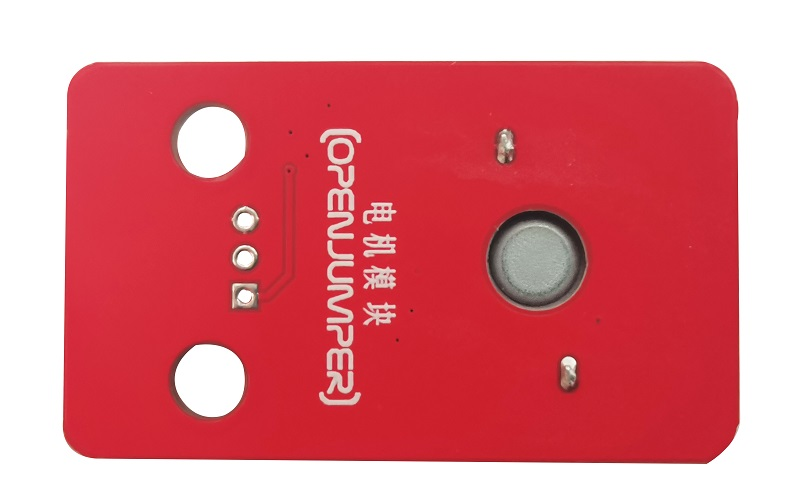
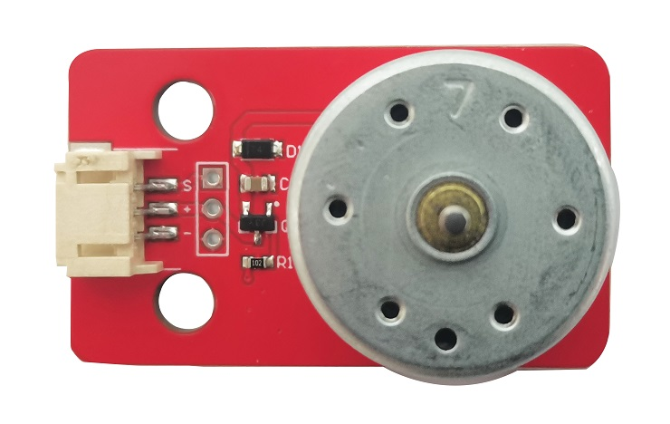
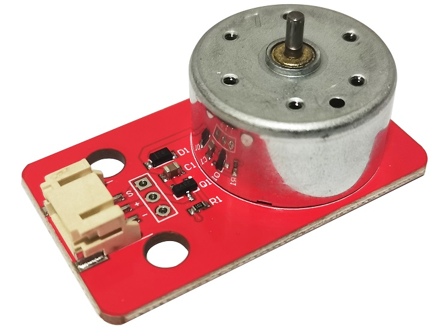

# 电机风扇模块

## 产品概述

电机驱动小模块是一款IO口小电流驱动大电流的驱动模块设计有防止反电动势的续流二极管，产品驱动方便，可PWM驱动控制，兼容性强等优点。

<table border="1">

<tr>
  <td align="center"></td>
  <td align="center"></td>
  <td align="center"></td>
</tr>
<tr>
  <td style="background-color:rgb(232,232,232,0.5) "colspan="3" align="center"> <a href="https://item.taobao.com/item.htm?id=697390386132"><font style="font-size:16px">电机风扇模块</font></a> </td>
</tr>
</table>

## 产品参数

+ 工作电压：DC3.3—5v

+ 工作电流： 31ma-54ma

+ 堵转电流：210ma-340ma

+ 触发电平：低电平（旧版本）

+ 触发电平：高电平（新版本）

## 端口说明

3PIN防反接插口

从左到右分别为：

+ s：信号

+ +：VCC

+ -：GND

## 示例程序

```C++
/*
www.openjumper.cn
*/
const int condPin = 2;
const int motorPin = 4;
int condState = 0;
void setup() {
pinMode(motorPin, OUTPUT);
pinMode(condPin, INPUT);
}
void loop() {
condState = digitalRead(condPin);
if (condState == HIGH)
{
digitalWrite(motorPin, HIGH);
}
else
{
digitalWrite(motorPin, LOW);
}
}
```

[mixly程序下载](http://download.openjumper.cn/mixly/motor-fan.mix)  