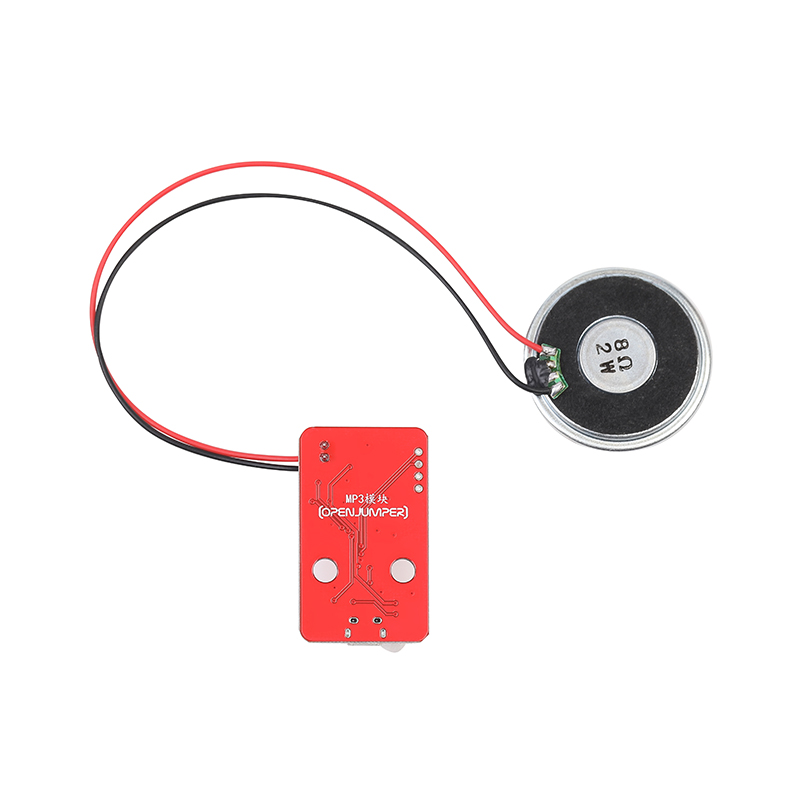

# MP3模块 

## 概述

OpenJumper MP3模块是一个串口MP3模块，完美的集成了MP3、WAV的硬解码。支持电脑直接更新spi flash的内容，通过简单的串口指令即可完成播放指定的音乐，以及如何播放音乐等功能，无需繁琐的底层操作，使用方便，稳定可靠。使用时只需提前将音频文件拷贝到模块即可。

<table border="1">

<tr>
  <td align="center"></td>
  <td align="center"></td>
  <td align="center"></td>
</tr>
<tr>
  <td style="background-color:rgb(232,232,232,0.5) "colspan="3" align="center"> <font style="font-size:16px">MP3模块 </font></td>
</tr>
</table>


## 硬件接口

+ 喇叭座：连接小喇叭播放音乐，建议使用以下类型的喇叭（1W 8Ω）

+ 模块控制接口：通过一根防反接4Pin线与Arduino串口相连，用于控制模块的播放。

+ 音频下载口：通过一根Micro USB数据线与电脑相连，在电脑端显示为一个U盘，可以将音频文件直接拷贝到模块中。

+ 播放指示灯：当模块处于播放状态时，该指示灯亮起；否则指示灯熄灭。
  
## 模块参数

+ 工作电压：3.3V~5V

+ 语音芯片：GD5800B（标准串口，TTL电平，波特率9600）

+ 存储容量：32Mbit

+ 音频格式：MP3、WAV

+ 接口：两个串口（其中一个为测试口，电路连接相同）、一个Micro USB口、一个喇叭接口板载音频功率放大器（功放）芯片

## 使用步骤

1. 使用一根micro USB数据线连接模块，此时模块相当于一个U盘，我们可以直接将需要播放的音频拷贝到里面即可。注意模块在第一次连接电脑拷贝音频前，按照电脑提示，是需要对模块存储器进行格式化操作。

2. 使用Micro USB数据线将模块与电脑相连接（一般情况下模块已经在测试环节完成格式化。若没有格式化，点击格式化即可）；
 
3. 此时模块会模拟为一个U盘，将准备好的音频文件拷贝到里面即可；

4. 文件拷贝完后，拔掉Micro USB数据线

5. 在将模块通过一根4Pin线与Arduino连接好；
 
6. 将喇叭与模块连接好；

7. 上传程序即可开始正常使用。

## 示例程序（Mixly）

  

    注：该图形化例程为wifiduino主板的例程，如果想要使用arduino（如UNOR3）只需将程序的D12=和D13对应修改为12和13即可。

该程序会以10的音量循环播放第一段音频，且每10s播放一次。

**注意：** 由于Arduino无法得知模块播放状态，所以当每次发送播放命令后都需要延时一段时间等待音频播放完成。比如现在的第一段音频播放时间为10s，那么我们就需要在程序中添加一个延时10s的语句，当然延时时间也可以更长一点。但若延时时间小于当前音频播放时间，当前音频会被打断从头开始播放。


## 示例程序（arduino）

```C++
/*
模块与arduino主板对应接线：+~VCC -~GND  RX~12  TX~13
该示例为循环播放模块中的3首音频，各10秒
*/
#include <Arduino.h>
#include <SoftwareSerial.h>
#include <GD5800_Serial.h>

GD5800_Serial mp3(12, 13); //（rx,tx）

void setup() {
  pinMode(2,INPUT_PULLUP);
  mp3.begin(9600);
  mp3.setVolume(20);//设置音量,0-30
  mp3.setLoopMode(MP3_LOOP_ALL);//设置循环模式
  mp3.play();  //播放
  mp3.setEqualizer(MP3_EQ_NORMAL);//设置EQ

}


void loop() {
  mp3.playFileByIndexNumber(1);
  delay(10000);
  mp3.playFileByIndexNumber(2);
  delay(10000);
  mp3.playFileByIndexNumber(3);
  delay(10000);
}

```

## 相关资料

[mixly程序下载](http://download.openjumper.cn/mixly/mp3.mix)  

库文件下载地址： <http://download.openjumper.cn/GD5800_Serial.rar>   

Arduino下载与安装： <https://arduino.me/download>

Mixly下载与安装： <https://openjumper.cn/mixly-oj/>