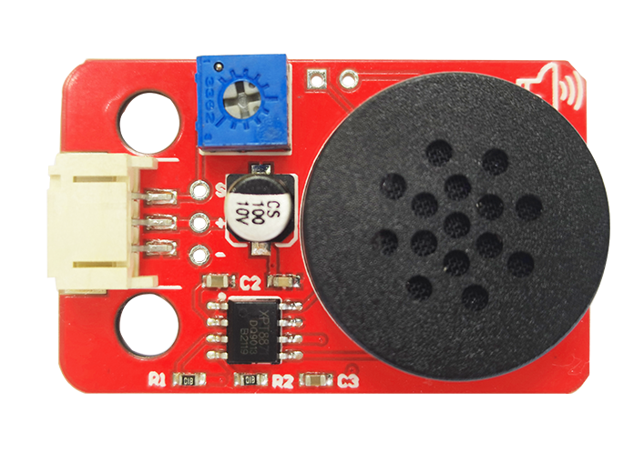
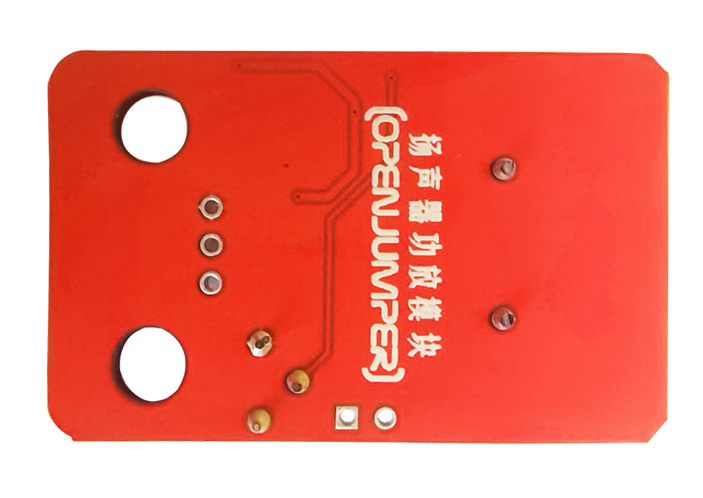
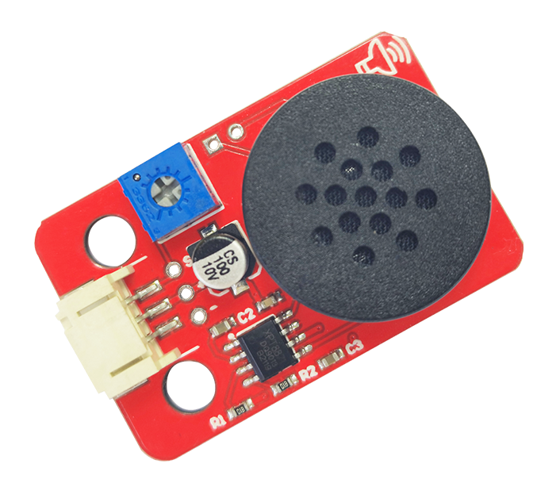

# 扬声器功放模块

## 产品简介

扬声器功放模块相当于一个功率放大模块，用法与无源蜂鸣器模块一致。不过相比与蜂鸣器模块来说，扬声器功放模块可以用于放大单路音频信号。具有过热、欠压和过流保护。对FM无干扰，效率高，音质优。

<table border="1">

<tr>
  <td align="center"></td>
  <td align="center"></td>
  <td align="center"></td>
</tr>
<tr>
  <td style="background-color:rgb(232,232,232,0.5) "colspan="3" align="center"><a href="https://item.taobao.com/item.htm?id=676508310378"><font style="font-size:16px"> 扬声器功放模块 </font></a> </td>
</tr>
</table>

## 产品参数

+ 功率：1W

+ 工作电压：5V

+ 工作模式：D类

+ 模块尺寸：42.3*27（mm）

+ 固定孔：乐高孔（间隔两个乐高单位）

## 端口说明

+ S：信号端口

+ +：VCC

+ -：GND

+ 接口类型：2.0_3pin防反接插口 

## 参考程序
```C++
/*
扬声器连接：D2
*/
void setup(){
pinMode(2, OUTPUT);
}void loop(){
tone(2,165);
delay(1000);
tone(2,294);
delay(1000);
tone(2,659);
delay(1000);
}
```