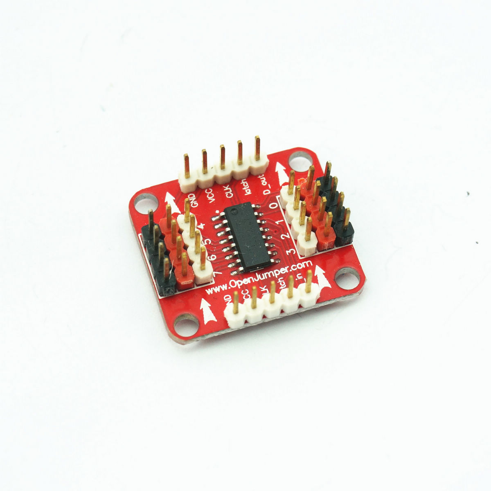

# 595移位输出数字模块

## 产品概述

OJ 移位输出数字模块是基于74HC595芯片数字扩展模块，当你使用arduino数字端口不够时，该模块可以为你提供极佳的解决方案，将3个IO扩展为8个IO，同时还可以级联将IO转为16、24、32··此时也只需要主控器提供3个IO。



[点我购买](https://item.taobao.com/item.htm?id=678848292930)

## 模块参数

+ 尺寸：24mm*28mm

+ 工作电压：5V

+ 通信方式：SPI

## 引脚定义

|名称|定义|名称|定义|
|--|--|--|--|
|GND||GND||
|VCC|	5V|	VCC|	5V|
|CLK	|时钟引脚	|CLK	|时钟引脚|
|Latch	|锁存引脚	|Latch	|锁存引脚|
|D_in	|数据输出引脚	|D_out	|数据输出引脚|
|0-7	|数字输出接口|||


## Arduino 驱动示例
```C++
//Pin connected to latch pin (ST_CP) of 74HC595
const int latchPin = 8;
//Pin connected to clock pin (SH_CP) of 74HC595
const int clockPin = 12;
////Pin connected to Data in (DS) of 74HC595
const int dataPin = 11;

void setup() {
  //set pins to output because they are addressed in the main loop
  pinMode(latchPin, OUTPUT);
  pinMode(dataPin, OUTPUT);  
  pinMode(clockPin, OUTPUT);
  Serial.begin(9600);
  Serial.println("reset");
}

void loop() {
  if (Serial.available() > 0) {
    // ASCII '0' through '9' characters are
    // represented by the values 48 through 57.
    // so if the user types a number from 0 through 9 in ASCII, 
    // you can subtract 48 to get the actual value:
    int bitToSet = Serial.read() - 48;

  // write to the shift register with the correct bit set high:
    registerWrite(bitToSet, HIGH);
  }
}

// This method sends bits to the shift register:

void registerWrite(int whichPin, int whichState) {
// the bits you want to send
  byte bitsToSend = 0;

  // turn off the output so the pins don't light up
  // while you're shifting bits:
  digitalWrite(latchPin, LOW);

  // turn on the next highest bit in bitsToSend:
  bitWrite(bitsToSend, whichPin, whichState);

  // shift the bits out:
  shiftOut(dataPin, clockPin, MSBFIRST, bitsToSend);

    // turn on the output so the LEDs can light up:
  digitalWrite(latchPin, HIGH);

}
```
## 其他文档

[74HC595](http://www.openjumper.cn/wp-content/uploads/2013/08/74HC595.pdf)

[shiftout](http://www.openjumper.cn/wp-content/uploads/2013/08/shiftout.pdf)