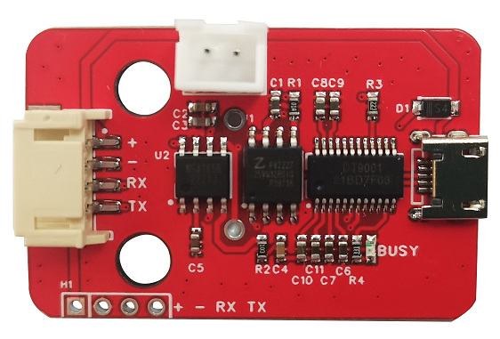
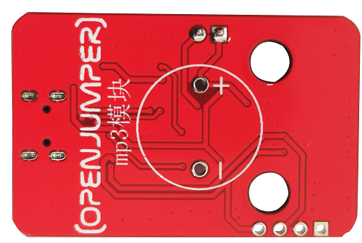
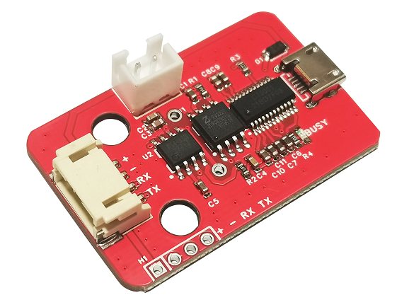
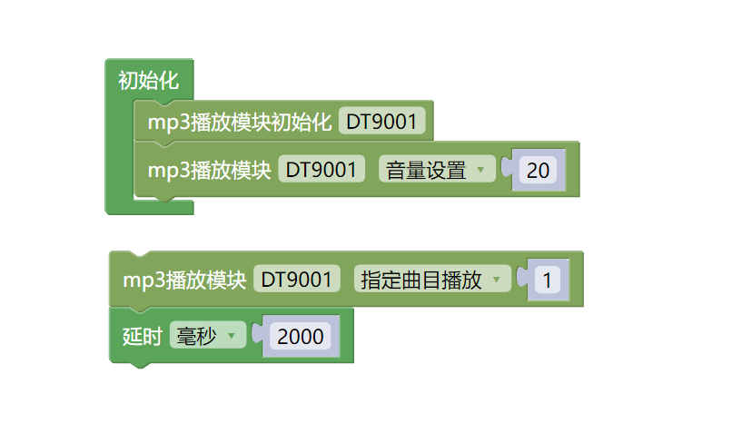

# DT9001 MP3模块

## 产品概述

OpenJumper DT9001MP3模块是一个串口MP3模块，完美的集成了MP3、WAV的硬解码。支持电脑直接更新spi flash的内容，通过简单的串口指令即可完成播放指定的音乐，以及如何播放音乐等功能，无需繁琐的底层操作，使用方便，稳定可靠。使用时只需提前将音频文件拷贝到模块即可，使用方式同 OpenJumper MP3 模块相似。
<table border="1">

<tr>
  <td align="center"></td>
  <td align="center"></td>
  <td align="center"></td>
</tr>
<tr>
  <td style="background-color:rgb(232,232,232,0.5) "colspan="3" align="center"><a href="https://item.taobao.com/item.htm?id=630714318616"><font style="font-size:16px"> DT9001 MP3模块 </font></a> </td>
</tr>
</table>

## 硬件接口

+ 喇叭座：连接小喇叭播放音乐，建议使用以下类型的喇叭（2W 8Ω）

+ 模块控制接口：通过一根防反接4Pin线与Arduino串口相连，用于控制模块的播放。

+ 音频下载口：通过一根Micro USB数据线与电脑相连，在电脑端显示为一个U盘，可以将音频文件直接拷贝到模块中。

+ 播放指示灯：当模块处于播放状态时，该指示灯亮起；否则指示灯熄灭。


## 模块参数

+ 工作电压：5V

+ 语音芯片：DT9001（标准串口，TTL电平，波特率9600）

+ 存储容量：4Mbit

+ 音频格式：MP3、WAV

+ 接口：两个串口（其中一个为测试口，电路连接相同）、一个Micro USB口、一个喇叭接口板载音频功率放大器（功放）芯片

## 使用步骤

1.使用一根micro USB数据线连接模块，此时模块相当于一个U盘，我们可以直接将需要播放的音频拷贝到里面即可。注意模块在第一次连接电脑拷贝音频前，按照电脑提示，是需要对模块存储器进行格式化操作。

2.使用Micro USB数据线将模块与电脑相连接（一般情况下模块已经在测试环节完成格式化。若没有格式化，点击格式化即可）；

3.此时模块会模拟为一个U盘，将准备好的音频文件拷贝到里面即可，然后断开USB连接；（音频文件格式为mp3，文件名需要改为00001 、00002以此类推）

4.将模块通过一根4Pin线与Arduino连接好；

5.将喇叭与模块连接好；

6.上传程序即可开始正常使用。

## 示例程序（Mixly）

PS：该图形化例程为Arduino UNO主板的例程。

 

该程序会以20的音量循环播放第一段音频，且每2s播放一次。

注意：由于Arduino无法得知模块播放状态，所以当每次发送播放命令后都需要延时一段时间等待音频播放完成。比如现在的第一段音频播放时间为2s，那么我们就需要在程序中添加一个延时2s的语句，当然延时时间也可以更长一点。但若延时时间小于当前音频播放时间，当前音频会被打断并执行新的指令。

## 示例程序（arduino）

```C++
#include "DT9001_UART.h"

DT9001 DT9001(2, 0);

void setup(){
  Serial.begin(9600); //这里固定为9600
  DT9001.Command_Data(SetVolume,20);
}

void loop(){
  DT9001.Command_Data(AppointTrack,1);
  delay(2000);

}
```

## 相关资料

+ Arduino库文件下载：<http://download.openjumper.cn/DT9001_UART.zip>

+ mixly库文件下载：<http://download.openjumper.cn/DT9001mixly%E5%BA%93%E6%96%87%E4%BB%B6.rar>

+ Arduino下载与安装： <https://arduino.me/download>

+ Mixly下载与安装： <https://openjumper.cn/mixly-oj/>
