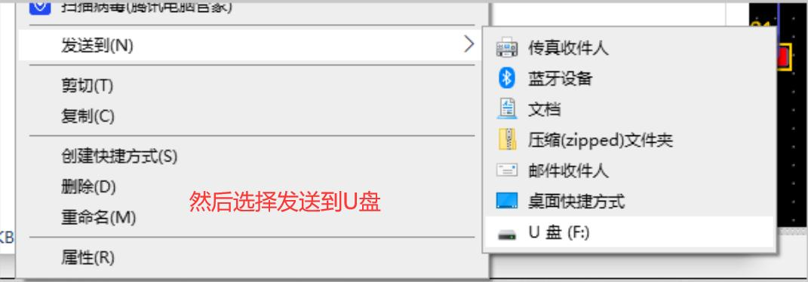
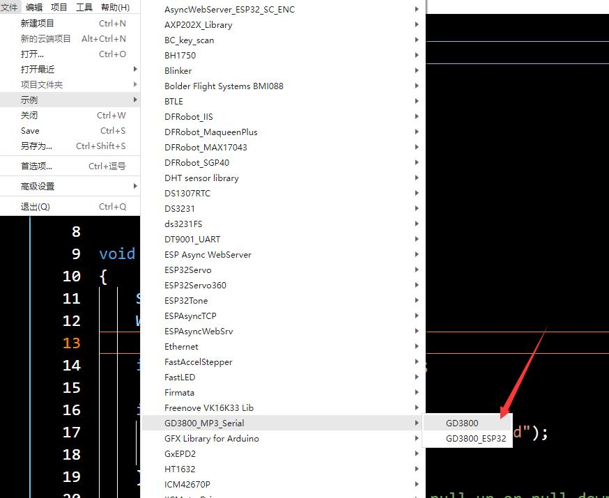
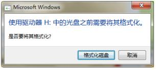

# 语音 mp3 模块（GD3800 版）

<table border="1">

<tr>
  <td align="center"></td>
  <td align="center"></td>
  <td align="center"></td>
</tr>
<tr>
  <td style="background-color:rgb(232,232,232,0.5) "colspan="3" align="center"> <a href="https://item.taobao.com/item.htm?id=630714318616">语音MP3模块（GD3800）</a></td>
</tr>
</table>

## 一、模块基本参数

+ 电源电压：5V
+ 串口电平：5V
+ 波特率：9600
+ 工作温度：-40℃~85℃
+ FLASH 大小：32MBit
+ 模块尺寸：26x46（mm）
+ 固定孔：M3
+ 固定孔中心间距：16mm
+ 串口连接方式：PH2.0 * 4P 或 XH2.54 * 4P（两个端子是同一个串口不同连接方式）
+ 扬声器参数：0.5W/8Ω
+ PWR：电源指示灯
+ BUSY：播放指示灯，播放时亮

## 二、使用说明

1、使用 USB-TYPE-C 线连接模块到电脑，此时模块将模拟为 U 盘（以下简称“该设备”，此时串口无效）。将准备好的音频文件拷贝到该设备。

注意：音频文件命名仅支持数字，且需要为 5 位，如 00001、00002 等。文件拷贝时，需要全选音频文件后将鼠标移动到第一个音频文件点击右键，选择发送到 U 盘即可。

2、安装库文件。

3、并打开示例。按照程序初始化软串口端口号，使用连接线将 mp3 模块与 UNO 连接即可。

最后按照程序里面的软件初始化引脚连接好模块即可

## 三、设备格式化

通常模块在出厂前测试时已经将模块格式化，用户无需再进行操作。若需要可按以下步骤进行：
1、将设备连接到电脑，弹出格式化提示（若未弹出，用户可在“我的电脑”或磁盘管理器中找到）,点击格式化磁盘；

2、进行格式化操作;

3、完成后即可正常使用；

## 其他资料

[示例程序及库下载](http://download.openjumper.cn/GD3800_Serial.zip)