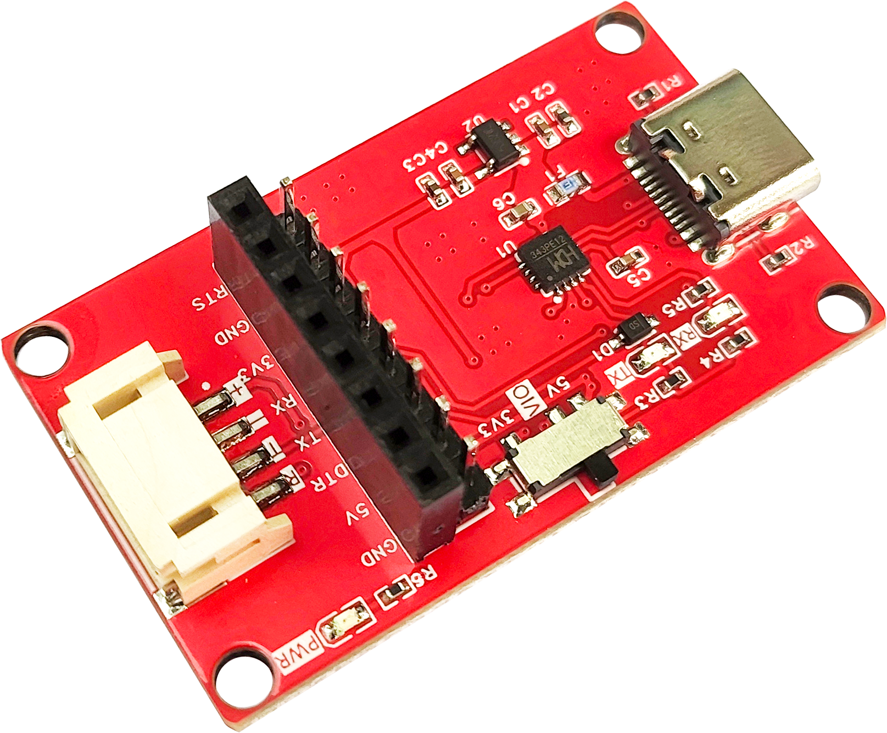
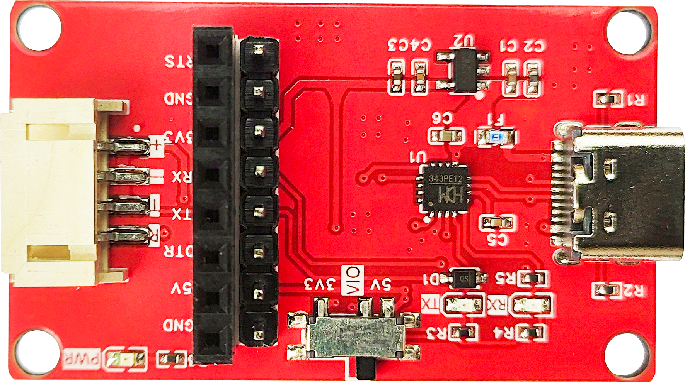
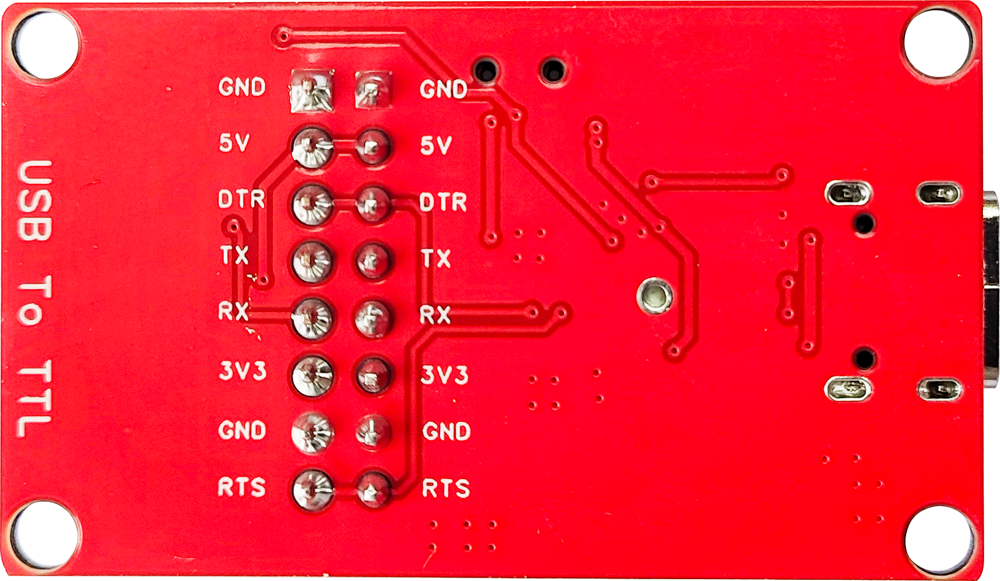

# CH343 USB转串口模块

<table border="1">

<tr>
  <td align="center"></td>
  <td align="center"></td>
  <td align="center"></td>
</tr>
<tr>
  <td style="background-color:rgb(232,232,232,0.5) "colspan="3" align="center"> <a href="https://item.taobao.com/item.htm?id=630714318616">CH343 USB转串口模块</a></td>
</tr>
</table>

## 一、模块基本参数

1.电源电压：5V

2.串口电平：5V/3.3V（通过VIO选择）

3.工作温度：-40℃~85℃

4.模块尺寸：26X44（mm）

5.固定孔：M3

6.固定孔中心间距：22*40mm

7.串口连接方式：PH2.0*4P或XH2.54（两个同一个串口不同连接方式）

8.PWR：电源指示灯

9.硬件全双工串口，内置独立的收发缓冲区，支持通讯波特率 50bps～6Mbps。

