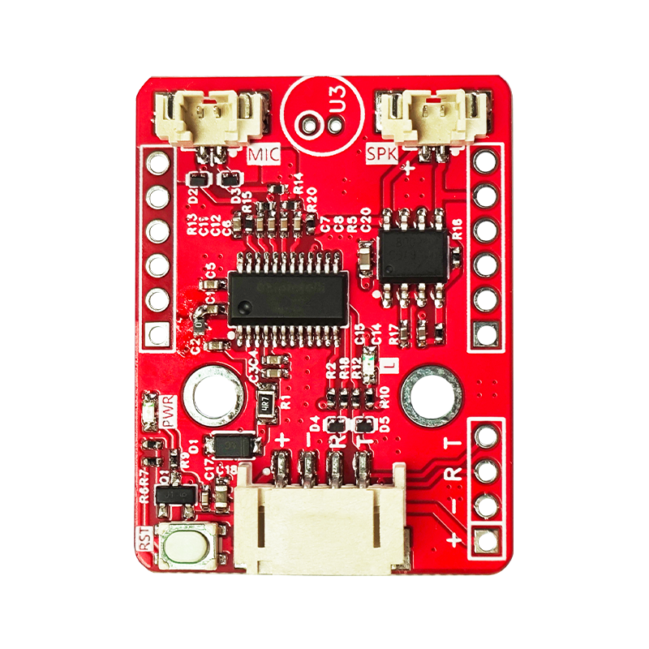
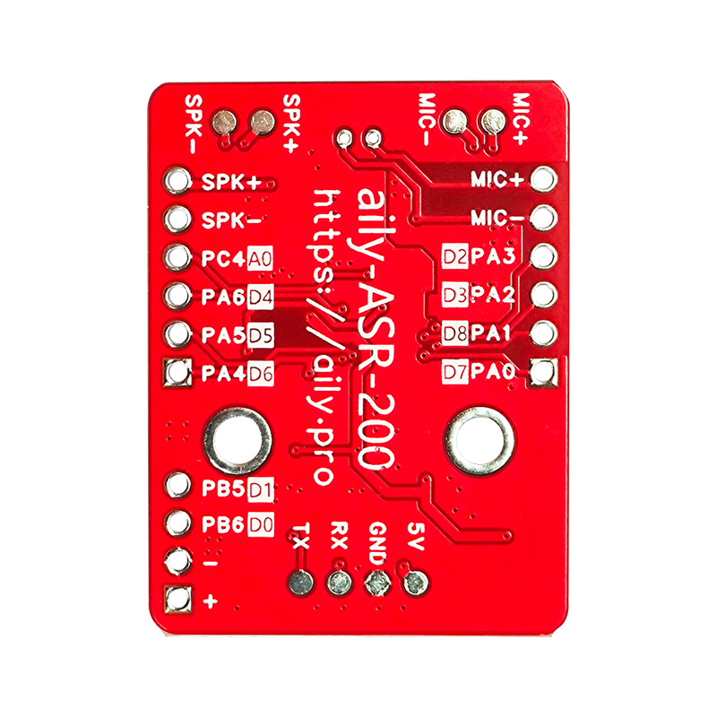
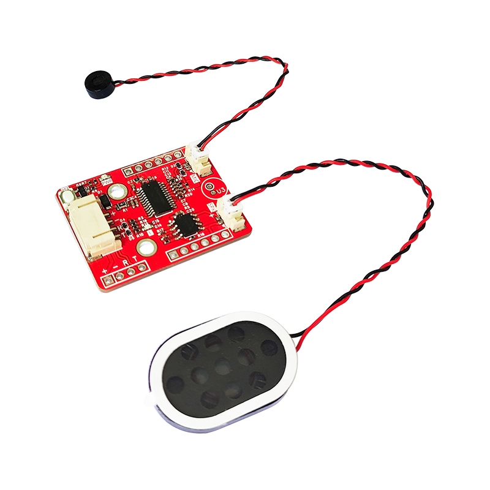

# 语音识别ASR200模块

语音识别技术，也被称为自动语音识别Automatic Speech Recognition，(ASR)，其目标是将人类的语音中的词汇内

容转换为计算机可读的输入，例如按键、二进制编码或者字符序列。与说话人识别及说话人确认不同，后者尝试识别或

确认发出语音的说话人而非其中所包含的词汇内容。


模块特点：


+ 内置脑神经网络处理器

+ 支持DNN\TDNNARNN等神经网络及卷积运算硬件运算，非软件运算

+ 支持语音识别、语音增强、语音检测、单麦克风降噪增强单麦克风回 声消除、360度全方位拾音等功能


<table border="1">

<tr>
  <td align="center"></td>
  <td align="center"></td>
  <td align="center"></td>
</tr>
<tr>
  <td style="background-color:rgb(232,232,232,0.5) "colspan="3" align="center"> <a href="https://item.taobao.com/item.htm?id=819112570194"><font style="font-size:16px">语音识别ASR200模块</font></a></td>
</tr>
</table>

## 一、模块基本参数

电源电压：5V（大于 500mA）

串口电平：3.3V

工作温度：-40℃~85℃

模块尺寸：37*28（mm）

固定孔：孔径3mm，孔距16mm（圆心距）

串口连接方式：PH2.0*4P 

喇叭接口：MX1.25*2P

驱动的喇叭参数：1W/8Ω（推荐使用）

PWR：电源指示灯

RST：复位按键


## 二、配套支持

+ 语音识别软件

+ arduino/esp32支持

+ 树莓派支持

+ 图形化支持


## 三、应用案例

+ 语音控制LED

+ 语音控制风扇开关

+ 语音控制空调

+ 语音控制舵机

+ 语音控制氛围灯颜色

+ 语音控制水泵


## 四、其他资料

[语音识别ASR200固件及使用方法+下载工具](http://download.openjumper.cn/ASR200.rar)


#### arduino示例

```c
#include <OJASR.h>
// 创建对象
OJASR asr(2, 3); //(rx,tx)


// 主程序开始
void setup() {
	asr.begin(115200);
	Serial.begin(115200);
}
void loop() {
	asr.asrRun();
	if (asr.asrDate == 0) {
		Serial.println("0");
	}
	else if (asr.asrDate == 1) {
		Serial.println("1");
	}
	else if (asr.asrDate == 2) {
		Serial.println("2");
	}
	else {
	}
	if (asr.WakeUpStatus) {
		Serial.println("ok");
	}
	else {
		Serial.println("no");
	}
}
```


#### mind+示例


