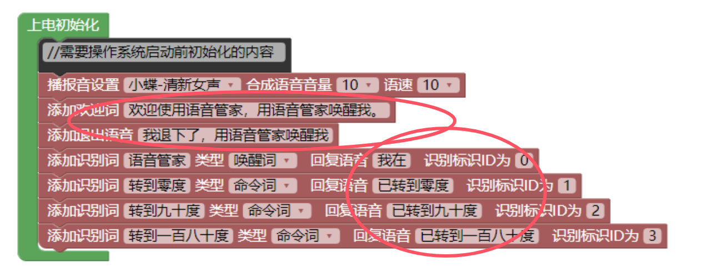

# ASR300语音识别

<table border="1" align="center">

<tr>
  <td align="center"></td>
  <td align="center"></td>
</tr>
<tr>
  <td style="background-color:rgb(232,232,232,0.5) "colspan="3" align="center"> <a href="https://item.taobao.com/item.htm?id=863443095729"><font style="font-size:16px"> ASR300</font></a> </td>
</tr>
</table>


## 简介

ASR300是一款AI离线语音识别模块与开发板，通过语音指令控制对应接口。配合离线指令编辑及下载软件方便用户自定义识别词，搭配主板中的USB下载接口，最高可存入300条离线语音指令。
此外，芯片内置脑神经网络处理器、支持DNN\TDNNARNN等神经网络及卷积运算硬件运算，非软件运算。支持语音识别、语音增强、语音检测、单麦克风降噪增强单麦克风回 声消除、360度全方位拾音等功能。这使得识别距离以及识别成功率大大增加。主要应用在各种智能家电控制以及涉及离线语音控制的诸多场景。


## 参数

- 识别指令：约300条
- 电源电压：5V(大于 500mA)
- 串口电平：3.3V
- 工作温度：-40℃~85℃
- 模块尺寸：44*22(mm)
- 固定孔：41*18mm
- 喇叭接口：MX1.25*2P
- 驱动的喇叭参数：1W/8Ω(推荐使用)
- PWR：电源指示灯
- RST：复位按键


## 引脚定义


##   

## 特点

- 1、内置脑神经网络处理器，离线识别率高
- 2、支持DNN\TDNNARNN等神经网络及卷积运算硬件运算，非软件运算
- 3、支持语音识别、语音增强、语音检测、单麦克风降噪增强单麦克风回 声消除、360度全方位拾音等功能
- 4、板载扬声器，最远识别距离超过5米范围（干扰音小）
- 5、ASR300主板保留半孔及排针孔，便于集成在各种语音识别项目中
- 6、自研识别词编辑及下载软件，可自定义识别词
- 7、支持arduino、esp32、树莓派等硬件，同时支持图形化软件mind+\mixly编程


## 使用说明：

### 一、软件安装准备

软件安装包下载可以通过下文的“其他资料”中的下载链接下载

- 方式 1：找到“天问 Block 软件秋季版”中两个压缩包，将两个压缩包解压即可得到软件安 装包。首先安装“天问 Block 2022 秋季版.exe”，然后安装“天问 Block 2022 秋季版 范例代 码更新补丁.exe”。
- 方式 2：使用浏览器打开天问官方网站 http://twen51.com/，下载软件并安装；
- 从官网获取安装包解压后运行 exe 文件进行安装，根据提示默认安装，安装过程中会自 动安装驱动，点击允许即可。
- 第一次打开软件，会让你选择主板，请选择 ASRPRO。
- 使用 USB 数据线连接语音识别模块到电脑。
- 注意：请安装好CH343串口模块的驱动，在这里下载https://www.wch.cn/downloads/CH343SER_EXE.html

##   

### 二、语音控制板载LED

1. 双击打开天问 Block 软件，选择设备为“ASRPRO”。

##   

##   

2. 选择开发模式:

##   

根据自己专业水平和喜好选择对应的开发模式。
3. 选择范例代码（语音控制板载LED）

##   

4. 点击 2M 编译下载

##   


- 它会自动下载，等待下载完成即可。

- 注意： 在上述第 3 步中，如果自己对图形内容进行了修改。则在点击 2M编译下载前，需要点击 生成模型（注意在此期间电脑需要能正常联网）。这是实现语音识别的关键一步。范例代码没有这步操作是因为其模型已经提前生成好了。

##   

- 生成模型及编译时请先注册用户，注册后登录即可生成模型，每次修改识别词和语音都需要重新生成模型。

##   

##   

- 模型生成后点击“2M 编译下载”即可将程序下载到语音识别模块。

##   

##   


- 下载完成后开发板会播报欢迎词。 随后使用 使用语音指令：“打开灯光”，控制板载的LED亮灯。“关闭灯光”可控制板载LED灯灭。

### 三、其他示例

+ 语音控制IO口

- 该示例通过语音控制主板上其他IO输出高低电平，这样在IO引脚上接入LED或者继电器等执行器便可以语音控制接口对应的输出。

##   

可在以下示例基础上编辑
  
##   


+ 语音控制PWM输出

- 不仅IO输出，芯片还提供了模拟输出（PWM）功能，通过编程设置，我们可以用语音来控制灯光调光或者舵机控制等功能

##   

- 可在以下示例基础上修改

##   

+ 语音控制舵机

- 针对于PWM功能，舵机驱动就是采用输出同频率不同占空比来控制舵机转动，示例将通过语音来控制舵机转动0度，90度，180度

##   

- 这里注意需要找到右下角“添加扩展”按钮

##   

- 然后找到舵机，点击加载

##   


+ 语音控制播放音频文件播放

- 试想通过语音直接与明星对话这个功能是否很具有想象力？只需要将录制好的语音音频文件，作为你设置的语音指令对应的回复，即可完成这个功能。

##   

- 还是以该程序为例，我们需要准备以下图中圈出部分的音频文件。若无法获取相关音频文件，可以在这里在线生成https://acgn.ttson.cn/（注意这里需要是.wav格式的，如果格式不正确，可以使用如“格式工厂”的软件转换）

##   

- 随后我们按下图所示的地址找到这里的音频文件。这里就是你当前示例生成的音频文件，我们要替换的就是这个。但是请不要直接替换。找到这个主要是我们需要按这里的编号对我们准备好的音频文件的文件名进行修改

##   

随后将我们准备好的音频文件按照你文件夹中的格式（即上图中）进行修改，注意前缀编号及其格式。

##   

最后点击这里的“一键换语音”即可

##   


当出现以下窗口时说明替换完成，关闭窗口。此时我们回到天问Block，点击2M编译下载即可。

##   

## arduino及图形化mind+例程（）

```C
#define D3 13
#define D4 4

void setup() {

Serial.begin(115200);//接收数据串口及波特率

pinMode(D3,OUTPUT);
pinMode(D4,OUTPUT);
delay(5000);
Serial.write(0x01);
delay(1000);

}

void loop() {
    if(Serial.available() > 0){
      byte SerialNowData = 0;
      SerialNowData = Serial.read();
      delay(10);
      if(SerialNowData == 0x01)//识别到打开空调
          digitalWrite(D3,HIGH);
      else if(SerialNowData == 0x02)//识别到关闭空调
          digitalWrite(D3,LOW);
      else if(SerialNowData == 0x7C)//识别到打开投影仪
          digitalWrite(D4,HIGH);
      else if(SerialNowData == 0x7D)//识别到关闭投影仪
          digitalWrite(D4,LOW);    
   }
}
```

##   

FAQ


