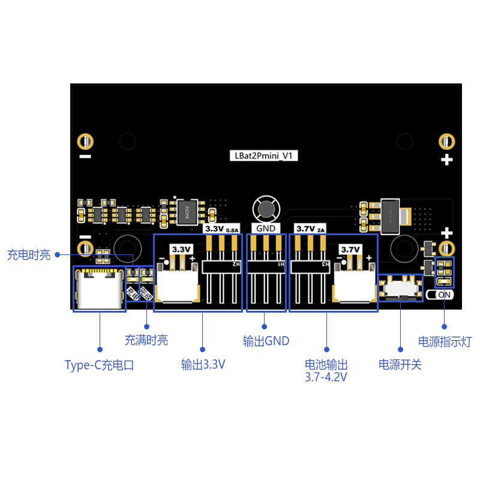

# 可充电锂电池系列模块

## 简介

openjumper可充电锂电池系列模块专为需要稳定电压输出的设备设计，提供3.3V和3.7V等多种电压输出能力。模块采用高效能锂电池，确保长时间的电力供应和优异的充电性能。其紧凑的设计使其易于集成到各种电子项目中，无论是便携式设备还是嵌入式系统。

 <a href="https://item.taobao.com/item.htm?id=863609438520">可充电锂电池模块</a></td>
|型号|参考图|
|--|--|
|3V7-1S1P LBat1Pmini_V1  ||
|3V7-1S2P LBat2Pmini_V1  ||
|5V-1S1P  LBat1S1P ||
|5V-1S2P  LBat1S2P 	| |

## 特点

+ 多电压输出：支持3.3V、3.7V、5V等电压输出，适应不同设备的电压需求。

+ 高效能锂电池：提供持久的电力供应，支持多次充电循环。

+ 安全可靠：内置过充、过流和短路保护，确保使用安全。

+ 紧凑设计：小巧轻便，易于集成到各种项目中。

+ 易于使用：简单的连接接口，方便快速安装和更换。

+ 这款锂电池模块是您电子项目的理想电源解决方案，提供稳定的电力支持，助力您的设备高效运行。

## 接口说明

|型号|充电接口|开关控制范围|USB供电母口|3.3v输出|3.7v输出|5v输出|7.4v输出|固定孔尺寸|模块尺寸|
|--|--|--|--|--|--|--|--|--|--|
|3.7V-1S1P|TypeC|所有输出电压|无|PH2.0 x1+2.54-3P排针x1|PH2.0 x1+2.54-3P排针x1|无|无|55.5|78*22MM|
|3.7V-1S2P|TypeC|所有输出电压|无|PH2.0 x1+2.54-3P排针x1|PH2.0 x1+2.54-3P排针x1|无|无|21.5*55.5MM|78*44MM|
|5V-1S1P|TypeC|3.3V/3.7V电压|有|PH2.0 x1+PH2.54 x1|PH2.0 x1+PH2.54 x1|PH2.0 x1+PH2.54 x1|USB口x1|无|15*55mm|78.5*30mm|
|5V-1S2P|TypeC|3.3V/3.7V电压|有|PH2.0 x1+PH2.54 x1|PH2.0 x1+PH2.54 x1|PH2.0 x1+PH2.54 x1|USB口x1|无|无|无|

## 功能参数表

|型号|电池数|输出电压种类|3.3V供电能力|3.7V供电能力|5V供电能力|过流保护（最大放电电流）|
|3.7V-1S|1|3.7V/3.3V|0.8A|2A|无	|2A|
|3.7V-2S|2|3.7V/3.3V|0.8A|2A|无	|5A|
|5V-1S|1|5V/3.7V/3.3V|1A|2A|2A|2A|
|5V-2S|2|5V/3.7V/3.3V|1A|2A|2A|5A|

+ 充电及电量指示灯说明

带5V输出：

 不带5V输出：
- 充电指示灯：
当充电器向电池充电时，充电指示灯亮，表示充电正在进行；当充电结束时，指示灯灭。插入充电器而没接电池的话指示灯会闪烁提示未接电池或电池接触不好
- 完成指示灯：
当充电结束时，充电完成指示灯亮。充电过程中，此灯不亮