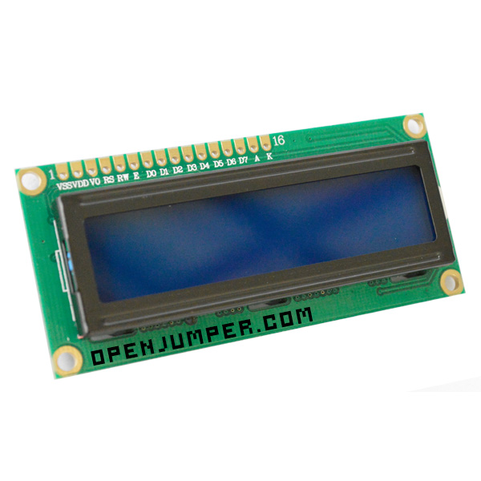

# LCD1602A液晶显示屏模块

## 概述

LCD1602液晶显示器是广泛使用的一种字符型液晶显示模块。它是由字符型液晶显示屏（LCD）、控制驱动主电路HD44780及其扩展驱动电路HD44100，以及少量电阻、电容元件和结构件等装配在PCB板上而组成。不同厂家生产的LCD1602芯片可能有所不同，但使用方法都是一样的。为了降低成本，绝大多数制造商都直接将裸片做到板子上。

[点我购买](https://item.taobao.com/item.htm?id=538024480157)

## 字符型液晶显示原理

点阵图形式液晶由M×N个显示单元组成，假设LCD显示屏有64行，每行有128列，每8列对应1字节的8位，即每行由16字节，共16×8=128个点组成。显示屏上64×16个显示单元与显示RAM区的1024字节相对应，每一字节的内容与显示屏上相应位置的亮暗对应。例如显示屏第一行的亮暗由RAM区的000H~00FH的16字节的内容决定，当（000H）=FFH时，屏幕左上角显示一条短亮线，长度为8个点；当（3FFH）=FFH时，屏幕右下角显示一条短亮线；当（000H）=FFH，（001H）=00H，（002H）=00H…，（00EH）=00H，（00FH）=00H时，在屏幕的顶部显示一条由8条亮线和8条暗线组成的虚线。这就是LCD显示的基本原理。 字符型液晶显示模块是一种专门用于显示字母、数字和符号等的点阵式LCD，常用16×1，16×2，20×2和40×2等的模块。
一般的LCD1602字符型液晶显示器的内部控制器大部分为HD44780，能够显示英文字母、阿拉伯数字、日文片假名和一般性符号。

## 技术参数

+ 显示容量：16×2个字符。

+ 芯片工作电压：4.5~5.5V。

+ 工作电流：2.0mA（5.0V）。

+ 模块最佳的工作电压：5.0V。

+ 字符尺寸：2.95mm×4.35mm（宽×高）

## 引脚功能

LCD1602采用标准的14脚（无背光）或16脚（带背光）接口，各引脚接口说明见表1。

|编号|符号|	引脚说明|	编号	|符号|	引脚说明|
|:--|:--|:--|:--|:--|:--|
|1	|VSS	|电源地 |9	|D2|	数据|
|2|	VDD	|电源正极	|10	|D3|	数据|
|3|	VL	|液晶显示偏压|	11|	D4|	数据|
|4|	RS|	数据/命令选择|	12|	D5|	数据
|5|	R/W	|读/写选择	|13|	D6	|数据|
|6	|E	|使能信号|	14|	D7|	数据|
|7	|D0	|数据	|15|	BLA	|背光源正极|
|8	|D1|	数据	|16|	BLK	|背光源负极|

**各引脚的功能介绍如下:**

+ 引脚1：VSS为地电源。

+ 引脚2：VDD接5V正电源。

+ 引脚3：VL为液晶显示器对比度调整端，接正电源时对比度最弱，接地时对比度最高，对比度过高时会产生“鬼影”现象，使用时可以通过一个10kQ的电位器调整其对比度。

+ 引脚4：RS为寄存器选择脚，高电平时选择数据寄存器、低电平时选择指令寄存器。

+ 引脚5：R/W为读/写信号线，高电平时进行读操作，低电平时进行写操作。当RS和R/W共同为低电平时可以写入指令或显示地址；当RS为低电平，R/W为高电平时，可以读忙信号；当RS为高电平，R/W为低电平时，可以写入数据。

+ 引脚6：E端为使能端，当E端由高电平跳变为低电平时，液晶模块执行命令。

+ 引脚7-14：D0-D7为8位双向数据线。

+ 引脚15：背光源正极。

+ 引脚16：背光源负极。