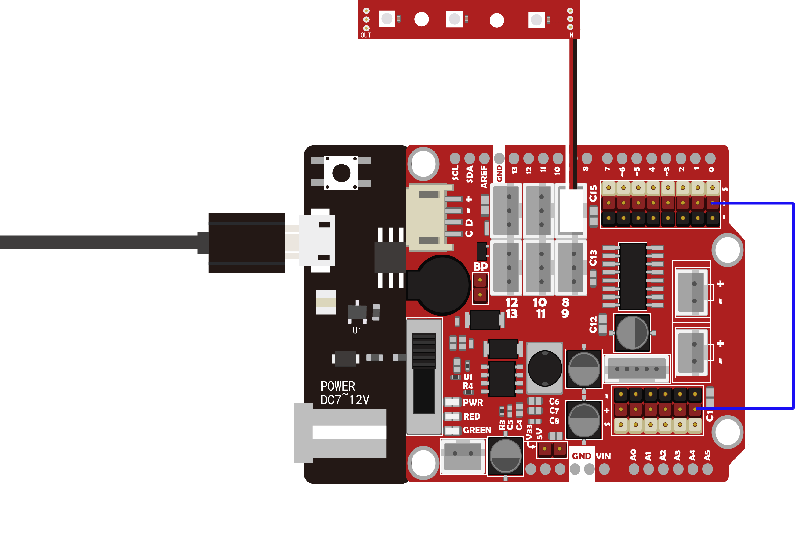

# 智能家居基础教程8-RGB可编程灯条

## 简介

在我们的街头巷尾，总有各种色彩斑斓的LED灯，装饰着我们这个世界，夜晚多彩的LED灯尤其的漂亮。这里我们一起来探索彩色LED的玩法吧。  
首先理解我们的灯光几乎是有三原色组成，也就是R（红色）、G（绿色）、B（蓝色），所以调节三种颜色不同的亮度比例，就可得到不同亮度的其他想要的颜色。在程序中，这个亮度值设定为0~255，所以程序输出RGB对应的亮度分别为（255,255,255）的时候，我们可以得到最大亮度的白色光。  
可编程RGB模块采用WS2812灯珠，允许wifiduino通过程序控制模块中的每个灯珠的颜色和亮暗程度。模块还可以级联，同时串联很多模块，也可对串联灯珠中的每个灯、某个灯，某一区域的灯进行单独控制。

<table border="1">

<tr>
  <td align="center"></td>
  <td align="center"></td>
  <td align="center"></td>
</tr>
<tr>
  <td style="background-color:rgb(232,232,232,0.5) "colspan="3" align="center"> <a href="https://item.taobao.com/item.htm?id=618554695098"><font style="font-size:16px"> RGB可编程灯条 </font></a> </td>
</tr>
</table>


## 库文件安装

由于WS2812灯珠为可编程灯珠，所以需要通过特定的协议进行编程才能让对应的LED发出想要的颜色。如果我们按照协议一条条写程序来驱动这个彩色灯带，会比较繁琐，好在有第三方提供的WS2812有对应的库文件，库文件将协议打包，我们只需在软件中包含库文件，然后就可以调用库文件里的专门用于调节灯颜色和亮度的函数，从而使程序变得更加简单、可读。  
要使用库文件，我们首先要了解库文件的安装。  
库文件下载地址：<https://github.com/adafruit/Adafruit_NeoPixel>  
将下载好的库文件，放在arduinoIDE安装目录下的libraries下，如图：  
   


## arduino/wifiduino示例程序：
```C++
/*****************************************************************************/
#include <Adafruit_NeoPixel.h>
//连接彩灯的引脚
#define PIN            D8
// 设置RGB灯的颗数
#define NUMPIXELS      3
// 新建一个对象
Adafruit_NeoPixel pixels = Adafruit_NeoPixel(NUMPIXELS, PIN, NEO_GRB + NEO_KHZ800);
int delayval = 500; // 延时时间
void setup() {
  pixels.begin(); // 初始化点亮灯条需要的库文件，只有初始化后才能使用该库文件
}
void loop() {
      // 一颗一颗灯逐渐点亮，然后又逐渐熄灭
  for(int i=0;i<NUMPIXELS;i++){
    pixels.setPixelColor(i, pixels.Color(40,40,40)); // 设置灯RGB的输出值设置为 40 40 40
    pixels.show(); // 将颜色值更新到硬件上显示
    delay(delayval); // 延时一小段时间
  }
    for(int i=NUMPIXELS;i>=0;i–){
    pixels.setPixelColor(i, pixels.Color(0,0,0)); // 设置灯RGB的输出值设置为 0 0 0
    pixels.show(); // 将颜色值更新到硬件上显示
    delay(delayval); // 延时一小段时间
  }
}
/*****************************************************************************/
```

## wifiduino连接硬件

 


将RGB灯条模块连接在wifiduino上的D8接口中。
## 观察现象

观察RGB模块上的灯将会一颗颗逐渐点亮后再熄灭，可修改程序，调节显示颜色，亮度，LED数量等操作
## Arduino Mixly图形化程序

 