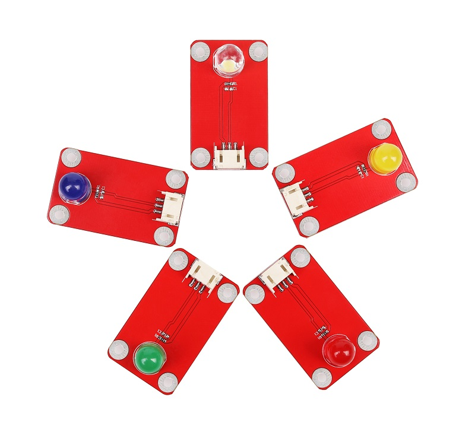
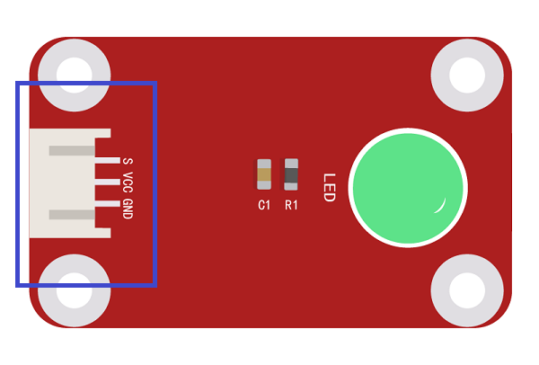

# LED模块
## 1.概述

LED模块是最简单的执行模块。同时它是一个低功率的光源，有几种颜色可供选择。从一个Arduino的IO供电。Arduino的IO口提供最大40 mA，可通过digitalWrite（）和的analogWrite（）函数来点亮LED  

  

[点我购买](https://item.taobao.com/item.htm?id=618309586043)


## 2.模块规格

+ 尺寸：20 * 25mm

+ 工作电压：3.3V-5V

+ 颜色：红、黄、绿、蓝、白
  
## 3.引脚

+ S：信号脚，接LED正极

+ +：NC脚，悬空

+ -：接地脚，接LED负极  



## 4.使用方法

可用数字IO口直接驱动，亦可用PWM端口调节亮度使用。
```C++
//模块连至数字3号端口，每隔100ms变换一次状态
void setup(){
pinMode(3,OUTPUT);
}

void loop(){
digitalWrite(3,HIGH);
delay(100);
digitalWrite(3,LOW);
delay(100);
}
```
```
//模块连至数字3号端口，呼吸灯

void setup(){
pinMode(3,OUTPUT);
}

void loop(){
for(int i = 0; i = 0;i--){
digitalWrite(3,LOW);
delay(10);
}
}
```  

## 5.其他文档

[mixly程序下载](http://download.openjumper.cn/mixly%2Fled.mix)  

[ledⅡModule Schematic](https://maifile.cn/dec/d50847988755@doc)