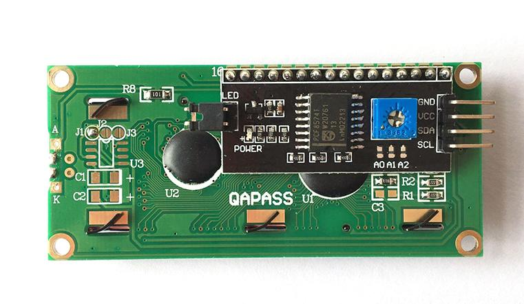
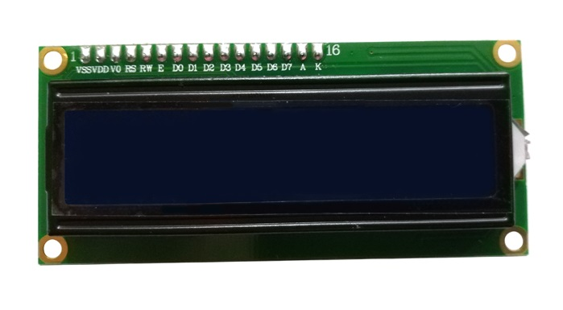
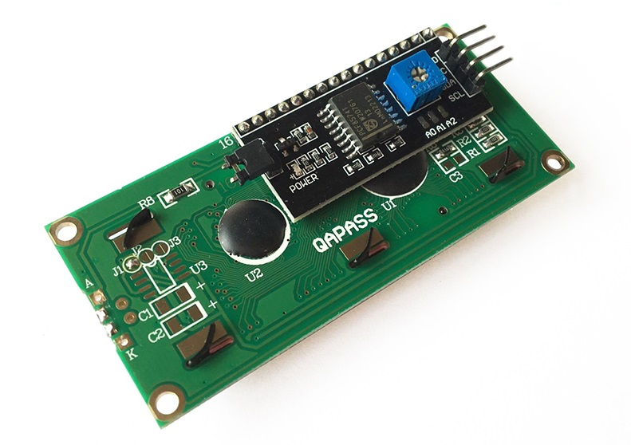
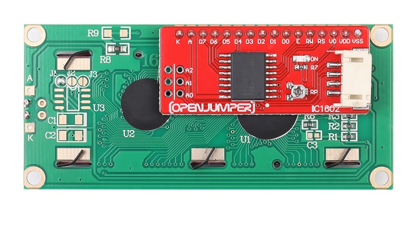
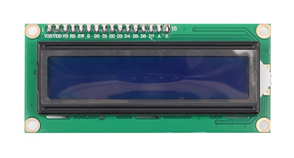
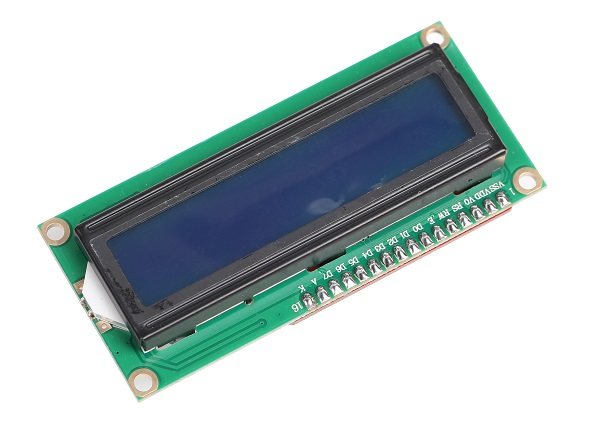
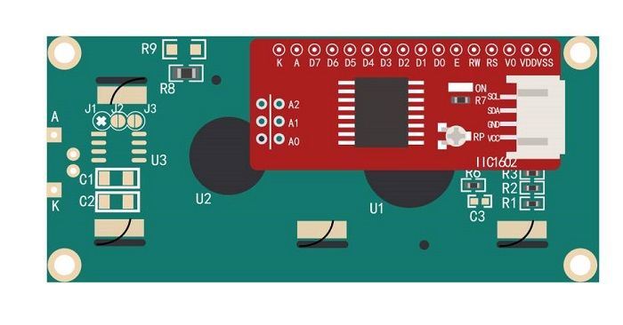

# IIC1602液晶显示屏模块

<table border="1">

<tr>
  <td align="center"></td>
  <td align="center"></td>
  <td align="center"></td>
</tr>
<tr>
  <td style="background-color:rgb(232,232,232,0.5) "colspan="3" align="center"> <a href="https://item.taobao.com/item.htm?id=537813224385"><font style="font-size:16px"> IIC1602液晶显示屏模块 </font></a> </td>
</tr>
<tr>
  <td align="center"></td>
  <td align="center"></td>
  <td align="center"></td>
</tr>
<tr>
  <td style="background-color:rgb(232,232,232,0.5) "colspan="3" align="center"> <a href="https://item.taobao.com/item.htm?id=591831697803"><font style="font-size:16px"> IIC1602液晶显示屏模块 </font></a> </td>
</tr>
</table>

## 概述

OpenJumper IIC LCD1602模块集成了IIC I/O扩展芯片PCA8574，使LCD 1602的使用更为简单。通过两线制的IIC总线（串行时钟线SCL，串行数据线SDA），可使Arduino实现控制LCD 1602显示的目的。既简化了电路，又节省了I/O口，使Arduino能实现更多的功能。通过模块上的电位器还可以调节LCD显示器的对比度。通过设置跳线还可以设置地址: 0x20-0x27。使Arduino能控制多块LCD 1602。

## 模块参数

+ 工作电压：5V

+ 接口：1个IIC/TWI两线数据通讯接口

+ IIC接口通讯地址：0x20-0x27（默认地址为0x27）

+ 可调节对比度

+ 可开关背光

+ 尺寸：43mm*18mm

## 引脚定义

+ GND 接地引脚

+ VCC 输出5V

+ SDA 串行数据线

+ SCL 串行时钟线
  
  

## 地址设置

跳帽插上为0，拔掉为1

|地址|A2|A1|A0|
|:-----|:----|:-----|:----|
|0x20|0|0|0|
|0x21|0|0|1|
|0x22|0|1|0|
|0x23|0|1|1|
|0x24|1|0|0|
|0x25|1|0|1|
|0x26|1|1|0|
|0x27|1|1|1|

## 连线

IIC LCD1602————Arduino
    
GND————GND
    
VCC————5V
    
SDA————A4
    
SCL————A5
    

## Arduino示例程序

将串口输入数据显示到1602 LCD上

```C++
// Displays text sent over the serial port (e.g. from the Serial Monitor) on an attached LCD.
#include <Wire.h>
#include <LiquidCrystal_I2C.h>

LiquidCrystal_I2C lcd(0x27,16,2); // set the LCD address to 0x27 for a 16 chars and 2 line display
void setup()
{
    lcd.init(); // initialize the lcd
    lcd.backlight();
    Serial.begin(9600);
    }
void loop()
{
    // when characters arrive over the serial port…
    if (Serial.available()) {
        // wait a bit for the entire message to arrive
        delay(100);
        // clear the screen
        lcd.clear();
        // read all the available characters
        while (Serial.available() > 0) {
            // display each character to the LCD
            lcd.write(Serial.read());
        }
    }
}
        
```
## 其他资料

库文件下载：[LiquidCrystal_I2C](http://openjumper.cn/wp-content/uploads/2013/09/LiquidCrystal_I2C.zip)

库文件下载：[LiquidCrystal_I2 (PCF8574）](http://openjumper.cn/wp-content/uploads/2013/09/LiquidCrystal_I2C%EF%BC%88pcf8574%EF%BC%89.rar)

**备注一：** LiquidCrystal_i2(PCF8574)库文件不兼容Arduino 1.6.x 的IDE，会出现字符显示不完整。请使用Arduino 较低版本的IDE。或者在线更新1602的库文件。

**备注二：** 如果液晶出现只显示一个首字符的现象，此时需要修改 LiquidCrystal_I2C.cpp 文件中的一个语句就可以了，更改如下：
```
inline size_t LiquidCrystal_I2C::write(uint8_t value) {
    send(value, Rs);
    return 0; 改为 return 1;
    }

```

## 其他文档：
[LiquidCrystal](http://openjumper.cn/wp-content/uploads/2013/09/LiquidCrystal.rar)