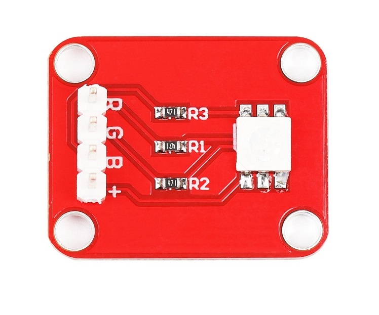

# RGB LED模块
## 概述

RGB LED模块由一个贴片全彩LED制成，通过R、G、B三个引脚的PWM电压输入可以调节三种基色（红/蓝/绿）的强度从而实现全彩的混色效果。用Arduino对模块的控制可实现酷炫的灯光效果。

<table border="1">

<tr>
  <td align="center"></td>
  <td align="center"></td>
  <td align="center"></td>
</tr>
<tr>
  <td style="background-color:rgb(232,232,232,0.5) "colspan="3" align="center"> <a href="https://item.taobao.com/item.htm?id=552830913340"><font style="font-size:16px"> RGB LED模块 </font></a> </td>
</tr>
</table>

## 产品参数

+ 尺寸：20*25mm
  
+ 工作电压：5V
  
+ LED驱动模式：共阳驱动

## 端口说明

+ R：红灯负极
  
+ G：绿灯负极
  
+ B：蓝灯负极
  
+ \+：VCC

## 示例程序

```C++
/*OJ RGB LED
 www.openjumper.cn
 */

 #define R 3
 #define G 5
 #define B 6
 int brightness = 0;    // how bright the LED is
 int fadeAmount = 5;    // how many points to fade the LED by

 void setup()  { 
  pinMode(R,OUTPUT);
  pinMode(G,OUTPUT);
  pinMode(B,OUTPUT);
 } 
 void loop()  { 
   analogWrite(R, brightness);    
   analogWrite(G, brightness);  
   analogWrite(B, brightness);    

   brightness = brightness + fadeAmount;

   if (brightness == 0 || brightness == 255) {
     fadeAmount = -fadeAmount ; 
   }     

   delay(30);                            
 }
```
## 相关文档
[schematic:RGBled](http://www.openjumper.cn/wp-content/uploads/2012/08/RGBled.pdf)
