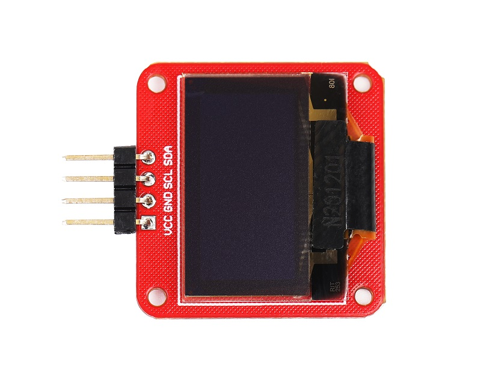
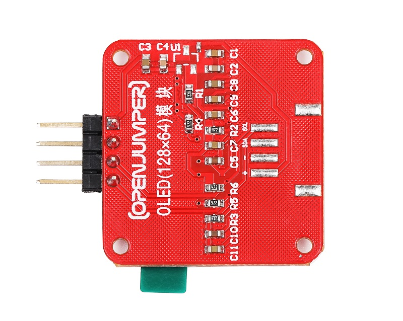
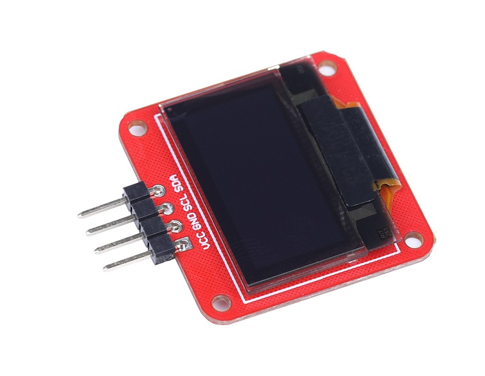
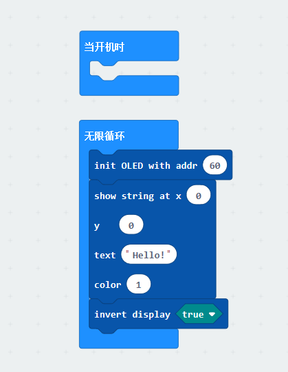

# OLED液晶显示屏模块

## 产品介绍

12864 OLED ,使用IIC接口，占用IO口少，能用u8glib、AdafruitSSD1306库驱动，方便使用。

<table border="1">

<tr>
  <td align="center"></td>
  <td align="center"></td>
  <td align="center"></td>
</tr>
<tr>
  <td style="background-color:rgb(232,232,232,0.5) "colspan="3" align="center"> <a href="https://item.taobao.com/item.htm?id=571125106180"><font style="font-size:16px"> OLED液晶显示屏模块 </font></a> </td>
</tr>
</table>

## 参数规格

+ 模块尺寸：28mm*33mm

+ 像素：128*64

+ 显示色彩：蓝色

+ 供电电压：5V

## 引脚定义

|标识	|功能|
|:--|:--|
|–|	GND|
|+	|+5V|
|SCL/SDA|	IIC|

## 特点

+ 屏幕尺寸:0.96英寸,点阵格式:128*64,通过使用u8glib 、AdafruitSSD1306库文件或自己编写驱动，连接OLED至Arduino的IIC通信接口就可以很方便的进行显示。
  
+ 屏幕工作电压为DC  5V。

## arduino 示例程序
```C++
#include <U8g2lib.h>
#include <Wire.h>

U8G2_SSD1306_128X64_NONAME_1_HW_I2C u8g2(U8G2_R0, U8X8_PIN_NONE);

void page1() {
  u8g2.setFont(u8g2_font_timR08_tf);
  u8g2.setFontPosTop();
  u8g2.setCursor(0,20);
  u8g2.print("1234");
}

void setup(){
  u8g2.setI2CAddress(0x3C*2);
  u8g2.begin();
  u8g2.enableUTF8Print();

}

void loop(){
  u8g2.firstPage();
  do
  {
    page1();
  }while(u8g2.nextPage());

}
```

## makecode图形化编程



## 其他资料

[OLED库文件下载](https://pan.baidu.com/s/162iLa80gheX44aBSaEatTA?pwd=7p9c) 提取码: 7p9c
