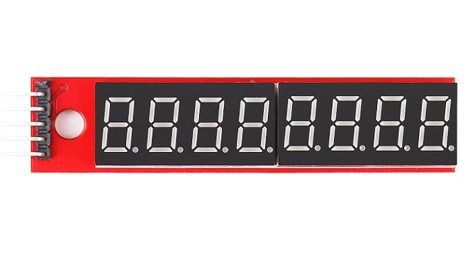
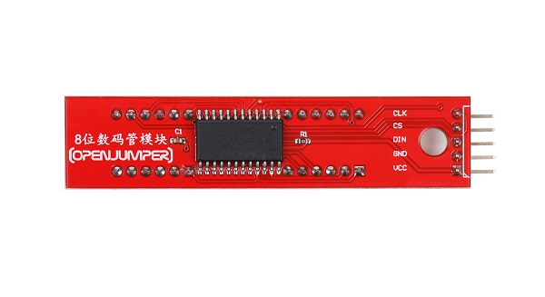
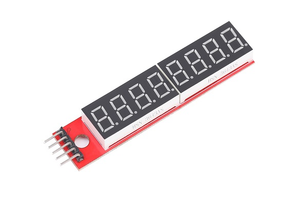
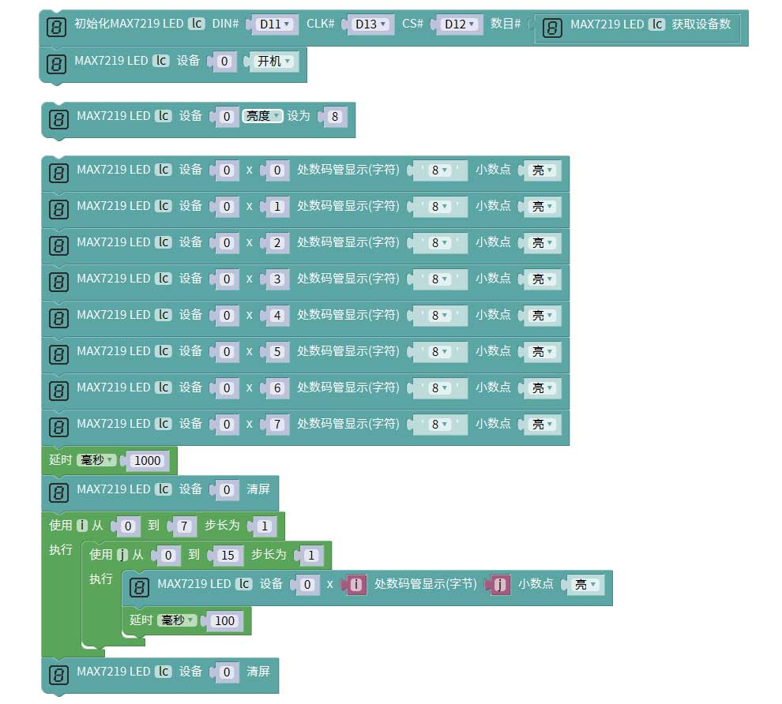

# 8位数码管模块
## 概述

数码管是一种专门用来显示数字的器件，但如果用其直接连接Arduino显示数字，只能一个（位）一个（位）数字得连接显示，且会非常得耗费引脚。因此我们将使用到一个数码管驱动模块，它可以同时驱动显示8位数码管，大大节省了单片机的IO端口。
支持arduino及wifiduino等主板。

<table border="1">

<tr>
  <td align="center"></td>
  <td align="center"></td>
  <td align="center"></td>
</tr>
<tr>
  <td style="background-color:rgb(232,232,232,0.5) "colspan="3" align="center"> <a href="https://item.taobao.com/item.htm?id=630712474932"><font style="font-size:16px">8位数码管模块 </font></a> </td>
</tr>
</table>


## 引脚定义

|引脚|	功能描述|
|:--|:--|
|CLK	|时钟序列输入端。最大速率为10MHz.在时钟的上升沿，数据移入内部移位寄存器。下降沿时，数据从DOUT端输出|
|CS|	片选端/载入数据（load）。该端为低电平时串行数据被载入移位寄存器。连续的后16位在该端（load）的上升沿时被锁定|
|DIN|	串行数据输入端口。在时钟上升沿时数据被载入内部的16位寄存器|
|GND	|电源负极|
|VCC	|电源正极|

## 参数

+ 工作电压：3.3V-5V
  
+ 驱动芯片：MAX7219CWG
  
+ 外形尺寸（长×宽×高）：72mm×17mm×9mm（不含插针）
  
+ 显示内容：8位带小数点
  
+ 固定孔径：3mm

## 示例程序（arduino）

```C++
#include <LedControl.h>

LedControl lc=LedControl(11, 13, 12, lc.getDeviceCount());
//LedControl lc=LedControl(D11, D13, D12, lc.getDeviceCount());  wifiduino
void setup(){

}

void loop(){
  lc.shutdown(0, false);

  lc.setIntensity(0, 8);

  lc.setChar(0, 0, '8', true);
  lc.setChar(0, 1, '8', true);
  lc.setChar(0, 2, '8', true);
  lc.setChar(0, 3, '8', true);
  lc.setChar(0, 4, '8', true);
  lc.setChar(0, 5, '8', true);
  lc.setChar(0, 6, '8', true);
  lc.setChar(0, 7, '8', true);
  delay(1000);
  lc.clearDisplay(0);
  for (int i = 0; i <= 7; i = i + (1)) {
    for (int j = 0; j <= 15; j = j + (1)) {
      lc.setDigit(0, i, j, true);
      delay(100);
    }
  }
  lc.clearDisplay(0);

}
```
## mixly示例程序

wifiduino示例程序



## 其他资料

arduino 库文件： <http://download.openjumper.cn/LedControl.rar>

Arduino下载与安装：<https://arduino.me/downloadhttps://arduino.me/download> 

Mixly下载与安装： <https://openjumper.cn/mixly-oj/>