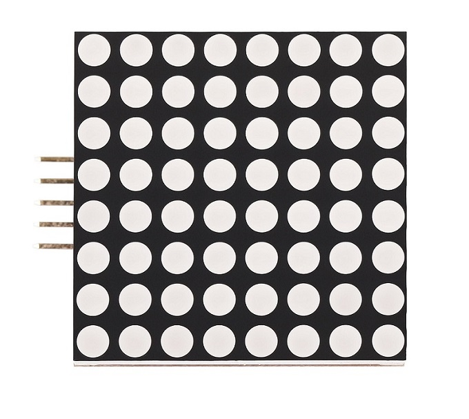
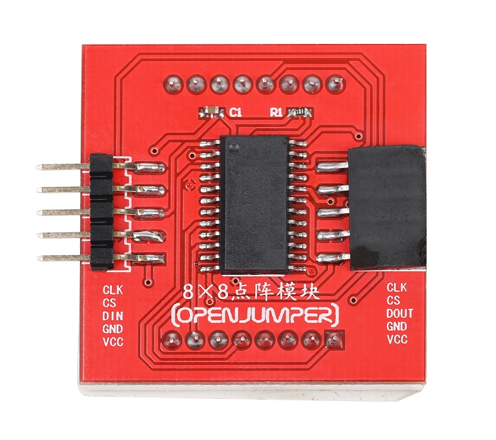
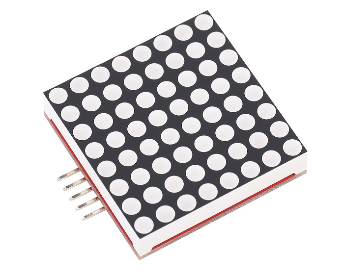
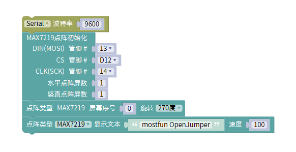

# 8×8点阵模块
## 概述

该点阵是由8×8个LED发光二极管组成的阵列，共计64个发光二极管。由MAX7219CWG芯片驱动。通过不同的显示方式，我们可以使用该模块显示数字、字母、汉字或自定义图形等。该模块还可以通过级联的方式，将多个模块拼接在一起，扩大显示范围。

<table border="1">

<tr>
  <td align="center"></td>
  <td align="center"></td>
  <td align="center"></td>
</tr>
<tr>
  <td style="background-color:rgb(232,232,232,0.5) "colspan="3" align="center"> <a href="https://item.taobao.com/item.htm?id=630065748600"><font style="font-size:16px"> 8×8点阵模块 </font></a> </td>
</tr>
</table>

## 引脚定义

|输入端| 输出端|
|:--|:--|
|CLK | CLK|
|CS  |  CS|
|DIN | DOUT|
|GND | GND|
|VCC |VCC|

## 参数

+ 工作电压：3.3V-5V
  
+ 驱动芯片：MAX7219CWG

+ 外形尺寸（长×宽×高）：38mm×38mm×9mm（不含插针）
  
+ 显示范围：8×8（可级联）

## 示例程序（arduino）

```C++
#include <SPI.h>
#include <Adafruit_GFX.h>
#include <Max72xxPanel.h>

Max72xxPanel myMatrix = Max72xxPanel(D12,1,1);

void setup(){
  Serial.begin(9600);
}

void loop(){
  myMatrix.setRotation(0,1);
  myMatrix.scrollMessage("mostfun OpenJumper",100);

}
```

## mixly示例程序



## 其他资料

arduino 库文件：

<http://download.openjumper.cn/Adafruit_GFX_Library.rar>

<http://download.openjumper.cn/Max72xxPanel.rar>

Arduino下载与安装： <https://arduino.me/download>

Mixly下载与安装： <https://openjumper.cn/mixly-oj/>
