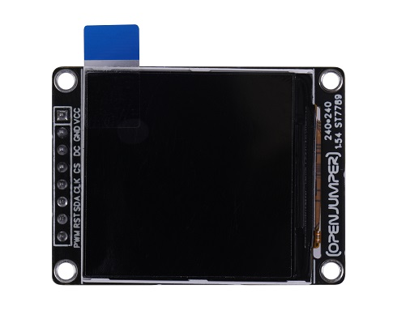
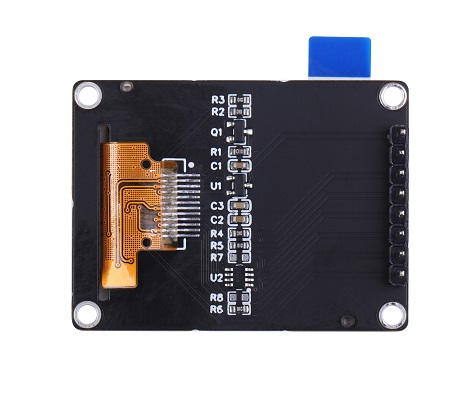
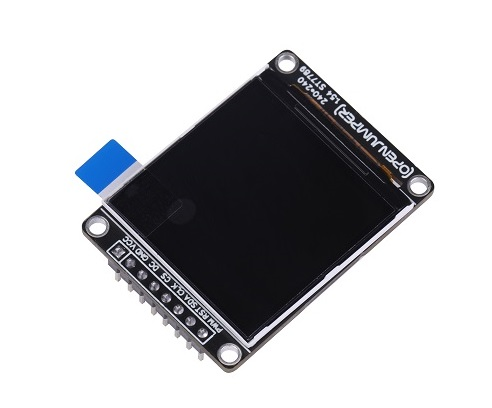
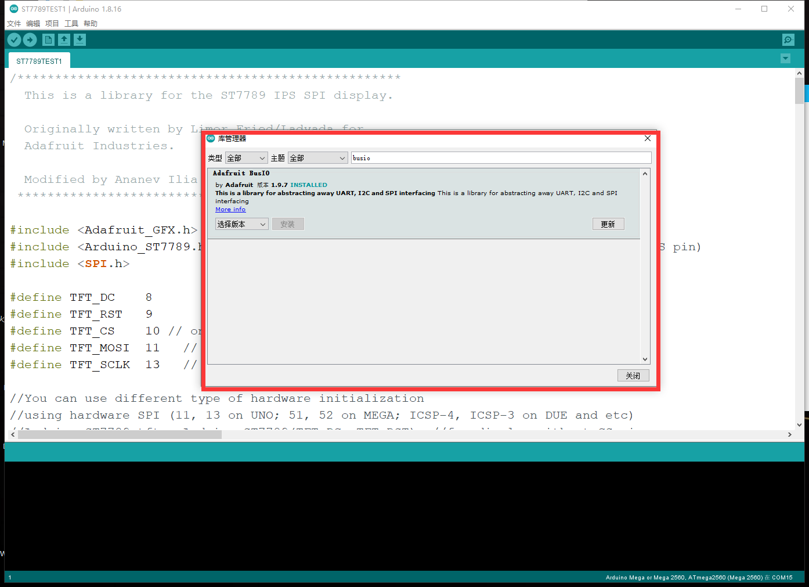

# TFT-LCD显示屏
## 产品介绍

TFT-LCD显示屏采用ST7789VW作为驱动芯片，TFT-LCD显示屏的特点是亮度好、对比度高、层次感强、颜色鲜艳。

ST7789VW芯片是一款用于262K彩色图形TFT-LCD的单片控制器/驱动器。该芯片能够直接连接到外部设备微处理器，并接受8位/9位/16位/18位并行接口。由于集成电源驱动液晶所需的电路；可以用最少的组件制作一个显示系统。

<table border="1" align="center">

<tr>
  <td align="center"></td>
  <td align="center"></td>
  <td align="center"></td>
</tr>
<tr>
  <td style="background-color:rgb(232,232,232,0.5) "colspan="3" align="center"> <a href="https://item.taobao.com/item.htm?id=665418470268"><font style="font-size:16px"> TFT-LCD显示屏 </font></a> </td>
</tr>
</table>


## 硬件参数

+ 模块尺寸：43 x 32mm

+ 屏幕尺寸：1.54英寸

+ 材料：高清IPS LCD

+ 分辨率：240(H)RGB x 240(V)

+ 驱动芯片：ST7789VW

+ 通信接口：4Line SPI

+ 显示颜色：全彩

+ 显示区域：27.72(H) x 27.72(V) mm

+ 面板尺寸：31 52(H) x 33.72(V) x1.9(D)mm

+ 像素间距：0.1155(H) X 0.1155(V) mm

+ 视角方向：All View

+ 工作电压：5V

+ 工作电流：30mA

+ 背光类型：3 White LED Parallel

+ 工作温度：-20~70度

## 引脚定义

|序号| 名称|说明|
|:--|:--|:--|
|1 |PWM |脉宽调制|
|2| RST|复位管脚|
|3| SDA |SPI数据线|
|4 |CLK|SPI数据时钟线|
|5 |CS|SPI片选低电平有效|
|6| DC|数据/指令控制管脚|
|7 |GND|电源地|
|8 |VCC|电源正极|

## Arduino UNO接线说明

|TFT显示屏|Arduino UNO|
|:--:|:--:|
|VCC|5V|
|GND|GND|
|DC|8|
|CS|10|
|CLK|13|
|SDA|11|
|RST|9|

## 屏幕驱动程序

**Arduino uno**
```C++
/***************************************************
  This is a library for the ST7789 IPS SPI display.

  Originally written by Limor Fried/Ladyada for 
  Adafruit Industries.

  Modified by Ananev Ilia
 ****************************************************/

#include <Adafruit_GFX.h>    // Core graphics library by Adafruit
#include <Arduino_ST7789.h> // Hardware-specific library for ST7789 (with or without CS pin)
#include <SPI.h>

#define TFT_DC    8
#define TFT_RST   9 
#define TFT_CS    10 // only for displays with CS pin
#define TFT_MOSI  11   // for hardware SPI data pin (all of available pins)即模块上SDA
#define TFT_SCLK  13   // for hardware SPI sclk pin (all of available pins)即模块上CLK

//You can use different type of hardware initialization
//using hardware SPI (11, 13 on UNO; 51, 52 on MEGA; ICSP-4, ICSP-3 on DUE and etc)
//Arduino_ST7789 tft = Arduino_ST7789(TFT_DC, TFT_RST); //for display without CS pin
//Arduino_ST7789 tft = Arduino_ST7789(TFT_DC, TFT_RST, TFT_CS); //for display with CS pin
//or you can use software SPI on all available pins (slow)
//Arduino_ST7789 tft = Arduino_ST7789(TFT_DC, TFT_RST, TFT_MOSI, TFT_SCLK); //for display without CS pin
Arduino_ST7789 tft = Arduino_ST7789(TFT_DC, TFT_RST, TFT_MOSI, TFT_SCLK, TFT_CS); //for display with CS pin
//Arduino_ST7789 tft = Arduino_ST7789(-1, TFT_RST, TFT_MOSI, TFT_SCLK, TFT_CS); //for display with CS pin and DC via 9bit SPI


float p = 3.1415926;

void setup(void) {
  Serial.begin(9600);
  Serial.print("Hello! ST7789 TFT Test");

  tft.init(240, 240);   // initialize a ST7789 chip, 240x240 pixels

  Serial.println("Initialized");

  uint16_t time = millis();
  tft.fillScreen(BLACK);
  time = millis() - time;

  Serial.println(time, DEC);
  delay(500);

  // large block of text
  tft.fillScreen(BLACK);
  testdrawtext("Lorem ipsum dolor sit amet, consectetur adipiscing elit. Curabitur adipiscing ante sed nibh tincidunt feugiat. Maecenas enim massa, fringilla sed malesuada et, malesuada sit amet turpis. Sed porttitor neque ut ante pretium vitae malesuada nunc bibendum. Nullam aliquet ultrices massa eu hendrerit. Ut sed nisi lorem. In vestibulum purus a tortor imperdiet posuere. ", WHITE);
  delay(1000);

  // tft print function
  tftPrintTest();
  delay(4000);

  // a single pixel
  tft.drawPixel(tft.width()/2, tft.height()/2, GREEN);
  delay(500);

  // line draw test
  testlines(YELLOW);
  delay(500);

  // optimized lines
  testfastlines(RED, BLUE);
  delay(500);

  testdrawrects(GREEN);
  delay(500);

  testfillrects(YELLOW, MAGENTA);
  delay(500);

  tft.fillScreen(BLACK);
  testfillcircles(10, BLUE);
  testdrawcircles(10, WHITE);
  delay(500);

  testroundrects();
  delay(500);

  testtriangles();
  delay(500);

  mediabuttons();
  delay(500);

  Serial.println("done");
  delay(1000);
}

void loop() {
  tft.invertDisplay(true);
  delay(500);
  tft.invertDisplay(false);
  delay(500);
}

void testlines(uint16_t color) {
  tft.fillScreen(BLACK);
  for (int16_t x=0; x < tft.width(); x+=6) {
    tft.drawLine(0, 0, x, tft.height()-1, color);
  }
  for (int16_t y=0; y < tft.height(); y+=6) {
    tft.drawLine(0, 0, tft.width()-1, y, color);
  }

  tft.fillScreen(BLACK);
  for (int16_t x=0; x < tft.width(); x+=6) {
    tft.drawLine(tft.width()-1, 0, x, tft.height()-1, color);
  }
  for (int16_t y=0; y < tft.height(); y+=6) {
    tft.drawLine(tft.width()-1, 0, 0, y, color);
  }

  tft.fillScreen(BLACK);
  for (int16_t x=0; x < tft.width(); x+=6) {
    tft.drawLine(0, tft.height()-1, x, 0, color);
  }
  for (int16_t y=0; y < tft.height(); y+=6) {
    tft.drawLine(0, tft.height()-1, tft.width()-1, y, color);
  }

  tft.fillScreen(BLACK);
  for (int16_t x=0; x < tft.width(); x+=6) {
    tft.drawLine(tft.width()-1, tft.height()-1, x, 0, color);
  }
  for (int16_t y=0; y < tft.height(); y+=6) {
    tft.drawLine(tft.width()-1, tft.height()-1, 0, y, color);
  }
}

void testdrawtext(char *text, uint16_t color) {
  tft.setCursor(0, 0);
  tft.setTextColor(color);
  tft.setTextWrap(true);
  tft.print(text);
}

void testfastlines(uint16_t color1, uint16_t color2) {
  tft.fillScreen(BLACK);
  for (int16_t y=0; y < tft.height(); y+=5) {
    tft.drawFastHLine(0, y, tft.width(), color1);
  }
  for (int16_t x=0; x < tft.width(); x+=5) {
    tft.drawFastVLine(x, 0, tft.height(), color2);
  }
}

void testdrawrects(uint16_t color) {
  tft.fillScreen(BLACK);
  for (int16_t x=0; x < tft.width(); x+=6) {
    tft.drawRect(tft.width()/2 -x/2, tft.height()/2 -x/2 , x, x, color);
  }
}

void testfillrects(uint16_t color1, uint16_t color2) {
  tft.fillScreen(BLACK);
  for (int16_t x=tft.width()-1; x > 6; x-=6) {
    tft.fillRect(tft.width()/2 -x/2, tft.height()/2 -x/2 , x, x, color1);
    tft.drawRect(tft.width()/2 -x/2, tft.height()/2 -x/2 , x, x, color2);
  }
}

void testfillcircles(uint8_t radius, uint16_t color) {
  for (int16_t x=radius; x < tft.width(); x+=radius*2) {
    for (int16_t y=radius; y < tft.height(); y+=radius*2) {
      tft.fillCircle(x, y, radius, color);
    }
  }
}

void testdrawcircles(uint8_t radius, uint16_t color) {
  for (int16_t x=0; x < tft.width()+radius; x+=radius*2) {
    for (int16_t y=0; y < tft.height()+radius; y+=radius*2) {
      tft.drawCircle(x, y, radius, color);
    }
  }
}

void testtriangles() {
  tft.fillScreen(BLACK);
  int color = 0xF800;
  int t;
  int w = tft.width()/2;
  int x = tft.height()-1;
  int y = 0;
  int z = tft.width();
  for(t = 0 ; t <= 15; t++) {
    tft.drawTriangle(w, y, y, x, z, x, color);
    x-=4;
    y+=4;
    z-=4;
    color+=100;
  }
}

void testroundrects() {
  tft.fillScreen(BLACK);
  int color = 100;
  int i;
  int t;
  for(t = 0 ; t <= 4; t+=1) {
    int x = 0;
    int y = 0;
    int w = tft.width()-2;
    int h = tft.height()-2;
    for(i = 0 ; i <= 16; i+=1) {
      tft.drawRoundRect(x, y, w, h, 5, color);
      x+=2;
      y+=3;
      w-=4;
      h-=6;
      color+=1100;
    }
    color+=100;
  }
}

void tftPrintTest() {
  tft.setTextWrap(false);
  tft.fillScreen(BLACK);
  tft.setCursor(0, 30);
  tft.setTextColor(RED);
  tft.setTextSize(1);
  tft.println("Hello World!");
  tft.setTextColor(YELLOW);
  tft.setTextSize(2);
  tft.println("Hello World!");
  tft.setTextColor(GREEN);
  tft.setTextSize(3);
  tft.println("Hello World!");
  tft.setTextColor(BLUE);
  tft.setTextSize(4);
  tft.print(1234.567);
  delay(1500);
  tft.setCursor(0, 0);
  tft.fillScreen(BLACK);
  tft.setTextColor(WHITE);
  tft.setTextSize(0);
  tft.println("Hello World!");
  tft.setTextSize(1);
  tft.setTextColor(GREEN);
  tft.print(p, 6);
  tft.println(" Want pi?");
  tft.println(" ");
  tft.print(8675309, HEX); // print 8,675,309 out in HEX!
  tft.println(" Print HEX!");
  tft.println(" ");
  tft.setTextColor(WHITE);
  tft.println("Sketch has been");
  tft.println("running for: ");
  tft.setTextColor(MAGENTA);
  tft.print(millis() / 1000);
  tft.setTextColor(WHITE);
  tft.print(" seconds.");
}

void mediabuttons() {
  // play
  tft.fillScreen(BLACK);
  tft.fillRoundRect(25, 10, 78, 60, 8, WHITE);
  tft.fillTriangle(42, 20, 42, 60, 90, 40, RED);
  delay(500);
  // pause
  tft.fillRoundRect(25, 90, 78, 60, 8, WHITE);
  tft.fillRoundRect(39, 98, 20, 45, 5, GREEN);
  tft.fillRoundRect(69, 98, 20, 45, 5, GREEN);
  delay(500);
  // play color
  tft.fillTriangle(42, 20, 42, 60, 90, 40, BLUE);
  delay(50);
  // pause color
  tft.fillRoundRect(39, 98, 20, 45, 5, RED);
  tft.fillRoundRect(69, 98, 20, 45, 5, RED);
  // play color
  tft.fillTriangle(42, 20, 42, 60, 90, 40, GREEN);
}
```
**ESP32**
```C++
#include "2_TFT_SPI.h"  
extern char FONT16[][32];
extern char FONT24[][72];
extern char FONT32[][128];
extern unsigned char gImage_uzi[96000];

void setup() {
  Serial.begin(115200);
  lcd_io_set(2,4,5,19,22,23);  //LCD IO 的设置 ，传入参数顺序分别是：SCL SDA DC CS RES BLK (BLK可以填写零，那么我们直接把BLK接在3.3v高电平上就可以不用IO控制背光)
  LCD_Init();
  }

void loop() {
  LCD_Clear(WHITE);
  /* 这两个参数叫做默认画笔参数，是在模块驱动内定义好的，一个是画笔颜色一个是背景颜色，设置之后凡是不传入颜色的画图，显示字符等都是用这一对参数，我们可以改变它 */
  POINT_COLOR = GREEN;  BACK_COLOR = 0xffff;   
  
  LCD_Fill(20, 20, 220, 80, RED);  //指定矩形区域填充什么颜色，参入参数分别是矩形区域左上角XY坐标以及右下角XY坐标，然后是填充的颜色
  LCD_DrawLine(20, 20, 220, 80);  //画线函数，颜色使用上面的默认的那种
  LCD_DrawRectangle(20, 100, 120, 140);  //画矩形函数，传入参数直接是左上角和右下角的XY坐标，颜色就是使用默认的上面那对画笔参数
  gui_circle(30, 180, YELLOW, 30, 1);  //画圆函数，传入参数分别为：圆心XY坐标，颜色，半径，以及是否填充（1为填充，0为不填充）
  gui_circle(120, 180, BLUE, 30, 0);
  Draw_Triangel(30, 220, 0, 260, 60, 260);  //在指定位置画三角形，传入参数就是三角形的三个点（上-左-右）
  Fill_Triangel(90, 220, 60, 260, 120, 260);  //在指定位置填充三角形，用法与上面画三角形一样，但是会填充为画笔颜色的颜色
  
  delay(2000);
  LCD_Clear(BLACK);
  POINT_COLOR = RED;  BACK_COLOR = BLACK;
  LCD_ShowChar(20, 0, RED, BLACK, 'C', 16, 1);
  //显示英文字符串，传入参数分别是：显示字符串起始位置XY坐标，字体大小（可以选12或者16，分别代表1206和1608两种字体），最后是是否进行覆盖（0是不覆盖，1是覆盖），颜色用的是默认的画笔参数
  LCD_ShowString(20,20, 12, "hello", 1);  
  LCD_ShowString(20,40, 16, "world", 1);
  
  LCD_ShowNum(20, 60, 615, 6, 16);  //显示数字（整数），传入参数为：显示的起始XY坐标，要显示的数字（这里我写的615），数字长度（这里写6就是可以显示6位以内，可以自己改），然后是字体大小，同样是填12或者16
  //显示小数的方法：
  char buffer_temp[20] = "";
  sprintf(buffer_temp, "show float num:%0.3f", 13.14);  //把小数强制转化到一个数组里面进行显示，这种方法同样适用于其他类型的数字，也可以用0.3f%这种保存一定精度
  LCD_ShowString(20,80, 16, buffer_temp, 1);
  memset(buffer_temp, 0, sizeof(buffer_temp));    //清空字符串

  DrawFont16(20, 100, GREEN, RED, FONT16[0], 1);  //写一个16x16中文字符，FONT16[0]就代表第零个中文字符
  DrawFont16(20+16, 100, GREEN, RED, FONT16[1], 0);  //写一个16x16中文字符，FONT16[0]就代表第零个中文字符

  DrawFont24(20, 125, GREEN, RED, FONT24[0], 1);  //写一个16x16中文字符，FONT16[0]就代表第零个中文字符
  DrawFont24(20+24, 125, GREEN, RED, FONT24[1], 0);  //写一个16x16中文字符，FONT16[0]就代表第零个中文字符

  DrawFont32(20, 165, GREEN, RED, FONT32[0], 1);  //写一个16x16中文字符，FONT16[0]就代表第零个中文字符
  DrawFont32(20+32, 165, GREEN, RED, FONT32[1], 0);  //写一个16x16中文字符，FONT16[0]就代表第零个中文字符
  
  delay(2000); 
  showimage(gImage_uzi, 200, 240, 0, 0);
  delay(2000);
}       

/* ******************************************************************************************************************************************************** */
/* ********************************************* 我们取的字模，取字模配置及其大小不能变但是字体形式可以自己选 ************************************************ */
/* ******************************************************************************************************************************************************** */
char FONT16[][32] =  /* 16x16 大小字体的字模，取模方法在博文中已经给出，取出后放在这里，记住按顺序填好后面“深,0”这样的标号方便自己知道是哪个 */
{
0x00,0x00,0x27,0xFC,0x14,0x04,0x14,0xA4,0x81,0x10,0x42,0x08,0x40,0x40,0x10,0x40,
0x17,0xFC,0x20,0x40,0xE0,0xE0,0x21,0x50,0x22,0x48,0x2C,0x46,0x20,0x40,0x00,0x40,/*深,0*/
0x11,0x04,0x11,0x24,0x11,0x24,0x11,0x24,0x11,0x24,0xFD,0x24,0x11,0x24,0x11,0x24,
0x11,0x24,0x11,0x24,0x11,0x24,0x1D,0x24,0xE1,0x24,0x42,0x24,0x02,0x04,0x04,0x04,/*圳,1*/
};

char FONT24[][72] =
{
0x00,0x00,0x00,0x00,0x00,0x00,0x00,0x00,0x00,0x00,0x00,0x00,0x00,0x18,0x00,0x00,
0x18,0x00,0x00,0x18,0x00,0x00,0x18,0x00,0x3F,0xFF,0xFE,0x30,0x18,0x06,0x30,0x18,
0x06,0x30,0x18,0x06,0x30,0x18,0x06,0x30,0x18,0x06,0x3F,0xFF,0xFE,0x30,0x18,0x06,
0x00,0x18,0x00,0x00,0x18,0x00,0x00,0x18,0x00,0x00,0x18,0x00,0x00,0x18,0x00,0x00,
0x00,0x00,0x00,0x00,0x00,0x00,0x00,0x00,/*中，0*/
0x00,0x00,0x00,0x00,0x00,0x00,0x00,0x00,0x00,0x00,0x38,0x00,0x00,0x1C,0x00,0x00,
0x06,0x00,0xFF,0xFF,0xFF,0x06,0x00,0x30,0x06,0x00,0x30,0x03,0x00,0x60,0x03,0x00,
0x60,0x01,0x80,0xC0,0x00,0xC1,0x80,0x00,0xE3,0x00,0x00,0x36,0x00,0x00,0x1C,0x00,
0x00,0x77,0x00,0x03,0xC1,0xE0,0x1E,0x00,0x3C,0x60,0x00,0x07,0x00,0x00,0x00,0x00,
0x00,0x00,0x00,0x00,0x00,0x00,0x00,0x00,/*文，1*/
};

char FONT32[][128] =
{
0x00,0x00,0x00,0x00,0x00,0x06,0x00,0x00,0x00,0x03,0x00,0x00,0x00,0x00,0xC0,0x00,
0x00,0x01,0xC0,0xC0,0x00,0x01,0x07,0xC0,0x00,0x01,0xFF,0x00,0x02,0x1F,0xFE,0x00,
0x07,0xF0,0x1C,0x00,0x07,0xC0,0x70,0x00,0x0F,0x00,0xE0,0x00,0x0E,0x03,0xF0,0x00,
0x1C,0x0F,0xF0,0x00,0x3C,0x0F,0x70,0x00,0x3C,0x00,0xE0,0x00,0x18,0x00,0xC0,0x00,
0x00,0x00,0xC0,0x00,0x00,0x00,0xC0,0x00,0x00,0x00,0x60,0x00,0x00,0x00,0x20,0x00,
0x00,0x00,0x37,0x00,0x00,0x01,0xFF,0x00,0x00,0x7F,0xF8,0x00,0x07,0xF8,0x30,0x00,
0x1F,0x80,0x30,0x00,0x00,0x80,0x30,0x00,0x00,0xC0,0x30,0x00,0x00,0x60,0x60,0x00,
0x00,0x18,0xE0,0x00,0x00,0x0F,0xC0,0x00,0x00,0x06,0x00,0x00,0x00,0x00,0x00,0x00,/*字,0*/
0x00,0x00,0x00,0x00,0x00,0x00,0x00,0x00,0x00,0x00,0x00,0xC0,0x00,0x00,0x00,0xE0,
0x00,0x20,0x01,0xB8,0x00,0x70,0x3F,0xF8,0x00,0x61,0xFF,0xC0,0x00,0xC3,0x03,0x00,
0x01,0xC6,0x06,0x00,0x03,0x8C,0x06,0x00,0x03,0x08,0x0C,0x00,0x06,0x08,0x0C,0x00,
0x0E,0x18,0x18,0x3F,0x1E,0x10,0x1B,0xF3,0x1F,0x90,0x3F,0x07,0x00,0x80,0x3C,0x1C,
0x01,0x90,0x70,0x7C,0x01,0x90,0x60,0xFE,0x01,0xA0,0xC3,0xF8,0x01,0xA0,0x0F,0xD8,
0x03,0xA0,0x08,0x18,0x03,0x60,0x00,0x18,0x03,0x40,0x00,0x18,0x03,0xC0,0x00,0x18,
0x03,0x80,0x00,0x18,0x03,0x00,0x00,0x18,0x00,0x00,0x00,0x18,0x00,0x00,0x00,0x10,
0x00,0x00,0x00,0x30,0x00,0x00,0x00,0x30,0x00,0x00,0x00,0x00,0x00,0x00,0x00,0x00,/*体,1*/
};

unsigned char gImage_uzi[96000] = {  };  //这里就太长了，所以不贴出整个图像数组

```

## Arduino库文件

arduino库文件可以在库管理器里面搜索到，您可以在库管理器里面搜索安装，安装不了的情况再用下边提供的库文件压缩包安装。安装方法采用添加压缩包的方式。



Arduino库文件下载:< https://pan.baidu.com/s/19gdsvYBKaoRAW_r1rhqO6Q?pwd=68ys> 提取码：68ys 

## 其他文件

TFT屏幕驱动程序下载:<https://pan.baidu.com/s/1W8zw6LU0mcrPEJZamawN4Q?pwd=ft9s> 提取码：ft9s