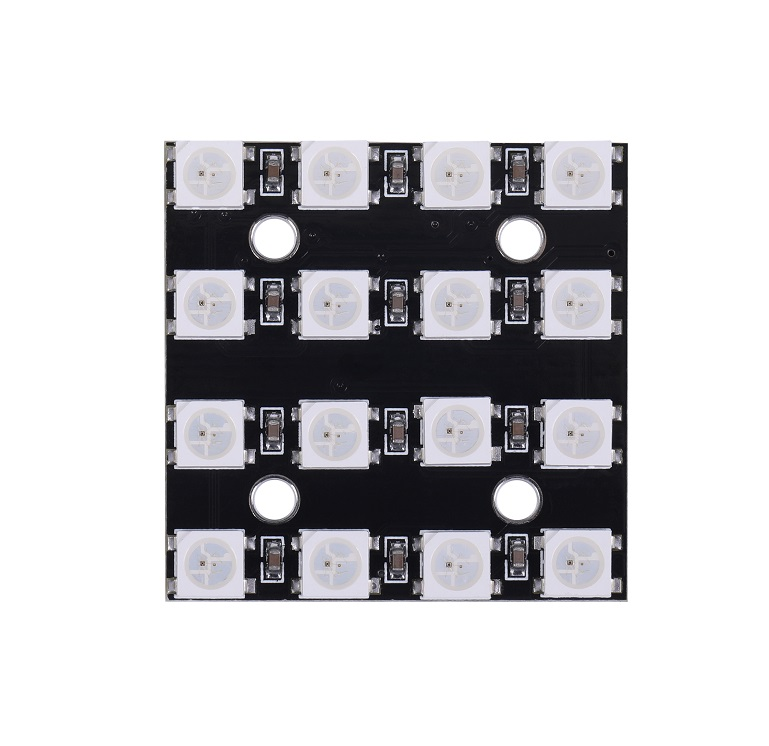
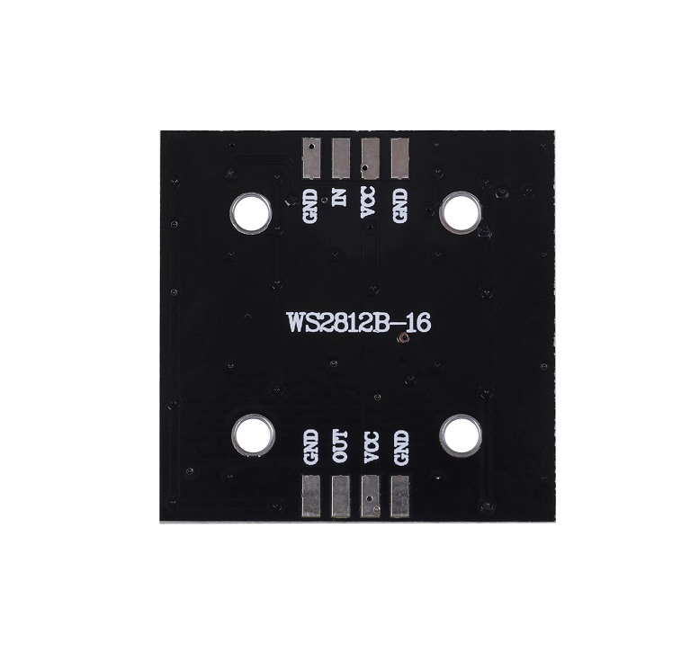

# WS2812B-4*4位全彩驱动彩灯开发板

## 产品概述

WS2812是一个集控制电路与发光电路于一体的智能外控LED光源。其外型与一个5050LED灯珠相同，每个元件即为一个像素点。像素点内部包含了智能数字接口数据锁存信号整形放大驱动电路，还包含有高精度的内部振荡器和12V高压可编程定电流控制部分，有效保证了像素点光的颜色高度一致。

数据协议采用单线归零码的通讯方式，像素点在上电复位以后，DIN端接受从控制器传输过来的数据，首先送过来的24bit数据被第一个像素点提取后，送到像素点内部的数据锁存器，剩余的数据经过内部整形处理电路整形放大后通过DO端口开始转发输出给下一个级联的像素点，每经过一个像素点的传输，信号减少24bit。像素点采用自动整形转发技术，使得该像素点的级联个数不受信号传送的限制，仅仅受限信号传输速度要求。

LED具有低电压驱动，环保节能，亮度高，散射角度大，一致性好，超低功率，超长寿命等优点。将控制电路集成于LED上面，电路变得更加简单，体积小，安装更加简便。

<table border="1" align="center">

<tr>
  <td align="center"></td>
  <td align="center"></td>
  <td align="center"></td>
</tr>
<tr>
  <td style="background-color:rgb(232,232,232,0.5) "colspan="3" align="center"> <a href="https://item.taobao.com/item.htm?id=665515714598"><font style="font-size:16px"> WS2812 16位全彩驱动彩灯开发板</font></a> </td>
</tr>
</table>


## 产品特点 

+ IC控制电路与LED点光源公用一个电源。

+ 控制电路与RGB芯片集成在一个5050封装的元器件中，构成一个完整的外控像素点。

+ 内置信号整形电路，任何一个像素点收到信号后经过波形整形再输出，保证线路波形畸变不会累加。

+ 内置上电复位和掉电复位电路。

+ 每个像素点的三基色颜色可实现256级亮度显示，完成16777216种颜色的全真色彩显示，扫描频率不低于400Hz/s。

+ 串行级联接口，能通过一根信号线完成数据的接收与解码。

+ 任意两点传传输距离在不超过5米时无需增加任何电路。

+ 当刷新速率30帧/秒时，级联数不小于1024点。

+ 数据发送速度可达800Kbps。

+ 光的颜色高度一致，性价比高。

## 产品规格

+ 名称：WS2812全彩环形LED模块（16位灯珠）

+ 尺寸：34*34mm

+ 芯片：WS2812B（内置于LED）

+ LED：5050封装RGB全彩高亮

+ 电压：5V

+ 端口：数字

+ 平台：Arduino 单片机

+ 控制方式：内置控制芯片，只需一个IO口即可控制
  
## 引脚功能

|序号 |符号| 管脚名 |功能描述|
|:--|:--|:--|:--|
|1 |VCC |电源 |供电管脚|
|2| OUT |数据输出 |控制数据信号输出|
|3 |GND |地|信号接地和电源接地|
|4 |IN |数据输入|控制数据信号输入|

## 最大额定值
(如无特殊说明，TA=25°C,Vss=0V)

|参数 |符号 |范围| 单位|
|:--|:--|:--|:--|
|电源电压| VDD| +3.5 ~ +5.3| V
|逻辑输入电压 |VI| -0.5 ~ VDD+0.5| V
|工作温度| Topt |-25 ~ +80|°C
|储存温度| Tstg| -40 ~ +105|°C


## LED特性参数

|发光颜色 |主波长(nm) |发光强度(mcd) |工作电流(mA) |工作电压(V)|
|:--|:--|:--|:--|:--|
|红光 |620~630 |550~700 |16 |1.8~2.2|
|绿光|515~530 |1100~1400 |16| 2.8~3.1|
|蓝光| 465~475 |200~400| 16 |2.9~3.2|


## 主要应用领域

+ LED全彩发光字灯串，LED全彩模组， LED全彩软灯条硬灯条，LED护栏管。

+ LED点光源，LED像素屏，LED异形屏，各种电子产品，电器设备跑马灯。

## 实验例程

四色交替流水灯

实验接线

Module UNO

VCC —— 3.3V

GND —— GND

DI  ——  D6

```C++

#include <FastLED.h>
#define LED_PIN     6
#define NUM_LEDS    16
CRGB leds[NUM_LEDS];

void setup() {
  FastLED.addLeds<WS2812, LED_PIN, GRB>(leds, NUM_LEDS);
}
void loop() {
  for (int i = 0; i <= 15; i++) {
    leds = CRGB ( 0, 0, 200);
    FastLED.show();
    delay(33);
  }
  for (int i = 15; i >= 0; i--) {
    leds = CRGB ( 89, 0, 0);
    FastLED.show();
    delay(33);
  }
  for (int i = 0; i <= 63; i++) {
    leds = CRGB ( 0, 89, 0);
    FastLED.show();
    delay(33);
  }
   for (int i = 15 i >= 0; i--) {
    leds = CRGB ( 89, 0, 200);
    FastLED.show();
    delay(33);
  }
}
```