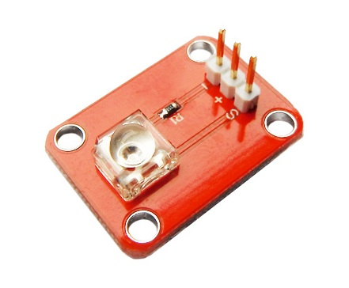
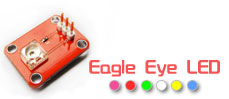

# 食人鱼LED模块
## 概述

高亮度的食人鱼LED模块，多种颜色供你选择，可结合Arduino制作你的光电互动作品，亦可用作照明。



[点我购买](https://item.taobao.com/item.htm?id=552575304805)


## 参数

+ 尺寸：20*25mm

+ 工作电压：3.3V-5V

+ 发光角度：90-100度

+ 颜色：紫、绿、白、红、黄、蓝



## 引脚说明

+ S：信号脚，接LED正极

+ +：NC脚，悬空

+ -：接地脚，接LED负极

## 使用方法

可用数字IO口直接驱动，亦可用PWM端口调节亮度使用。

//模块连至数字3号端口，每隔100ms变换一次状态
```C++
void setup(){
pinMode(3,OUTPUT);
}

void loop(){
digitalWrite(3,HIGH);
delay(100);
digitalWrite(3,LOW);
delay(100);
}

//模块连至数字3号端口，呼吸灯

void setup(){
pinMode(3,OUTPUT);
}

void loop(){
for(int i = 0; i = 0;i--){
digitalWrite(3,LOW);
delay(10);
}
}
```
## 相关文档

[5mm-Piraha-Led-Datesheetw1014uc](http://www.openjumper.cn/wp-content/uploads/2012/08/5mm-Piraha-Led-Datesheetw1014uc.pdf)

[5mm-Piraha-Led-Datesheetw1005uc](http://www.openjumper.cn/wp-content/uploads/2012/08/5mm-Piraha-Led-Datesheetw1005uc.pdf)

schematic:[led](http://www.openjumper.cn/wp-content/uploads/2012/08/led.pdf)