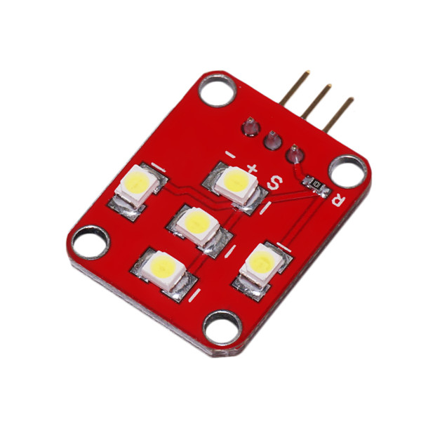

# Power-LED模块

## 概述

执行模块POWER LED采用五颗高亮LED并加上限流电阻保护LED，当用Arduino的IO口输出高电平驱动时直接可以照亮LED。配合arduino传感器扩展板，可以做出相应的灯光互动作品，同时POWER LED模块也可以点亮用来照明。



## 模块参数

+ 模块尺寸：20*25mm

+ 工作电压：5V

+ 驱动模式：高电平驱动

+ 灯光颜色：白色

## 端口说明

+ S:信号输入

+ +:VCC

+ -:GND

## 示例程序

```C++
/*OJ Power LED module 
 www.openjumper.cn
 */

 int Relay_pin = 13;            //连接模块至arduino信号脚13

 void setup() {                
   pinMode(Relay_pin, OUTPUT);      
 }

 void loop() {
   digitalWrite(Relay_pin, HIGH);   // 点亮LED
   delay(1000);               
   digitalWrite(Relay_pin, LOW);    // 熄灭LED
   delay(1000);               
 }
```

## 其他文档

[PowerLED](http://www.openjumper.cn/wp-content/uploads/2013/04/PowerLED.pdf)
