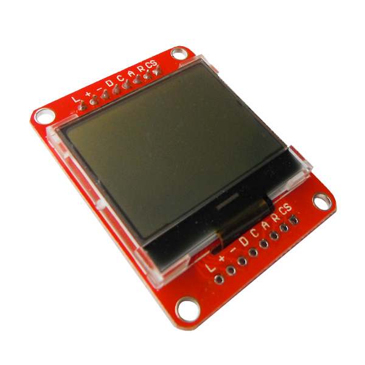

# 迷你12864液晶显示模块

## 概述

mini12864 LCD模块是一款基于12864液晶显示器开发的显示模块。这款模块SPI为接口的显示模块，配合12864LCD库文件，便可轻松显示汉字，字符和图形。并有背光LED控制，可使显示效果更美观。

## 模块参数

+ 外形尺寸 (长×宽×高）：47mm×38mm×6mm（不含插针）

+ LCD视域（长×宽）：33.7mm×33.5mm

+ LCD有效显示区域（长×宽）：30.7mm×23mm

+ 背光模式：白色LED支架背光

+ 工作电压：3.3V ～ 5.5V（内置升压电路，无需高压）

+ 控制IC ：UC1701

+ 阵格式：128列×64行

+ 显示效果：白底黑字

## 模块特点

+ 结构轻、薄、带背光 

     注：在LCD屏表面有一层保护膜，你可以将它撕掉

+ IC采用UC1701，功能强大，稳定性好

+ 功耗低：

     LCD工作电流：0.2mA（背光LED关闭状态）

     背光LED工作电流：≤4.5mA

     总功耗：≤23.5mW（5V）、≤15.5mW（3.3V）

+ 显示内容：

     可显示128列×64行点阵单色图片

     可显示16×16点阵和12×12点阵汉字及图片

     可显示8字/行×4行（16×16点阵汉字）

     可显示16字/行×8行（8×8点阵的英文、数字、符号）

+ 接口简单方便：采用3线SPI串行接口以及一条命令/数据控制线，最多只需5个端口（3线SPI接口加命令/数据控制线，再加上复位信号线）

+ 模块上分别设计有上下位置引脚引出，上部已焊接有2.54mm间距插针，下部预留有焊盘，方便进行模块化连接。

## 引脚定义

|标示符号|名称 |功能|
|:--|:--|:--|
|R |RESET |	低电平复位，复位完成后，回到高电平，液晶模块开始工作。如果不需软件给芯片复位，可不连接|
|A |A0 	|数据和命令选择。L：命令 H：数据|
|CS |CS |SPI片选（内部已拉高），低有效|
|C |SCK |SPI	串行时钟|
|D |MOSI（SID）|SPI数据传输|
|- |GND |电源地|
|+ 	|VCC |DC 3.3V～5.5V|
|L 	|LED |背光LED使能，低电平有效|

## 使用及例程

[mini12864 datasheet](http://www.openjumper.cn/wp-content/uploads/2013/09/mini12864-datasheet.pdf)

## 相关文档

[u8glib_arduino_v1.15](http://www.openjumper.cn/wp-content/uploads/2013/09/u8glib_arduino_v1.15.zip)（推荐使用类库）

[uc1701](http://www.openjumper.cn/wp-content/uploads/2013/09/uc1701.pdf)

[Lcd12864](http://www.openjumper.cn/wp-content/uploads/2013/09/Lcd12864.zip)（已停止维护）

[Mini12864-LCD-schematic-1](http://www.openjumper.cn/wp-content/uploads/2013/09/Mini12864-LCD-schematic-1.pdf)